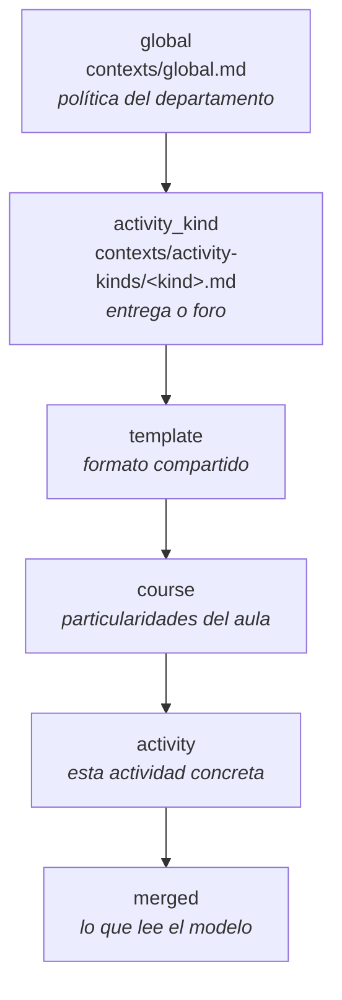

# Contextos de corrección

Aquí vive el juego de instrucciones predeterminado. En una instalación nueva estos Markdown
crean la versión 1; desde entonces PostgreSQL conserva la versión activa y el historial inmutable.
Desplegar de nuevo no compara ni sobrescribe un contexto existente.

No son documentación. Son instrucciones ejecutables: lo que se escribe aquí determina las notas de
los alumnos. Se revisan con el mismo cuidado que el código.

**Y son el modelo de personalización del producto.** Vega no sabe de ninguna materia en concreto:
sabe de corregir entregas y de responder foros. Lo que la hace servir a un departamento de
matemáticas, de lengua o de física está en estos ficheros, y los edita el profesorado desde la
propia aplicación —`PUT /api/contexts/{level}/{key}`—, sin desplegar nada y sin pasar por un
desarrollador. Personalizar Vega es escribir prompts.

## Los cinco niveles



| Nivel (`ContextLevel`) | `key` | Fichero | Frecuencia de cambio | Qué va aquí |
|---|---|---|---|---|
| `global` | `global` | `global.md` | Una o dos veces al año | Tono del feedback, arrastre, justificación, decimales, redondeo |
| `activity_kind` | el `ActivityKind` | `activity-kinds/assignment.md`, `activity-kinds/forum.md` | Rara | Qué se valora en una entrega y qué en un foro |
| `template` | slug de plantilla | `activity-kinds/assignment*.md` como semilla | Ocasional | Formato compartido por varias actividades |
| `course` | id del curso | Se crea desde la aplicación | Por aula | Criterios propios del curso |
| `activity` | el `slug` de la actividad | `activities/tema04.md`, `activities/problema12.md`… | Cada actividad | Errores típicos de este tema, exigencias concretas, qué aceptar y qué no |

La correspondencia fichero ↔ fila de `grading_contexts` es exacta: el nivel es el directorio, la
`key` es el nombre del fichero sin extensión (`global` para el nivel global).

Los `ActivityKind` son exactamente dos, `assignment` y `forum`, así que el nivel intermedio no puede
tener más de dos ficheros. Cualquier otro nombre en `activity-kinds/` no lo lee nadie.

`activity-kinds/assignment-tema.md` se siembra como la plantilla `simulacro-tema`; no es un
`ActivityKind`. Los niveles `course` y `activity` nacen al configurarlos para una instalación.

## Cómo se combinan

**Concatenación en orden, de general a específico.** Lo específico **añade y matiza**; nunca borra
lo general. Cuando hay contradicción explícita, **gana el nivel más específico** — y así se le dice
al modelo dentro de `global.md`, porque el sistema no lo garantiza por sí solo.

`resolveContext()` (en `packages/core`) pone a cada nivel su cabecera —«Contexto global», «Tipo de
actividad», «Actividad»— y los junta. Un nivel vacío no genera cabecera: una sección con título y
sin contenido sólo gasta tokens.

El orden no es estético. Es el de especificidad, y además es el que aprovecha el prompt caching: lo
que menos cambia va primero, de modo que el prefijo compartido por todas las entregas de una misma
actividad sea lo más largo posible.

Además del texto de los cinco niveles, el motor recibe ya estructurado desde la tabla `activities`:

- `pointsAllocation` — los apartados con sus puntos máximos. Manda sobre lo que devuelva la IA.
- `graded` y `maxScore` — si la actividad se puntúa y sobre cuánto. En un foro son `false` y `null`,
  y entonces no hay apartados ni nota: la corrección es sólo el documento.
- `activityKind` — para que el proveedor sepa si corrige sobre una transcripción o sobre el texto
  que escribió el alumno.

El resultado se puede ver tal cual, sin gastar tokens, en `GET /api/contexts/resolved/{activityId}`
(`ResolvedContextResponse`), que devuelve los niveles por separado y el `merged` final. Si una
corrección sale rara, **el primer sitio donde mirar es ahí**.

Además de los tres niveles, `resolveContext()` añade al final dos cosas que **no** son Markdown de
esta carpeta:

- **La solución de referencia de la actividad**, en su propia sección. Se titula **«Solución de
  referencia»** si la actividad se puntúa y **«Material asociado»** si no: en un foro de dudas ese
  campo no es la respuesta correcta a nada, sino el material del que preguntan los alumnos, y
  llamarlo «solución» invita al modelo a tratarlo como plantilla de respuesta.
- **El contenido de los ficheros de contexto de texto**, una sección «Material adjunto · *nombre*»
  por fichero. Sólo `.tex`, `.md`, `.markdown` y `.txt`: un `.tex` ya es texto, entra literal en el
  prompt y se cachea con el resto. De un PDF o una imagen **no se guarda el contenido**, y la
  aplicación lo dice en vez de fingir que llegan.

Van al final, y no es capricho: son lo más concreto y lo que más cambia entre actividades, así que
ponerlos antes acortaría el prefijo cacheable sin ganar nada.

> **El lote sí envía todo eso.** `apps/api/src/routes/batch.ts:232-245` pasa `referenceSolution`,
> `graded` y el contenido de los ficheros de texto (los que tienen `upload_complete = true`) a
> `resolveContext()`. Lo que la pantalla de contexto efectivo enseña es lo que el modelo lee.
>
> Esta nota decía lo contrario hasta que se cerró la carencia, y conviene saberlo porque quien
> leyera sólo la documentación antigua concluiría que Vega corrige sin la solución de referencia.

Ver [ADR 0015](../docs/decisiones/0015-contextos-versionados-y-prompts.md).

## Ficheros y base de datos

Los contextos tienen una semilla en estos ficheros y su estado vivo en PostgreSQL. La regla cerrada
es **el fichero siembra una vez; la base de datos manda**:

1. `bootstrap()` crea sólo los contextos inexistentes con versión 1 y `source = 'seed'`.
2. En ejecución se lee exclusivamente la versión activa de PostgreSQL.
3. Cada edición crea una versión `N + 1` inmutable y mueve el puntero activo en la misma transacción.
4. No se escribe en Git ni se sincroniza el repositorio durante la ejecución.

La única excepción es la CLI del motor, que lee estos ficheros directamente y no toca la base de
datos. Es lo que permite ajustar un prompt y ver el efecto sin levantar nada:

```
pnpm --filter @vega/core cli grade --actividad tema04 --pdf examen.pdf
pnpm --filter @vega/core cli grade --actividad foro-didactica --tipo foro
```

## Cómo se escribe un buen contexto

Sirve igual para un departamento de matemáticas que para uno de lengua: lo que cambia son los
ejemplos, no las reglas.

- **En imperativo y dirigido al corrector.** «Penaliza…», «Acepta…», «No exijas…». No describas el
  temario: instruye sobre cómo puntuar.
- **Con números, cuando la actividad se puntúa.** «Descuenta 0,25 puntos por no indicar el dominio»
  sirve. «Valora la rigurosidad» no sirve para nada. En una actividad no puntuable no hay puntos que
  repartir, así que ahí el criterio se escribe en términos de qué señalar y con qué prioridad: «Di
  primero lo que está bien resuelto y después lo que falta».
- **Con ejemplos del error concreto**, cuando el error sea reconocible. Un ejemplo vale más que tres
  frases de criterio. En una materia con notación propia, escríbelo en esa notación; los ejemplos en
  LaTeX de los ficheros de esta carpeta son de matemáticas porque esa es la materia del juego de
  datos, no porque el formato lo exija.
- **Sin repetir el nivel superior.** Si ya está en `global.md`, no lo copies en la actividad. Copiar
  es cómo empiezan las contradicciones.
- **Corto.** Todo esto viaja en cada llamada. Un contexto de actividad que pasa de una pantalla
  probablemente contiene material que pertenece a `activity-kinds/`.

### Lo propio de cada tipo de actividad

El nivel `activity_kind` es donde vive la diferencia entre los dos trabajos de Vega, y conviene no
mezclarla con lo demás:

- **`assignment.md`** — hay fichero del alumno y ha pasado por transcripción. Aquí se dice qué hacer
  con las marcas `[ILEGIBLE]` y `[DUDA]` que deja el OCR (la regla sana: no supongas el contenido,
  señálalo), y cómo puntuar apartado por apartado.
- **`forum.md`** — no hay fichero ni transcripción: se corrige el texto que el alumno escribió, y
  **normalmente no se puntúa**. Aquí se dice qué es una buena intervención en esa materia y con qué
  tono responder, sin criterios de puntuación que no se van a aplicar.

## Convenciones

- Español de España. Coma decimal (`0,75`), nunca punto.
- LaTeX entre `$…$` en línea y `$$…$$` en bloque. Se renderiza con KaTeX en la UI. Sólo donde haga
  falta: en una materia sin notación matemática no hay ninguna razón para usarlo.
- Los apartados se nombran igual que en `pointsAllocation`: `1a`, `1b`, `2`, `Desarrollo`.
- Un fichero por `(level, key)`. Nada de includes ni de plantillas.
