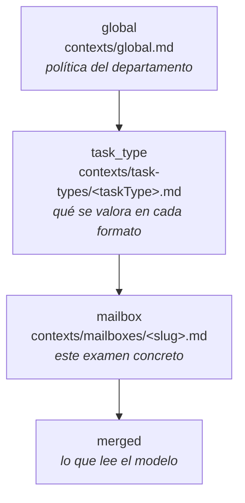

# Contextos de corrección

Aquí vive lo que la IA lee antes de corregir. Son ficheros Markdown, versionados con git, y son
**el juego por defecto que carga la aplicación**: al arrancar sobre una base de datos sin
contextos, estos ficheros siembran la tabla `grading_contexts`.

No son documentación. Son instrucciones ejecutables: lo que se escribe aquí determina las notas de
los alumnos. Se revisan con el mismo cuidado que el código.

## Los tres niveles

| Nivel (`ContextLevel`) | `key` | Fichero | Frecuencia de cambio | Qué va aquí |
|---|---|---|---|---|
| `global` | `global` | `global.md` | Una o dos veces al año | Tono del feedback, arrastre, justificación, decimales, redondeo |
| `task_type` | el `TaskType` | `task-types/simulacro_problema.md`, `task-types/simulacro_tema.md` | Rara | Qué se valora y qué pesa en cada formato de examen |
| `mailbox` | el `slug` del buzón | `mailboxes/tema04.md`, `mailboxes/problema12.md`… | Cada examen | Errores típicos de este tema, exigencias concretas, qué aceptar y qué no |

La correspondencia fichero ↔ fila de `grading_contexts` es exacta: el nivel es el directorio, la
`key` es el nombre del fichero sin extensión (`global` para el nivel global).

## Cómo se combinan

**Concatenación en orden, de general a específico.** Lo específico **añade y matiza**; nunca borra
lo general. Cuando hay contradicción explícita, **gana el nivel más específico** — y así se le dice
al modelo dentro de `global.md`, porque el sistema no lo garantiza por sí solo.

Al contexto de los tres niveles el motor le añade, ya estructurado desde la tabla `mailboxes`:

- `referenceSolution` — la resolución del profesor, en LaTeX o texto.
- `pointsAllocation` — los apartados con sus puntos máximos.
- `maxScore` — la nota máxima del examen.
- `gradingNotes` — indicaciones del buzón editadas desde la UI (complementan al fichero de
  `mailboxes/`, no lo sustituyen).

El resultado se puede ver tal cual, sin gastar tokens, en `GET /api/contexts/resolved/{mailboxId}`
(`ResolvedContextResponse`), que devuelve los tres niveles por separado y el `merged` final. Si una
corrección sale rara, **el primer sitio donde mirar es ahí**.

Ver [ADR 0003](../docs/decisiones/0003-contexto-tres-niveles.md).

## Ficheros y base de datos

Los contextos existen en dos sitios: estos ficheros y la tabla `grading_contexts`. La regla
provisional es **el fichero siembra, la base de datos manda**:

1. Base de datos vacía para un `(level, key)` → se carga el fichero.
2. Existe fila → se usa la fila. El fichero se ignora.
3. Editar desde la UI (`PUT /api/contexts/{level}/{key}`) escribe **sólo** en la base de datos.

Consecuencia incómoda y conocida: tras la primera edición desde el móvil, el fichero del
repositorio queda desactualizado y nadie avisa. Si esto debe resolverse con commit automático desde
la UI, con un botón de exportar, o eliminando uno de los dos almacenes, es una **pregunta abierta**
— ver `docs/hu/HU-06-editor-contextos-tres-niveles.md`.

## Cómo se escribe un buen contexto

- **En imperativo y dirigido al corrector.** «Penaliza…», «Acepta…», «No exijas…». No describas el
  temario: instruye sobre cómo puntuar.
- **Con números.** «Descuenta 0,25 puntos por no indicar el dominio» sirve. «Valora la rigurosidad»
  no sirve para nada.
- **Con ejemplos del error concreto**, en LaTeX, cuando el error sea reconocible. Un ejemplo vale
  más que tres frases de criterio.
- **Sin repetir el nivel superior.** Si ya está en `global.md`, no lo copies en el buzón. Copiar es
  cómo empiezan las contradicciones.
- **Corto.** Todo esto viaja en cada llamada. Un contexto de buzón que pasa de una pantalla
  probablemente contiene material que pertenece a `task-types/` o a la solución de referencia.

## Convenciones

- Español de España. Coma decimal (`0,75`), nunca punto.
- LaTeX entre `$…$` en línea y `$$…$$` en bloque. Se renderiza con KaTeX en la UI.
- Los apartados se nombran igual que en `pointsAllocation`: `1a`, `1b`, `2`, `Desarrollo`.
- Un fichero por `(level, key)`. Nada de includes ni de plantillas.
