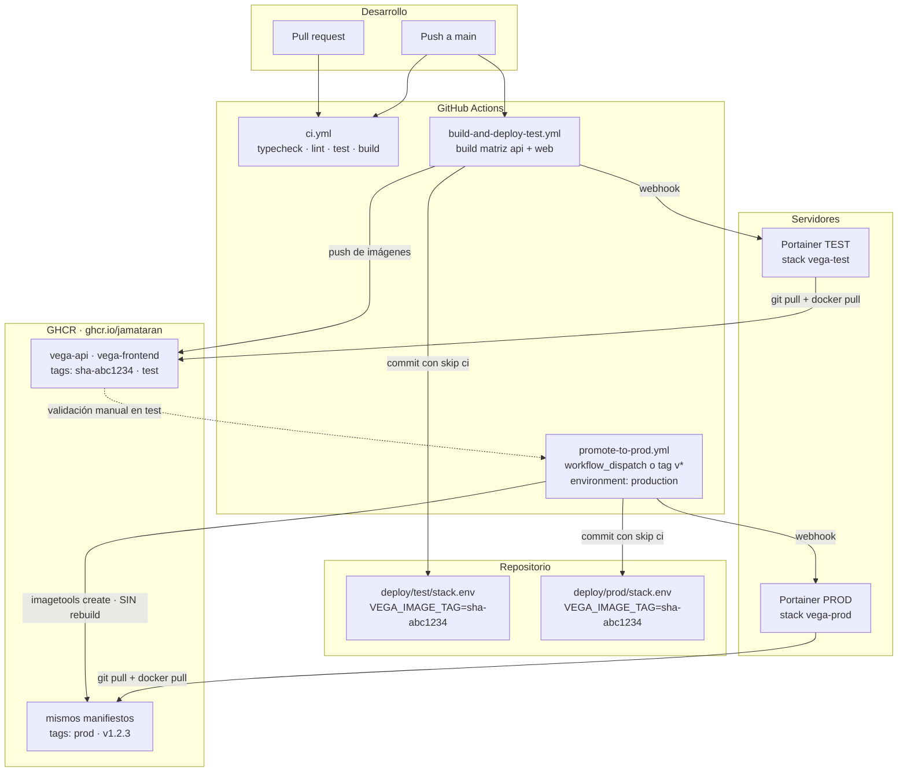

# Despliegue de Vega

Vega se despliega con **dos entornos independientes**, cada uno gobernado por su propio
Portainer y por su propio fichero compose de este repositorio:

| Entorno | Compose | Variables | Stack Portainer | Puertos publicados |
|---|---|---|---|---|
| Test | `deploy/test/docker-compose.yml` | `deploy/test/stack.env` | `vega-test` | web `20702`, api `20701` |
| Producción | `deploy/prod/docker-compose.yml` | `deploy/prod/stack.env` | `vega-prod` | web `20702`, api `20701` |

Los puertos coinciden a propósito: cada entorno vive en su propia máquina, con su propio
Portainer, así que no compiten por el host y el proxy inverso de cada uno usa la misma
configuración. Si algún día los dos stacks acabaran en la misma máquina, hay que darle
otro par de valores a `VEGA_API_PORT` / `VEGA_WEB_PORT` en uno de los dos.

La regla que ordena todo lo demás: **el tag desplegado está escrito en git**. Nunca se
despliega un `:latest` opaco. `deploy/<entorno>/stack.env` contiene un `VEGA_IMAGE_TAG`
con un `sha-<short>` inmutable, y el historial de ese fichero *es* el historial de
despliegues del entorno.

---

## El flujo completo



### 1 · Push a `main` → test

`build-and-deploy-test.yml` construye las dos imágenes en paralelo (matriz `api` / `web`)
y las publica en GHCR con **dos tags**:

- `sha-<short>` — inmutable, es el que se despliega de verdad.
- `test` — flotante, sólo por comodidad para depurar a mano.

Acto seguido escribe `VEGA_IMAGE_TAG=sha-<short>` en `deploy/test/stack.env`, lo commitea
con `[skip ci]` (para no reentrar en bucle) y dispara el webhook del Portainer de test.
Portainer vuelve a clonar el repo, ve el tag nuevo y redespliega.

### 2 · Promoción a producción

Cuando lo probado en test convence, se lanza **Promote to prod** desde la pestaña Actions
con el `sha-<short>` que aparece en el resumen del workflow de test:

```
Actions → Promote to prod → Run workflow
  image_tag: sha-abc1234      ← obligatorio
  version:   v1.4.0           ← opcional
```

También se dispara solo al empujar un tag `v*`, en cuyo caso el `sha-<short>` sale del
commit etiquetado y la versión del propio nombre del tag.

**No se reconstruye nada.** El workflow usa `docker buildx imagetools create`, que escribe
manifiestos nuevos en GHCR apuntando a las capas que ya existen: `prod` y `v1.4.0` acaban
señalando byte a byte a la imagen que se validó en test. Reconstruir daría una imagen
distinta (timestamps, dependencias transitivas resueltas de nuevo…) y la validación de
test dejaría de valer.

Después actualiza `deploy/prod/stack.env` con el mismo `sha-<short>` —no con `prod`— y
dispara el webhook del Portainer de producción.

El job declara `environment: production`, así que puedes exigir aprobación manual en
**Settings → Environments → production → Required reviewers**: el workflow se queda
esperando el visto bueno antes de tocar nada.

---

## Configurar cada stack en Portainer

Mismo procedimiento en los dos Portainer, cambiando la ruta del compose.

1. **Stacks → Add stack → Repository**.
2. **Name**: `vega-test` (o `vega-prod`). Debe coincidir con el `name:` del compose para
   que Portainer no cree un proyecto duplicado.
3. **Repository URL**: `https://github.com/jamataran/vega`
   **Repository reference**: `refs/heads/main`
4. **Compose path**: `deploy/test/docker-compose.yml` (o `deploy/prod/docker-compose.yml`).
5. **Authentication**: si el repositorio es privado, un *fine-grained PAT* con permiso de
   solo lectura sobre el contenido.
6. **Automatic updates → Webhook**: actívalo y **copia la URL que genera**. Esa URL es el
   secreto que hay que dar de alta en GitHub (`PORTAINER_TEST_WEBHOOK` /
   `PORTAINER_PROD_WEBHOOK`). Activa también *Re-pull image*.
7. **Environment variables → Advanced mode**: pega el bloque **(2)** de
   `deploy/<entorno>/stack.env.example` con los valores reales (contraseñas, `JWT_SECRET`,
   `ANTHROPIC_API_KEY`, `WEB_ORIGIN`, puertos…).
   **No pongas aquí `VEGA_IMAGE_TAG`**: lo gestiona la CI desde git y una variable en la UI
   de Portainer tendría prioridad sobre el fichero, congelando el despliegue en un tag viejo.
8. **Deploy the stack**.

### Por qué hay un `.env` además de `stack.env`

Docker Compose sólo interpola `${VEGA_IMAGE_TAG}` en la línea `image:` desde el entorno del
proceso o desde un fichero llamado **exactamente `.env`** situado junto al `docker-compose.yml`.
Como el `.gitignore` del repositorio excluye `.env`, la CI escribe el tag en dos sitios:

- `deploy/<entorno>/stack.env` — el registro legible y versionado; es lo que lees y lo que
  editas para un rollback.
- `deploy/<entorno>/.env` — espejo mecánico del anterior, añadido con `git add -f`, que es
  el que Compose lee de verdad al desplegar.

Los dos ficheros siempre llevan el mismo valor y los escribe el mismo paso del workflow.

---

## Rollback

El rollback no reconstruye ni re-etiqueta nada: la imagen anterior sigue en GHCR con su
`sha-` propio, que es justo la gracia de los tags inmutables.

```bash
# 1 · Averigua a qué se quiere volver: el historial del fichero es el de despliegues.
git log --oneline -p -- deploy/prod/stack.env | head -40

# 2 · Pon el sha- anterior en los dos ficheros.
printf 'VEGA_IMAGE_TAG=sha-abc1234\n' > deploy/prod/stack.env
printf 'VEGA_IMAGE_TAG=sha-abc1234\n' > deploy/prod/.env

# 3 · Commitea con [skip ci] y empuja.
git add deploy/prod/stack.env && git add -f deploy/prod/.env
git commit -m 'revert(deploy): prod -> sha-abc1234 [skip ci]'
git push
```

4. En Portainer: **Stacks → vega-prod → Pull and redeploy** (o vuelve a llamar al webhook).

> **Cuidado con el esquema.** Volver a una imagen anterior *no* revierte las migraciones
> SQL que ya se aplicaron: las migraciones sólo avanzan. Un rollback entre versiones que
> comparten esquema es inmediato; si la versión nueva introdujo un cambio destructivo,
> hay que restaurar antes el volcado de Postgres. Por eso conviene que las migraciones
> sean aditivas (añadir columna, no renombrarla) durante al menos un ciclo de despliegue.

---

## Migraciones: se aplican solas

Las migraciones SQL versionadas **viajan dentro de la imagen del API**, en `/app/migrations`.
El entrypoint del contenedor las aplica de forma idempotente y sólo después arranca el
servidor Fastify; si la migración falla, el servidor no llega a levantarse y el healthcheck
mantiene el contenedor marcado como *unhealthy* en lugar de servir tráfico contra un esquema
a medias.

Consecuencia práctica: **el flujo GitOps sólo despliega imágenes**. No hay paso manual de
migración, ni un job aparte en la CI, ni un `exec` en el contenedor. Cambiar de tag es
cambiar de esquema.

Los primeros segundos tras un despliegue el API responde 503: por eso el healthcheck del
compose lleva `start_period` de 45 s (test) y 60 s (prod).

---

## Proxy inverso

TLS y enrutado son responsabilidad del proxy de delante. Los contenedores publican HTTP
plano en los puertos de la tabla inicial. Sondas de salud: `GET /api/health` en el API
(verifica la base de datos) y `/health.txt` en la web.

Cabeceras que **hay que reenviar** en todos los casos — sin ellas Fastify genera URLs
absolutas en `http://` y el rate limiting cuenta todas las peticiones como si vinieran del
propio proxy:

| Cabecera | Para qué |
|---|---|
| `Host` | que el API se vea a sí mismo con el dominio público |
| `X-Forwarded-Proto` | que sepa que el cliente habla HTTPS (cookies `Secure`, redirecciones) |
| `X-Forwarded-For` | IP real del cliente, para logs y rate limiting |
| `X-Real-IP` | idem, esperada por algunos middlewares |

Además: `WEB_ORIGIN` en `stack.env` debe coincidir **exactamente** con el origen público de
la PWA (esquema, dominio, sin barra final) o CORS rechazará las llamadas.

### nginx

Fichero completo y comentado en **`deploy/nginx/vega.subdomain.tld.conf.example`**: redirección
a HTTPS conservando el reto ACME, TLS, HSTS, `/api/` al 20701 y el resto al 20702.

```bash
cp deploy/nginx/vega.subdomain.tld.conf.example /etc/nginx/sites-available/vega.subdomain.tld
# ajusta server_name y las rutas de los certificados
ln -s /etc/nginx/sites-available/vega.subdomain.tld /etc/nginx/sites-enabled/
nginx -t && systemctl reload nginx
```

Dos detalles que cuestan una tarde si se pasan por alto:

- **`proxy_pass` sin barra final** (`http://127.0.0.1:20701`, no `.../`). Con barra, nginx
  recorta el prefijo y el API responde 404 a todo, porque sus rutas ya viven bajo `/api`.
- **`proxy_read_timeout 120s`.** El defecto de nginx son 60 s: con él una corrección larga
  muere con 504 mientras el API sigue gastando tokens.

El entorno de test es el mismo fichero con `test.vega.subdomain.tld`; los puertos no cambian,
porque el stack de test corre en otra máquina.

### Plesk

En **Dominios → vega.ejemplo.es → Apache & nginx Settings → Additional nginx directives**,
pega los dos bloques `location` de arriba. Deja *Proxy mode* de Apache **desactivado** para
que nginx sirva directamente y no se encadenen dos proxies. El certificado se gestiona con
Let's Encrypt desde el panel, como en cualquier otro dominio.

### Traefik

Con Traefik por labels no hacen falta puertos publicados: basta con meter los contenedores
en la red de Traefik y quitar las secciones `ports:` del compose. Traefik ya reenvía
`X-Forwarded-*` por defecto.

```yaml
labels:
  - traefik.enable=true
  - traefik.http.routers.vega-frontend.rule=Host(`vega.ejemplo.es`)
  - traefik.http.routers.vega-frontend.entrypoints=websecure
  - traefik.http.routers.vega-frontend.tls.certresolver=le
  - traefik.http.services.vega-frontend.loadbalancer.server.port=8080
  - traefik.http.routers.vega-api.rule=Host(`vega.ejemplo.es`) && PathPrefix(`/api`)
  - traefik.http.routers.vega-api.entrypoints=websecure
  - traefik.http.routers.vega-api.tls.certresolver=le
  - traefik.http.services.vega-api.loadbalancer.server.port=3000
```

### Alternativa: un solo vhost

`apps/frontend/nginx.conf` trae comentado un bloque `location /api/` que reenvía al contenedor
`api` desde dentro del propio contenedor web. Si lo activas, el proxy inverso sólo necesita
apuntar al puerto de la web y desaparece el CORS, a cambio de un salto extra para el tráfico
de la API.

---

## Secretos y variables a dar de alta

### En GitHub — *Settings → Secrets and variables → Actions → Secrets*

| Secreto | Obligatorio | Qué es |
|---|---|---|
| `PORTAINER_TEST_WEBHOOK` | recomendado | URL del webhook del stack `vega-test`. Sin él, el workflow **avisa y continúa**: la imagen se publica y el tag se commitea, pero hay que redesplegar a mano. |
| `PORTAINER_PROD_WEBHOOK` | recomendado | Ídem para el stack `vega-prod`. Mismo comportamiento degradado. |

`GITHUB_TOKEN` es automático: no hay que crearlo. Basta para publicar en GHCR y para
commitear el `stack.env` gracias a los `permissions` declarados en cada workflow.

### En GitHub — *Settings → Environments*

| Entorno | Para qué |
|---|---|
| `test` | registro de despliegues del entorno de pruebas (sin protecciones). |
| `production` | **Required reviewers** para exigir aprobación manual antes de promocionar. |

### En GitHub — *Settings → Actions → General*

Marca **Read and write permissions** en *Workflow permissions*, o los `git push` del tag
desplegado fallarán con 403.

### En cada Portainer — *Stack → Environment variables*

Los mismos nombres en los dos entornos, con valores **distintos**:

| Variable | Test | Producción |
|---|---|---|
| `POSTGRES_USER` | `vega` | `vega` |
| `POSTGRES_PASSWORD` | contraseña de test | contraseña propia, distinta |
| `POSTGRES_DB` | `vega` | `vega` |
| `JWT_SECRET` | aleatorio de 48 bytes | aleatorio de 48 bytes, **distinto** |
| `JWT_EXPIRES_IN` | `12h` | `12h` |
| `WEB_ORIGIN` | `https://test.vega.ejemplo.es` | `https://vega.ejemplo.es` |
| `NODE_ENV` | `test` | `production` |
| `LOG_LEVEL` | `debug` | `info` |
| `NODE_OPTIONS` | `--max-old-space-size=512` | `--max-old-space-size=768` |
| `VEGA_API_PORT` | `20701` | `20701` |
| `VEGA_WEB_PORT` | `20702` | `20702` |
| `AI_PROVIDER` | `mock` | `anthropic` |
| `ANTHROPIC_API_KEY` | vacío | `sk-ant-…` |
| `AI_MODEL_TRANSCRIPTION` | `claude-opus-4-8` | `claude-opus-4-8` |
| `AI_MODEL_GRADING` | `claude-opus-4-8` | `claude-opus-4-8` |
| `LMS_CONNECTOR` | `mock` | `moodle3` |
| `MOODLE_BASE_URL` | — | `https://moodle.ejemplo.es` |
| `MOODLE_TOKEN` | — | token del web service |
| `SMTP_HOST` / `SMTP_PORT` / `SMTP_USER` / `SMTP_PASSWORD` / `SMTP_FROM` | opcional | credenciales SMTP |
| `BRAND_NAME` | `Vega (test)` | nombre de la academia |

Genera los secretos de firma con:

```bash
node -e "console.log(require('crypto').randomBytes(48).toString('base64url'))"
```

Si el paquete de GHCR es privado, además hay que dar de alta en cada Portainer un
**Registry** (`Registries → Add registry → Custom`) apuntando a `ghcr.io` con tu usuario de
GitHub y un PAT con `read:packages`. Si el paquete es público, no hace falta.

---

## Operativa habitual

```bash
# Qué hay desplegado ahora mismo en cada entorno
cat deploy/test/stack.env deploy/prod/stack.env

# Historial de despliegues de producción
git log --format='%ad %s' --date=short -- deploy/prod/stack.env

# Qué commit es una imagen concreta
docker buildx imagetools inspect ghcr.io/jamataran/vega-api:sha-abc1234 --format '{{json .Provenance}}'

# Logs de un servicio (en el host, o desde la UI de Portainer)
docker compose -p vega-prod logs -f api

# Volcado de la base de datos de producción
docker compose -p vega-prod exec postgres \
  pg_dump -U vega -d vega -Fc -f /backups/vega-$(date +%F).dump
```

## Notas de construcción de las imágenes

Los dos Dockerfiles se construyen **desde la raíz del monorepo**, porque necesitan el
lockfile y los `package.json` de todos los workspaces:

```bash
docker build -f apps/api/Dockerfile -t vega-api:local .
docker build -f apps/frontend/Dockerfile -t vega-frontend:local .
```

- Usan `# syntax=docker/dockerfile:1.7-labs` para poder copiar sólo los manifiestos con
  `COPY --parents` (que es lo que hace cacheable `pnpm install`) y para escribir el
  entrypoint del API con un heredoc, sin dejar un `.sh` suelto en el árbol de la aplicación.
- La imagen del API termina en una etapa mínima generada con `pnpm deploy --prod`: sin
  pnpm, sin toolchain y sin devDependencies. Corre como usuario `vega`, no como root.
- La imagen web corre nginx como usuario `nginx` y escucha en **8080**, no en 80.
- Las migraciones quedan en `/app/migrations`, con un enlace simbólico en `/migrations`.
  El enlace existe porque `src/db/migrate.ts` resuelve el directorio como `../../migrations`
  respecto a su propia ubicación: en el árbol de fuentes eso da `apps/api/migrations`, pero
  en el bundle (`/app/dist/index.js`) daría `/migrations`. Para migrar a mano:
  `docker compose -p vega-prod exec api node dist/migrate.js`.
- Las variables `VITE_*` se hornean en tiempo de build. Es deliberado: si dependieran del
  entorno de arranque, la imagen de test y la de producción no podrían ser el mismo
  artefacto y la promoción sin rebuild perdería su sentido.
- Conviene añadir un `.dockerignore` en la raíz del repositorio (al menos `node_modules`,
  `.git`, `**/dist`) para no mandar basura al daemon en builds locales. En CI da igual,
  porque el checkout está limpio.
