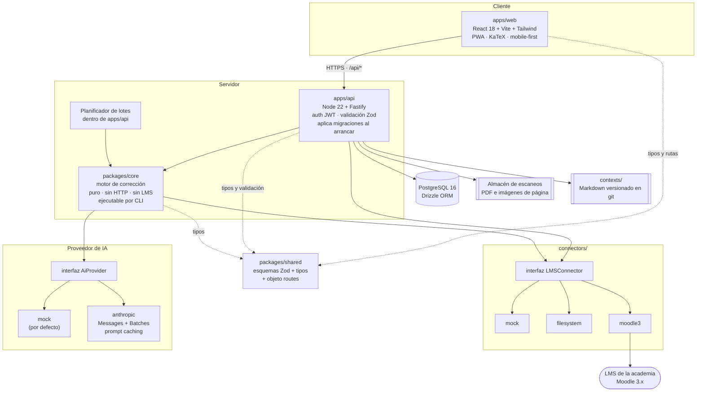
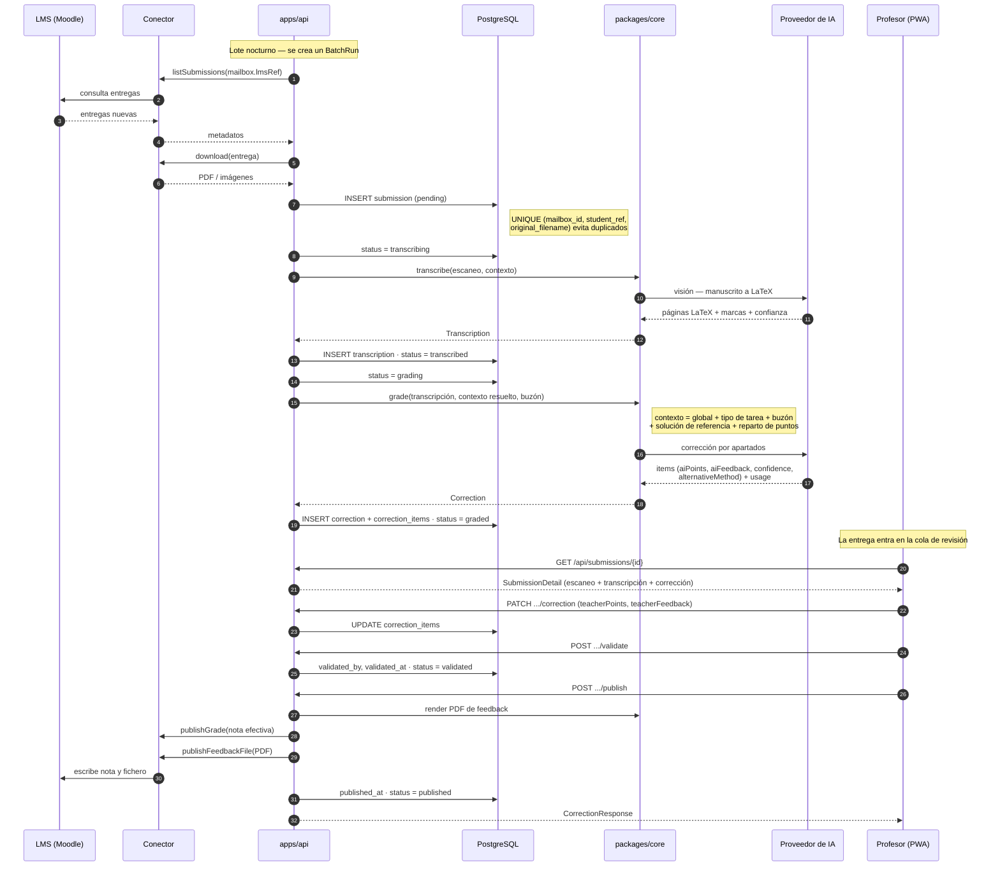
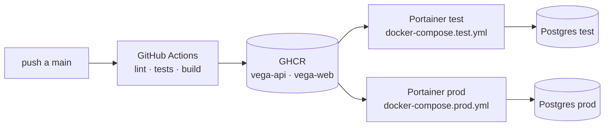

# Arquitectura

## Vista de componentes



**Lo que no aparece en el diagrama a propósito**: no hay cola de mensajes externa, ni Redis, ni
worker separado. El planificador de lotes vive dentro del proceso de `apps/api`. Para el volumen
de una academia (decenas de entregas por noche, no miles) una segunda pieza de infraestructura
sería coste sin beneficio. El día que deje de serlo, la frontera por la que partir ya está
dibujada: `packages/core` no depende de Fastify, así que se puede sacar a un proceso propio sin
tocar la lógica.

## Flujo de una entrega, de principio a fin



### Notas sobre el flujo

1. **La transcripción y la corrección son dos llamadas separadas.** Transcribir es un problema de
   visión; corregir es un problema de razonamiento sobre texto. Separarlas permite reintentar sólo
   la parte que falló, cachear el contexto de corrección entre entregas del mismo buzón, y —lo más
   importante— enseñar al profesor la transcripción para que juzgue si la corrección parte de una
   lectura correcta del manuscrito.
2. **El lote se ordena por buzón**, no por fecha. Todas las entregas de `tema04` seguidas
   comparten el mismo prefijo de prompt (contexto de los tres niveles + solución de referencia),
   que es exactamente lo que el prompt caching abarata. Ordenar por fecha invalidaría la caché en
   cada salto de buzón.
3. **La publicación es un paso explícito**, separado de la validación. Validar es un acto del
   profesor; publicar es una operación de red que puede fallar (LMS caído, token caducado) y se
   puede reintentar sin volver a molestar al profesor.
4. **Nada llega al alumno sin `validated_at`.** El endpoint de publicación rechaza con `409
   CONFLICT` cualquier entrega que no esté en `validated`. Ver
   [ADR 0004](decisiones/0004-validacion-humana-obligatoria.md).

## Por qué el monorepo está partido así

```
apps/
  api/          servidor Fastify + migraciones SQL + planificador de lotes
  web/          PWA React
packages/
  core/         motor de corrección: transcribir y corregir
  shared/       esquemas Zod, tipos y objeto routes
connectors/
  <lms>/        implementaciones de la interfaz LMSConnector
contexts/       contextos de corrección en Markdown, versionados con git
deploy/         ficheros compose de test y de producción
docs/           esta carpeta
```

### `packages/shared` — el contrato, no una librería de utilidades

Es el único paquete del que dependen todos los demás, y a propósito no contiene lógica de negocio:
sólo esquemas Zod, los tipos inferidos de ellos, un puñado de funciones puras derivadas del modelo
(`effectivePoints`, `effectiveSource`, `totalScore`) y el objeto `routes`.

El valor está en que **el mismo esquema valida en los dos extremos del cable**. El front no
escribe rutas a mano ni redefine formas de datos; el API valida la entrada contra el mismo objeto
que el front usó para construirla. Un cambio de contrato rompe la compilación en ambos lados a la
vez, que es cuando se quiere que rompa.

La regla que mantiene esto sano: **`shared` no importa nada de `api`, `web`, `core` ni
`connectors`.** Si algo necesita ir en la dirección contraria, no pertenece a `shared`.

### `packages/core` — el motor, sin saber que existe la web

Contiene transcripción y corrección: dado un escaneo y un contexto, produce una `Transcription` y
una `Correction`. No conoce Fastify, ni la base de datos, ni el LMS. Recibe lo que necesita como
argumentos y devuelve estructuras del dominio.

Tres razones concretas:

- **Se ejecuta por CLI** (`pnpm --filter core cli grade --buzon tema04 --pdf examen.pdf`), que es
  como se ajustan los prompts sin levantar toda la aplicación ni ensuciar la base de datos.
- **Se testea con ficheros de fixture** y el proveedor de IA en modo mock, sin red y sin coste.
- **Se puede sacar a un proceso propio** si el volumen lo pide, porque la frontera ya está trazada.

### `apps/api` — el que sí sabe de todo

Orquesta: autentica, consulta la base de datos, resuelve el contexto de los tres niveles, llama a
`core`, persiste el resultado, expone HTTP y aplica las migraciones al arrancar. También aloja el
planificador de lotes. Es el único que escribe en Postgres.

### `apps/web` — mobile-first de verdad

El profesor corrige de pie, entre clases, con una mano. La pantalla de revisión se diseña primero
para 375 px y luego se ensancha, no al revés. Consume exclusivamente el contrato de `shared` y
renderiza LaTeX con KaTeX. Es instalable como PWA.

### `connectors/` — fuera de `packages/` a propósito

Están al mismo nivel que `apps` y `packages` porque son **puntos de extensión de terceros**: la
invitación es que quien tenga otro LMS añada un directorio aquí, implemente cuatro métodos y abra
un PR, sin entender el resto del monorepo. Enterrarlos en `packages/` los haría parecer detalle
interno. Ver [ADR 0006](decisiones/0006-conectores-lms-interfaz-minima.md).

### `contexts/` — en el repositorio, no en la base de datos

Los contextos de corrección son ficheros Markdown versionados con git. El repositorio guarda el
juego por defecto, que es el que carga la aplicación cuando la tabla `grading_contexts` está
vacía. A partir de ahí, la edición desde la UI escribe en base de datos.

El motivo de tener los dos: git da historial, diff y revisión por pares sobre unas instrucciones
que **determinan las notas de los alumnos** — un cambio en `contexts/global.md` es un cambio de
criterio de evaluación y merece el mismo escrutinio que un cambio de código. La base de datos da
edición inmediata desde el móvil, que es lo que el profesor necesita a las once de la noche.

> La reconciliación entre ambos (¿qué gana si el fichero y la fila divergen?, ¿se hace commit
> automático al editar desde la UI?) es una pregunta abierta: ver `HU-06` y `contexts/README.md`.

## Despliegue

Dos entornos, **test** y **prod**, cada uno gobernado por su propia instancia de Portainer
apuntando a un fichero compose distinto en `deploy/`. CI/CD publica las imágenes en GHCR y
actualiza los stacks. Los cambios de esquema viajan dentro de la imagen del API: las migraciones
SQL se aplican de forma idempotente al arrancar el contenedor, así que el despliegue no tiene
pasos manuales. Ver [ADR 0002](decisiones/0002-migraciones-sql-planas.md) y
[ADR 0007](decisiones/0007-dos-entornos-portainer.md).



Endpoints de salud para el proxy inverso: `GET /api/health` (verifica la base de datos, el
proveedor de IA y el conector activo) y `/health.txt` en el front.
