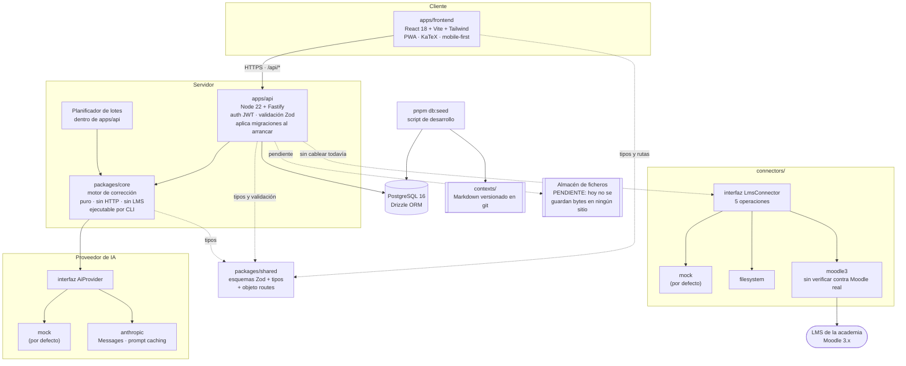
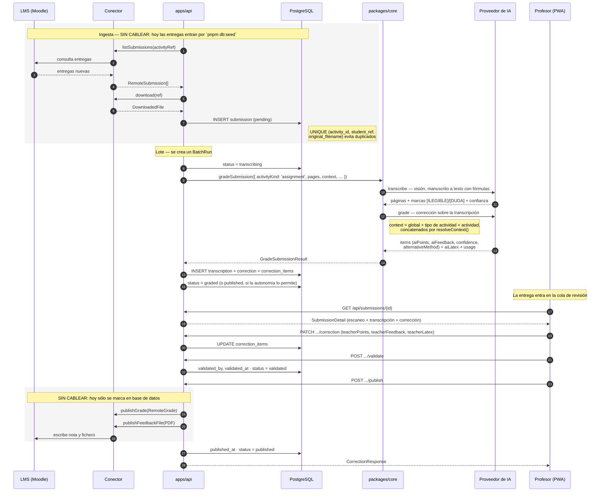
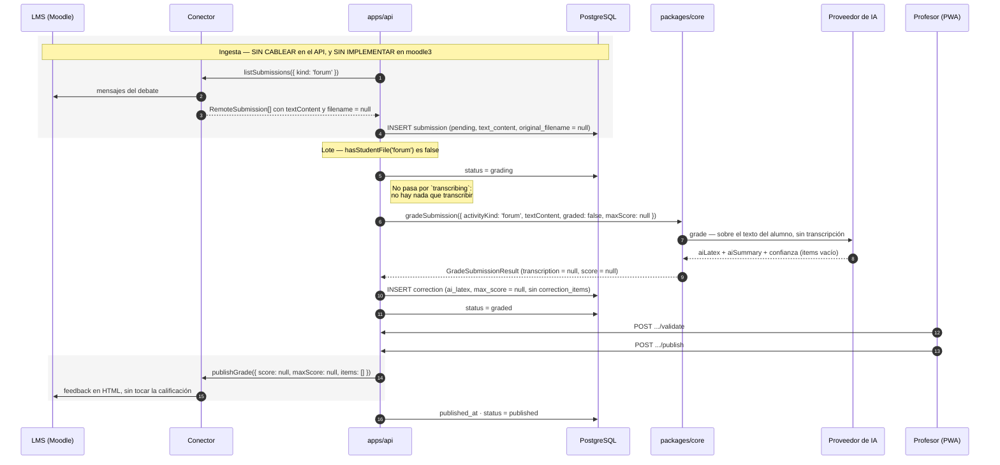
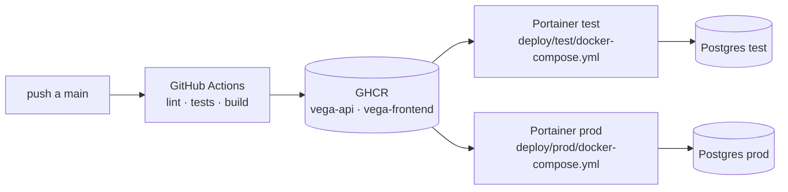

# Arquitectura

## Los dos trabajos

Vega reacciona a **actividades** de Moodle (`Activity`), y hay dos tipos (`ActivityKind`):

| | `assignment` — entrega | `forum` — foro |
|---|---|---|
| Qué manda el alumno | Un fichero (examen escaneado) | Texto escrito en el foro |
| Dónde llega | `submissions.original_filename` + páginas | `submissions.text_content` |
| ¿Transcripción? | Sí: `pending → transcribing → transcribed → grading` | No: `pending → grading` |
| ¿Se puntúa? | Normalmente sí (`graded = true`, `max_score` con valor) | Normalmente no (`graded = false`, `max_score = null`) |
| Qué produce | Apartados en `correction_items` + `corrections.ai_latex` | Sólo `corrections.ai_latex` |
| Qué se publica | Nota y feedback | Feedback, **sin nota** |

Quien decide es `hasStudentFile(kind)` de `@vega/shared`: devuelve `true` sólo para `assignment`, y
es la única bifurcación real del pipeline. Todo lo demás —resolución de contexto, motor, autonomía,
cola de revisión, publicación— es el mismo código para los dos.

**La nota es opcional, no un detalle de configuración.** `graded: boolean` y `maxScore: number |
null` son campos independientes con un `CHECK` que los ata (`activities_graded_needs_max_score`: si
se puntúa, tiene que haber nota máxima). Cuando `graded` es `false` el motor no alinea apartados, no
calcula nota y `RemoteGrade.score` viaja a `null`; el conector de Moodle traduce ese `null` a `-1`,
que es como Moodle representa «sin calificación».

## Vista de componentes



Dos flechas que no son sólidas y conviene leer despacio:

- **`contexts/` no lo lee el API en tiempo de ejecución.** Los Markdown del repositorio los lee el
  script de siembra (`apps/api/src/db/seed.ts`) y los vuelca en la tabla `grading_contexts`. A
  partir de ahí manda la base de datos: `readContextLevel()` consulta la tabla y nada más. Ver
  [`contexts/README.md`](../contexts/README.md).
- **El API todavía no llama a ningún conector.** La interfaz existe y tiene tres implementaciones,
  pero ni la ingesta ni la publicación están cableadas. Ver «Estado real» al final.

**Lo que no aparece en el diagrama a propósito**: no hay cola de mensajes externa, ni Redis, ni
worker separado. El planificador de lotes vive dentro del proceso de `apps/api` y se protege con
`pg_try_advisory_lock`, de modo que si algún día hay dos réplicas sólo una ejecute el lote. Para el
volumen de una academia (decenas de entregas por noche, no miles) una segunda pieza de
infraestructura sería coste sin beneficio. El día que deje de serlo, la frontera por la que partir
ya está dibujada: `packages/core` no depende de Fastify, así que se puede sacar a un proceso propio
sin tocar la lógica.

## Flujo de una entrega, de principio a fin



## Flujo de una intervención de foro

El mismo motor, con dos pasos menos. No hay fichero que descargar, no hay OCR y no hay nota que
publicar.



Detalles que sólo se ven mirando el código:

- **`corrections.ai_latex` es la única salida de una actividad no puntuable.** No hay apartados que
  guardar, así que `correction_items` se queda vacío y `corrections.max_score` a `null`. Todo el
  valor está en el documento redactado. `effectiveLatex()` decide cuál vale: el del profesor si lo
  ha editado, si no el de la IA.
- **La confianza se calcula distinto.** Con transcripción, `overallConfidence()` pondera OCR (0,4) y
  corrección (0,6) y resta 0,05 por cada marca. Sin transcripción no hay nada que ponderar: manda la
  corrección. Y sin apartados que promediar, se usa la confianza que reporta el propio proveedor
  sobre el documento que ha redactado.
- **El PDF de feedback no aplica.** `annotatedFileUrl` se guarda a `null` cuando no hay fichero del
  alumno: no hay original que anteponer a las páginas de corrección.
- **La regla de publicación no cambia.** Un foro pasa por `validated` igual que una entrega, y
  `POST /api/submissions/{id}/publish` responde `409 CONFLICT` si la entrega no está validada. Ver
  [ADR 0004](decisiones/0004-validacion-humana-obligatoria.md).

## Notas sobre el flujo

1. **La transcripción y la corrección son dos llamadas separadas.** Transcribir es un problema de
   visión; corregir es un problema de razonamiento sobre texto. Separarlas permite reintentar sólo
   la parte que falló, cachear el contexto de corrección entre entregas de la misma actividad, y
   —lo más importante— enseñar al profesor la transcripción para que juzgue si la corrección parte
   de una lectura correcta del manuscrito. En un foro sólo hay la segunda llamada.
2. **El lote se ordena por actividad**, no por fecha (`ORDER BY activity_id, submitted_at`). Todas
   las entregas de `tema04` seguidas comparten el mismo prefijo de prompt —los tres niveles de
   contexto—, que es exactamente lo que el prompt caching abarata. Ordenar por fecha invalidaría la
   caché en cada salto de actividad. El contexto resuelto se memoriza además por actividad dentro
   del lote, y el proveedor de IA se instancia una sola vez para todo el lote.
3. **La publicación es un paso explícito**, separado de la validación. Validar es un acto del
   profesor; publicar es una operación de red que puede fallar (LMS caído, token caducado) y se
   puede reintentar sin volver a molestar al profesor.
4. **Nada llega al alumno sin `validated_at`**, salvo por la vía de la autonomía, que es explícita y
   se decide actividad a actividad.
5. **Tope de 25 entregas por ejecución** (`MAX_PER_RUN`), para que un lote lanzado a mano no se coma
   la tarde. Un fallo en una entrega la deja en `error` con el mensaje truncado a 500 caracteres y
   el lote continúa con la siguiente.

## Autonomía por actividad

`AutonomyMode` se guarda en `activities.autonomy` y decide qué pasa con una corrección recién hecha:

| Modo | Qué hace |
|---|---|
| `review_all` | El profesor valida todo. Es el valor por defecto. |
| `review_low_confidence` | Se publica sola si la confianza global supera 0,75 **y** el OCR no dejó ninguna marca. El resto espera en la cola. |
| `autonomous` | Se publica sin intervención. |

La conjunción de `review_low_confidence` no es redundante: una marca `[ILEGIBLE]` significa que hay
papel que nadie ha leído, y eso no se publica sin profesor por muy alta que sea la confianza.

Lo que se publica solo queda marcado (`corrections.published_automatically`) y se cuenta aparte en
el lote (`batch_runs.submissions_auto_published`). El motor añade además un aviso
`autonomy_below_threshold` cuando el modo permitiría publicar sin supervisión pero la confianza
global no da para tanto.

La métrica que dice cuándo una actividad está lista para más autonomía es `avgTeacherDeviation` de
`GET /api/stats/overview`: la desviación media entre lo que propuso la IA y lo que validó el
profesor. Ver [ADR 0008](decisiones/0008-separar-puntos-ia-y-profesor.md).

## Por qué el monorepo está partido así

```
apps/
  api/          servidor Fastify + migraciones SQL + planificador de lotes
  frontend/     PWA React (paquete @vega/frontend, imagen vega-frontend)
packages/
  core/         motor de corrección: transcribir y corregir
  shared/       esquemas Zod, tipos y objeto routes
connectors/
  lms/          la interfaz LmsConnector, el registro y el conector mock
  filesystem/   carpeta local como si fuera un LMS
  moodle3/      Moodle 3.x por web services
contexts/       contextos de corrección en Markdown, versionados con git
deploy/         ficheros compose de test y de producción
docs/           esta carpeta
```

`pnpm-workspace.yaml` declara `apps/*`, `packages/*` y `connectors/*`.

### `packages/shared` — el contrato, no una librería de utilidades

Es el único paquete del que dependen todos los demás, y a propósito no contiene lógica de negocio:
sólo esquemas Zod, los tipos inferidos de ellos, un puñado de funciones puras derivadas del modelo
(`effectivePoints`, `effectiveSource`, `effectiveLatex`, `totalScore`, `hasStudentFile`), las
etiquetas en español (`ACTIVITY_KIND_LABEL`, `AUTONOMY_MODE_LABEL`…) y el objeto `routes`.

El valor está en que **el mismo esquema valida en los dos extremos del cable**. El front no
escribe rutas a mano ni redefine formas de datos; el API valida la entrada contra el mismo objeto
que el front usó para construirla. Un cambio de contrato rompe la compilación en ambos lados a la
vez, que es cuando se quiere que rompa.

La regla que mantiene esto sano: **`shared` no importa nada de `api`, `frontend`, `core` ni
`connectors`.** Si algo necesita ir en la dirección contraria, no pertenece a `shared`.

### `packages/core` — el motor, sin saber que existe la web

`gradeSubmission()` recibe el proveedor de IA, el contexto sin resolver, el reparto de puntos y si
la actividad se puntúa; devuelve transcripción (o `null`), corrección, nota (o `null`), contexto
resuelto, consumo y la lista de avisos de revisión. No conoce Fastify, ni la base de datos, ni el
LMS.

Aquí vive todo lo que es regla de negocio y no puede duplicarse: la normalización a cuartos de punto
(`POINT_STEP`), el emparejamiento de lo que devuelve la IA con el reparto del profesor
(`alignItems`, donde manda el reparto y no la IA), el cálculo de la confianza global y la detección
de lo que el profesor tiene que mirar sí o sí (`detectReviewFlags`).

Tres razones concretas para tenerlo aparte:

- **Se ejecuta por CLI**, que es como se ajustan los prompts sin levantar toda la aplicación ni
  ensuciar la base de datos:

  ```
  pnpm --filter @vega/core cli grade --actividad tema04 --pdf examen.pdf
  pnpm --filter @vega/core cli grade --actividad foro-didactica --tipo foro
  ```

  La CLI lee los contextos directamente de la carpeta `contexts/` (`--contextos <ruta>`), no de la
  base de datos: es el único sitio donde los ficheros del repositorio se usan para corregir de
  verdad.
- **Se testea con el proveedor de IA en modo mock**, sin red y sin coste.
- **Se puede sacar a un proceso propio** si el volumen lo pide, porque la frontera ya está trazada.

### `apps/api` — el que sí sabe de todo

Orquesta: autentica, consulta la base de datos, resuelve el contexto de los tres niveles, llama a
`core`, persiste el resultado, expone HTTP y aplica las migraciones al arrancar. También aloja el
planificador de lotes. Es el único que escribe en Postgres.

Genera además el PDF de feedback al vuelo en `GET /api/submissions/{id}/feedback.pdf`, con `pdf-lib`
(JS puro, para que la imagen del API siga siendo Node sin compilador). **El LaTeX no se compila**:
se vuelca como texto legible y paginado. Cuando haya compilación real sólo cambia
`renderCorrectionPages`.

### `apps/frontend` — mobile-first de verdad

El profesor corrige de pie, entre clases, con una mano. La pantalla de revisión se diseña primero
para 375 px y luego se ensancha, no al revés. Consume exclusivamente el contrato de `shared` y
renderiza LaTeX con KaTeX. Es instalable como PWA.

El paquete se llama `@vega/frontend` y su imagen `vega-frontend`.

### `connectors/` — fuera de `packages/` a propósito

Están al mismo nivel que `apps` y `packages` porque son **puntos de extensión de terceros**: la
invitación es que quien tenga otro LMS añada un directorio aquí, implemente cinco métodos y abra
un PR, sin entender el resto del monorepo. Enterrarlos en `packages/` los haría parecer detalle
interno. Ver [ADR 0006](decisiones/0006-conectores-lms-interfaz-minima.md).

La interfaz `LmsConnector` son cinco operaciones: `listActivities`, `listSubmissions`, `download`,
`publishGrade` y `publishFeedbackFile`. Los tipos que cruzan esa frontera son deliberadamente pobres
(`ActivityRef`, `SubmissionRef`, `RemoteSubmission`, `RemoteGrade`): un conector mueve ficheros,
textos y notas; corregir no es asunto suyo.

Dos decisiones de esa frontera que sostienen el caso del foro:

- `RemoteSubmission.filename` es `nullable` y `RemoteSubmission.textContent` lleva el texto ya
  concatenado del alumno. `download()` sólo tiene sentido en `assignment`; el mock y el conector de
  filesystem lanzan un error explícito si se les pide para un foro.
- `RemoteGrade.score` y `RemoteGrade.maxScore` son `nullable`, e `items` puede venir vacío. Así una
  actividad no puntuable publica feedback sin que el LMS reciba ninguna calificación.

### `contexts/` — en el repositorio, no en la base de datos

Los contextos de corrección son ficheros Markdown versionados con git. El repositorio guarda el
juego por defecto, que es el que `pnpm db:seed` vuelca en la tabla `grading_contexts`. A partir de
ahí, la aplicación lee siempre de la base de datos y la edición desde la UI escribe allí.

El motivo de tener los dos: git da historial, diff y revisión por pares sobre unas instrucciones
que **determinan las notas de los alumnos** — un cambio en `contexts/global.md` es un cambio de
criterio de evaluación y merece el mismo escrutinio que un cambio de código. La base de datos da
edición inmediata desde el móvil, que es lo que el profesor necesita a las once de la noche.

> La reconciliación entre ambos (¿qué gana si el fichero y la fila divergen?, ¿se hace commit
> automático al editar desde la UI?) es una pregunta abierta: ver `HU-06` y
> [`contexts/README.md`](../contexts/README.md).

**Los prompts son el modelo de personalización del producto.** Vega no sabe de matemáticas: sabe de
corregir. Lo que la hace servir a un departamento de lengua o a uno de física está en estos
Markdown, que edita el profesorado. El OCR y KaTeX existen porque hay trabajo manuscrito, no porque
el dominio sea matemático.

## Estado real

Lo que funciona de punta a punta hoy, con `LMS_CONNECTOR=mock` y `AI_PROVIDER=mock`: sembrar,
corregir por lotes (entregas y foros), revisar, editar, validar, publicar (marcándolo en base de
datos) y ver el consumo. Lo que no:

| Qué | Dónde | Estado |
|---|---|---|
| Ingesta desde el LMS | `apps/api` | **Sin cablear.** Ninguna ruta llama a `listSubmissions()` ni a `download()`. Las entregas de desarrollo las crea `pnpm db:seed`. |
| Publicación en el LMS | `routes/submissions.ts` | **Sin cablear.** `POST .../publish` marca `published_at` y el estado, con un `TODO(vega)` donde irían `publishGrade` y `publishFeedbackFile`. |
| Catálogo de actividades de Moodle | `routes/activities.ts` | **Mock.** `GET /api/activities/discover` devuelve una constante `MOODLE_CATALOGUE`. El comentario que dice que `@vega/connector-lms` «todavía no existe» está caduco: el paquete existe y ya no importa `TaskType`. |
| `moodle3` · listar cursos, tareas y foros | `connectors/moodle3` | **Implementado, sin verificar contra un Moodle real.** Usa `core_enrol_get_users_courses`, `mod_assign_get_assignments` y `mod_forum_get_forums_by_courses`. `pendingCount` de una entrega se devuelve a 0 a propósito: contarlo obligaría a bajarse todas las entregas. |
| `moodle3` · leer intervenciones de un foro | `connectors/moodle3` | **Sin implementar.** `listSubmissions()` lanza un error si el `kind` es `forum`. Falta el camino `mod_forum_get_forum_discussions_paginated` + posts de cada debate, concatenados por alumno en `textContent`. Para probar foros hay que usar el conector `mock` o `filesystem`. |
| `moodle3` · subir el PDF de feedback | `connectors/moodle3` | **Sin resolver.** `publishFeedbackFile()` rechaza siempre: Moodle 3 no expone un web service limpio para `assignfeedback_file`. `publishGrade()` sí incluye el feedback en HTML. Es el riesgo conocido del proyecto. |
| Almacén de ficheros | `apps/api` | **Sin implementar.** `activity_files` guarda metadatos y `storage_path` a `null`; los bytes no se guardan. Las páginas escaneadas de la UI son SVG generados al vuelo (`routes/scans.ts`). |
| Compilación de LaTeX | `feedback/pdf.ts` | **Simulada.** Se vuelca el LaTeX como texto legible; el «original del alumno» del PDF se reconstruye a partir de la transcripción y va etiquetado como reproducción. |
| `referenceSolution` | `activities` | **Se guarda y se edita, pero no llega al modelo.** `GradeInput` no tiene ese campo y el lote no lo pasa. Hoy la solución de referencia sólo influye si el profesor la escribe dentro del Markdown de nivel `activity`. |
| `GET /api/health` | `routes/health.ts` | Verifica **sólo la base de datos** (`SELECT 1`, y 503 si falla). `aiProvider` y `lmsConnector` son el valor de configuración, no una comprobación. |

## Despliegue

Dos entornos, **test** y **prod**, cada uno gobernado por su propia instancia de Portainer
apuntando a un fichero compose distinto en `deploy/`. CI/CD publica las imágenes en GHCR y
actualiza los stacks. Los cambios de esquema viajan dentro de la imagen del API: las migraciones
SQL se aplican de forma idempotente al arrancar el contenedor, así que el despliegue no tiene
pasos manuales. Ver [ADR 0002](decisiones/0002-migraciones-sql-planas.md) y
[ADR 0007](decisiones/0007-dos-entornos-portainer.md).



Endpoints de salud para el proxy inverso: `GET /api/health` y `/health.txt` en el front.
