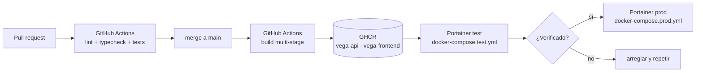

# ADR 0007 — Dos entornos (test y prod) desplegados por dos Portainer contra dos ficheros compose

**Estado**: Aceptado

## Contexto

Vega toca dos cosas que no admiten «probemos en producción»: **notas de alumnos** y **una API de
pago por uso**. Un despliegue con un prompt mal ajustado no rompe una pantalla: publica notas
equivocadas en el LMS, o quema saldo corrigiendo mal un lote entero de madrugada.

Hace falta un sitio donde probar cambios de prompt, de contexto y de conector con datos que no
importan, y donde el proveedor de IA pueda estar en `mock`.

El contexto de infraestructura es el de una academia, no el de una plataforma: servidores propios
o VPS, gestión con **Portainer**, sin Kubernetes, sin operador de GitOps, sin plataforma de
release. Y la persona que administra no es necesariamente quien programa.

## Decisión

**Dos entornos independientes, cada uno gobernado por su propia instancia de Portainer apuntando a
su propio fichero compose del repositorio. CI/CD publica las imágenes y dispara la actualización
de los stacks.**

| | test | prod |
|---|---|---|
| Fichero | `deploy/docker-compose.test.yml` | `deploy/docker-compose.prod.yml` |
| Portainer | instancia de test | instancia de producción |
| Base de datos | Postgres propio, datos de prueba | Postgres propio, datos reales |
| `AI_PROVIDER` | `mock` por defecto; `anthropic` a demanda para validar prompts | `anthropic` |
| `LMS_CONNECTOR` | `mock` o `filesystem` | `moodle3` |
| Imágenes | mismo tag que prod, desplegado antes | tag promovido tras verificar test |

Reglas que sostienen la decisión:

1. **Los dos ficheros compose están en el repositorio** y se revisan como código. Portainer no es
   la fuente de verdad de la configuración; el repositorio lo es.
2. **La única diferencia entre entornos es el entorno**: variables y volúmenes. Misma imagen, mismo
   esquema, mismo código. Si test y prod difieren en algo más, la prueba en test no prueba nada.
3. **Ningún secreto vive en los ficheros compose.** Van por variables de entorno gestionadas en
   cada Portainer.
4. **Las migraciones se aplican solas al arrancar** (ADR 0002), así que desplegar es cambiar el tag
   de la imagen. No hay paso manual de base de datos, ni orden entre pasos que equivocar.
5. **Prod nunca recibe un tag que no haya pasado por test.** La promoción es explícita.
6. **Prod y test nunca comparten Postgres ni credenciales de LMS.** Un conector `moodle3` apuntando
   al Moodle real desde test escribiría notas reales: por eso el conector por defecto de test es
   `mock` o `filesystem`.

## Consecuencias

**A favor**

- Hay un lugar seguro para probar cambios de prompt y de contexto sobre entregas reales
  anonimizadas, con `AI_PROVIDER=mock` o con gasto acotado.
- La entrega mockeada del proyecto tiene dónde vivir y enseñarse al cliente: es test con todo en
  mock.
- Quien administra la infraestructura ve un stack de Portainer y un compose legible, no una capa de
  herramientas que no conoce.
- Un problema de despliegue (variable que falta, volumen mal montado) aparece en test.
- El rollback es cambiar el tag de la imagen al anterior. Con la salvedad del punto siguiente.

**En contra**

- **El rollback de imagen no revierte el esquema.** Si la versión N aplicó una migración, volver a
  N-1 deja una base de datos por delante del código. Es la razón operativa por la que las
  migraciones son sólo aditivas y no borran datos (ADR 0002). Hay que asumirlo de forma explícita:
  el rollback es seguro **porque las migraciones se escriben para que lo sea**, no por arte de
  magia.
- **Dos Portainer son dos sitios donde configurar variables**, y desincronizarlos es fácil. Se
  mitiga con `.env.example` como referencia única y con la exposición del conector y el proveedor
  activos en `GET /api/health`, que permite verificar de un vistazo qué está corriendo cada
  entorno.
- El paso de test a prod es **manual**. Es lento a propósito: el freno humano antes de tocar notas
  reales es el mismo principio del ADR 0004.
- Dos entornos son dos Postgres, dos copias de seguridad y dos certificados. Coste de
  infraestructura y de mantenimiento asumido.
- Test acumula datos basura. Se admite recrearlo desde cero: la migración inicial se ejecuta sobre
  una base vacía sin problemas.
