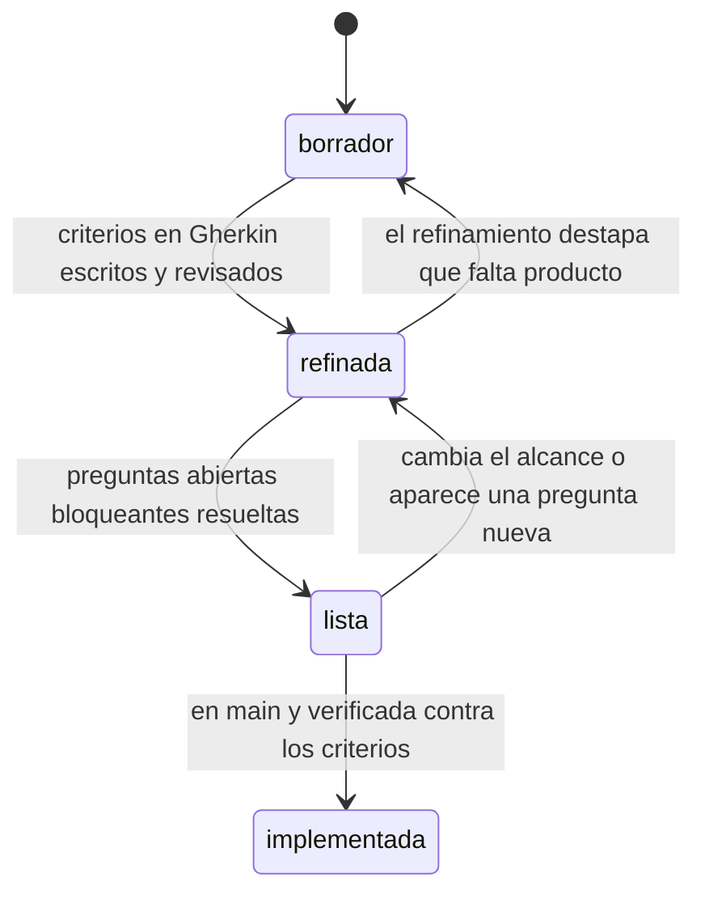
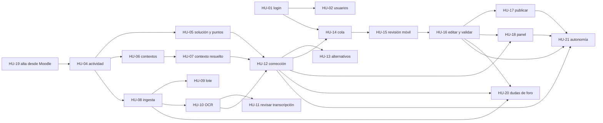

# Historias de usuario

Esta carpeta es el documento vivo del producto. Aquí se discute **qué hace Vega**, no cómo está
programado. Se edita a menudo y a propósito: cada HU lleva al final una sección de *Preguntas
abiertas* que es el orden del día de las sesiones de refinamiento.

## Cómo se organizan

- **Un fichero por HU**, con la convención `HU-XX-nombre-corto.md`.
  - `XX` es correlativo de dos dígitos y **no se reutiliza nunca**. Si una HU se descarta, su
    número muere con ella.
  - `nombre-corto` en minúsculas, sin acentos, separado por guiones.
- **Las HU no se renumeran** al reordenar el backlog. El orden lo da la prioridad, no el número.
- **Una HU cabe en una entrega.** Si al refinarla resulta que no cabe, se parte en dos con números
  nuevos y la original se marca como sustituida.
- [`_plantilla.md`](_plantilla.md) es la plantilla en blanco. Se copia para cada HU nueva.

## Ciclo de vida de una HU

| Estado | Qué significa | Qué falta para pasar al siguiente |
|---|---|---|
| **borrador** | Existe la narrativa y una idea del alcance. Los criterios pueden estar incompletos | Escribir los criterios en Gherkin y las reglas de negocio |
| **refinada** | Criterios completos y verificables. Puede quedar alguna pregunta abierta | Resolver las preguntas abiertas **marcadas como bloqueantes** |
| **lista** | Nada impide empezar a implementarla | Implementarla y verificar los criterios uno a uno |
| **implementada** | Está en `main` y sus criterios se han comprobado | — |

Una HU en **lista** puede seguir teniendo preguntas abiertas: las no bloqueantes se resuelven
durante o después de la implementación. Lo que no puede tener es un criterio de aceptación que
nadie sepa cómo verificar.

## Prioridad (MoSCoW)

| Sigla | Significado |
|---|---|
| **Must** | Sin esto no hay producto. El circuito entrega → corrección → validación → publicación no se cierra |
| **Should** | Importante, pero el circuito funciona sin ello a costa de trabajo manual |
| **Could** | Mejora real; se cae del alcance sin drama si aprieta el calendario |
| **Won't** | Decidido explícitamente que no entra en esta versión. Se documenta para que no se vuelva a proponer |

## La primera entrega es mockeada

La primera entrega desplegable es **front + back + UI completos con todo mockeado**:
`AI_PROVIDER=mock` y `LMS_CONNECTOR=mock` (ver [ADR 0005](../decisiones/0005-proveedor-ia-intercambiable.md)
y [ADR 0006](../decisiones/0006-conectores-lms-interfaz-minima.md)). Sirve para cerrar el diseño
del producto con el cliente antes de gastar un euro en tokens y antes de tocar el Moodle real.

La columna **Mock** del índice dice qué queda cubierto en esa entrega:

| Valor | Significado |
|---|---|
| **Sí** | Funcionalidad completa y real en la entrega mockeada. Los datos son simulados; la lógica es la definitiva |
| **Parcial** | Todas las pantallas y el contrato existen y funcionan contra datos simulados, pero la integración real (modelo de IA, LMS, planificador) queda pendiente |
| **No** | No entra. Ni siquiera la pantalla |

## Índice

| HU | Título | Épica | Estado | Prioridad | Est. | Mock |
|---|---|---|---|---|---|---|
| [HU-01](HU-01-inicio-de-sesion.md) | Inicio de sesión y sesión persistente | Acceso y usuarios | refinada | Must | 3 | **Sí** |
| [HU-02](HU-02-gestion-de-usuarios.md) | Alta y gestión de usuarios | Acceso y usuarios | borrador | Should | 5 | Parcial |
| [HU-03](HU-03-ajustes-y-estado.md) | Ajustes y estado del sistema | Acceso y usuarios | borrador | Could | 2 | **Sí** |
| [HU-04](HU-04-configuracion-de-actividad.md) | Configuración de una actividad | Actividades y contexto | refinada | Must | 5 | **Sí** |
| [HU-05](HU-05-solucion-referencia-y-reparto.md) | Solución de referencia y reparto de puntos | Actividades y contexto | refinada | Must | 5 | **Sí** |
| [HU-06](HU-06-editor-contextos-tres-niveles.md) | Editor de contextos de corrección | Actividades y contexto | borrador | Must | 8 | **Sí** |
| [HU-07](HU-07-contexto-efectivo-resuelto.md) | Ver el contexto efectivo de una actividad | Actividades y contexto | refinada | Should | 2 | Parcial |
| [HU-08](HU-08-ingesta-de-entregas.md) | Ingesta de entregas desde el conector | Ingesta | borrador | Must | 8 | Parcial |
| [HU-09](HU-09-lote-nocturno.md) | Lote nocturno de procesamiento | Ingesta | borrador | Should | 8 | Parcial |
| [HU-10](HU-10-transcripcion-ocr.md) | Transcripción del manuscrito a LaTeX | Transcripción | borrador | Must | 13 | Parcial |
| [HU-11](HU-11-revision-de-transcripcion.md) | Revisar la transcripción y reprocesar | Transcripción | borrador | Should | 8 | No |
| [HU-12](HU-12-propuesta-de-correccion.md) | Propuesta de corrección por apartados | Corrección | borrador | Must | 13 | Parcial |
| [HU-13](HU-13-metodos-alternativos-y-confianza.md) | Métodos alternativos y confianza | Corrección | borrador | Should | 5 | Parcial |
| [HU-14](HU-14-cola-de-revision.md) | Cola de revisión | Revisión y validación | refinada | Must | 5 | **Sí** |
| [HU-15](HU-15-pantalla-revision-movil.md) | Pantalla de revisión en el móvil | Revisión y validación | refinada | Must | 13 | **Sí** |
| [HU-16](HU-16-edicion-y-validacion.md) | Editar puntuaciones y validar | Revisión y validación | refinada | Must | 8 | **Sí** |
| [HU-17](HU-17-publicacion-en-lms.md) | Publicar nota y PDF de feedback | Publicación | borrador | Must | 13 | No |
| [HU-18](HU-18-panel-coste-y-desviacion.md) | Panel de coste y desviación | Observabilidad y coste | borrador | Should | 8 | Parcial |
| [HU-19](HU-19-alta-de-actividades-desde-moodle.md) | Alta de actividades desde Moodle | Actividades y contexto | borrador | Must | 8 | No |
| [HU-20](HU-20-respuesta-a-dudas-de-foro.md) | Respuesta a dudas de foro | Corrección | borrador | Must | 8 | Parcial |
| [HU-21](HU-21-modos-de-autonomia.md) | Modos de autonomía por actividad | Revisión y validación | borrador | Should | 8 | Parcial |

**Estimación** en puntos de historia, escala Fibonacci (1, 2, 3, 5, 8, 13). Total: 145 puntos.
No es un compromiso de plazo; es una medida de tamaño relativo para poder discutir el orden.

### Reparto por épica

| Épica | HU | Must | Should | Could |
|---|---|---|---|---|
| Acceso y usuarios | 01, 02, 03 | 1 | 1 | 1 |
| Actividades y contexto de corrección | 04, 05, 06, 07, 19 | 4 | 1 | — |
| Ingesta | 08, 09 | 1 | 1 | — |
| Transcripción | 10, 11 | 1 | 1 | — |
| Corrección | 12, 13, 20 | 2 | 1 | — |
| Revisión y validación | 14, 15, 16, 21 | 3 | 1 | — |
| Publicación | 17 | 1 | — | — |
| Observabilidad y coste | 18 | — | — | 1 |

### Alcance de la entrega mockeada

**Dentro** (todas las pantallas navegables, contrato completo, datos simulados):
HU-01, HU-03, HU-04, HU-05, HU-06, HU-14, HU-15, HU-16 al 100 %; HU-07, HU-08, HU-09, HU-10,
HU-12, HU-13 y HU-18 con la UI y el contrato terminados y la integración real pendiente.

**Fuera**: HU-11 (edición de transcripción, que además exige ampliar el contrato) y HU-17
(publicación real en Moodle 3, que arrastra el riesgo conocido de `assignfeedback_file`).

El criterio: la entrega mockeada tiene que permitir al cliente **recorrer el circuito completo**
—ver la cola, abrir una entrega, leer la transcripción, ajustar puntuaciones, validar— y decir si
el producto es el que quiere. Lo que se deja fuera es lo que no cambia esa conversación.

## Dependencias entre HU

## Cómo escribir una HU aquí

- **Gherkin verificable.** Cada `Entonces` tiene que poder comprobarlo alguien que no haya escrito
  la HU. «El sistema responde `409 CONFLICT`» sirve; «el sistema se comporta correctamente» no.
- **Nombres reales.** Estados, entidades y campos se escriben como se llaman en `@vega/shared`:
  `graded`, no «corregida»; `teacherPoints`, no «nota del profesor». Las etiquetas en español
  están en `SUBMISSION_STATUS_LABEL` y son para la UI, no para la especificación.
- **Las reglas de negocio se numeran** (`RN-1`, `RN-2`…) para poder citarlas desde los criterios y
  desde las conversaciones.
- **Los casos límite dicen qué se hace**, no sólo que existen.
- **Fuera de alcance es una sección obligatoria.** Escribir lo que la HU no hace evita la mitad de
  las discusiones.
- **Las preguntas abiertas son preguntas de verdad**, con opciones y con consecuencias. Si la
  respuesta es obvia, no es una pregunta abierta: es una regla de negocio que faltaba escribir. Se
  marcan **`[bloqueante]`** cuando impiden pasar la HU a *lista*.
