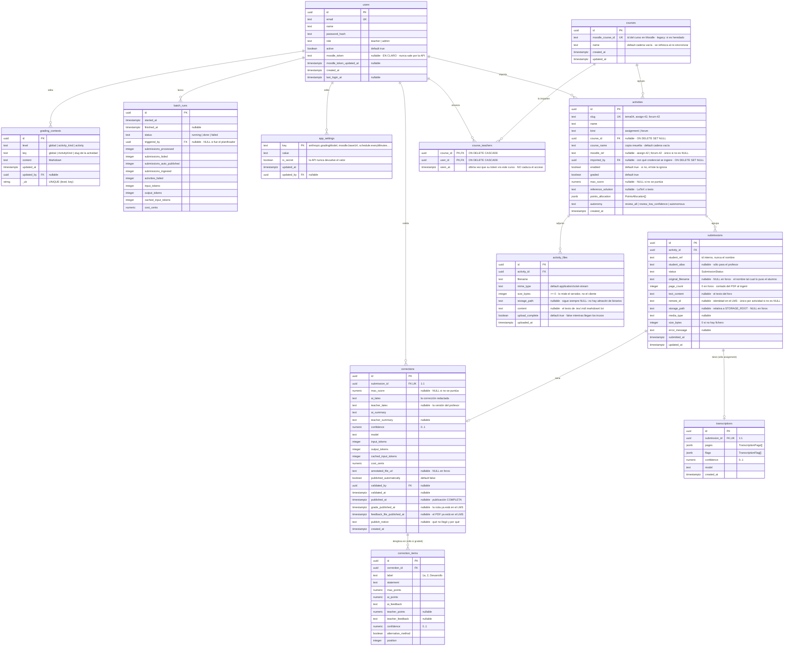
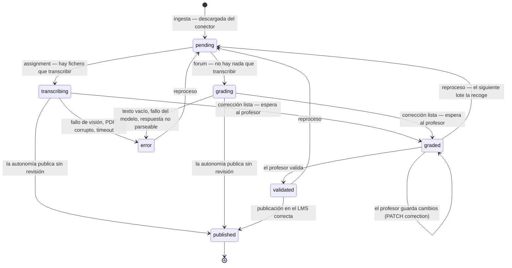

# Modelo de datos

Derivado de las migraciones de `apps/api/migrations/` —de `0001_init.sql` a
`0005_ingesta_y_publicacion.sql`— y de `packages/shared/src/domain.ts`. El SQL manda: si algo aquí no cuadra con
las migraciones, el error está en este documento.

`0002_activities.sql` cambió el eje del modelo. Los antiguos «buzones» son ahora **actividades de
Moodle** de dos tipos —entrega (`assignment`) y foro (`forum`)—, la nota pasó a ser opcional y cada
actividad lleva su grado de autonomía. `mailboxes` y `task_type` no existen: la migración renombra
en lugar de recrear, de modo que el despliegue aplica el cambio sobre una base ya poblada sin pasos
manuales.

`0003_courses.sql` añadió tres cosas que H2 necesitaba y la 0002 no dejaba resueltas:

1. **El curso deja de ser texto libre.** Tabla `courses`, con `activities.course_id` apuntando a
   ella. Sobre una cadena que Moodle puede renombrar no se construye un selector: renombrar partía
   el grupo en dos y dos cursos homónimos se mezclaban.
2. **`moodle_ref` gana prefijo de tipo e índice único parcial.** Una tarea con id 5 y un foro con id
   5 producían el mismo `moodle_ref` y el mismo `slug`, y la segunda importación se perdía en
   silencio por el `ON CONFLICT DO NOTHING`. Era pérdida de datos, no una carencia.
3. **El token de Moodle pasa a ser de cada usuario** (`users.moodle_token`), y
   `app_settings.moodle.token` **se borra**. Ver
   [ADR 0010](decisiones/0010-credencial-moodle-por-usuario.md).

`0004_course_access.sql` añadió **quién ve qué**. Hasta entonces `GET /api/activities` devolvía
todas las actividades a cualquier usuario autenticado y el `PATCH` dejaba a un profesor editar la de
otro; con las actividades iban las entregas, que llevan trabajo de alumnos concretos. La tabla
`course_teachers` vuelve a poner esa frontera dentro de Vega. El alcance es **por curso**, no por
quién importó la actividad: en un curso co-impartido, atarlo a quien pulsó el botón dejaría al otro
profesor sin ver media asignatura.

`0005_ingesta_y_publicacion.sql` es la que convierte al conector en algo más que un catálogo. Trae
cuatro cosas, todas exigidas por la ingesta y la publicación reales ([ADR 0012](decisiones/0012-ingesta-almacen-y-publicacion-en-dos-fases.md)):

1. **Dónde vive el fichero del alumno.** `submissions.storage_path` (relativa a `STORAGE_ROOT`),
   `media_type` y `size_bytes`. Antes no había ninguna: el lote fabricaba rutas falsas que sólo el
   proveedor de IA simulado toleraba.
2. **`submissions.remote_id` con índice único parcial `(activity_id, remote_id)`.** Es lo que
   deduplica los foros, donde la clave natural no protege nada. Cada duplicado se pagaría en tokens.
3. **La publicación en dos marcas**: `corrections.grade_published_at` y
   `feedback_file_published_at`, más `publish_notice`. `published_at` pasa a significar
   «publicación completa». Sin esto, un reintento tras un fallo parcial republicaría la nota.
4. **La ingesta se mide**: `batch_runs.submissions_ingested` y `activities_failed`. Sin ellos, «no
   había nada que corregir» y «no ha entrado nada» son el mismo cero.

Como la 0002, todo con `ALTER` e idempotente.

Las migraciones se aplican al arrancar el contenedor del API y quedan registradas con su suma de
comprobación en `_vega_migrations`, tabla de fontanería que no forma parte del dominio.

## Diagrama entidad-relación



> **`app_settings` es de la instalación; el token de Moodle no está aquí.** La clave `moodle.token`
> existió y la migración `0003` la **borra**, en vez de migrarla a alguien: no hay forma de saber de
> quién era y adjudicársela a un usuario al azar le daría los cursos de otro. Lo que queda en
> `app_settings` es `moodle.baseUrl` y `moodle.connector`, que sí son de instalación. El token vive
> en `users.moodle_token` porque `core_enrol_get_users_courses` devuelve los cursos del dueño del
> token, y por tanto la credencial decide qué cursos ve cada profesor.

`grading_contexts` aparece sin arista hacia `activities` porque la relación es lógica, no
referencial:

- `grading_contexts.key` apunta al `ActivityKind` o al `activities.slug` según el nivel. **No hay FK
  a propósito**: un contexto de actividad puede existir antes de que la actividad se cree (por
  ejemplo, el que viene del repositorio en `contexts/activities/`), y borrar una actividad no debe
  llevarse por delante unas instrucciones que costaron escribir.
- `batch_runs` agrega el consumo de una ejecución; qué entregas procesó se deduce por ventana
  temporal. Si esa trazabilidad hace falta, requiere una columna `batch_run_id` en `submissions` y
  una migración nueva — está en las preguntas abiertas de `HU-09`.

## Cardinalidades y restricciones que importan

| Regla | Dónde vive | Consecuencia |
|---|---|---|
| Una actividad puntuable **necesita** nota máxima | `CHECK activities_graded_needs_max_score` | No hay actividades a medio configurar. La API valida lo mismo antes, para devolver un 422 explicable en vez de un error de Postgres en crudo. |
| La nota máxima, si existe, es positiva | `CHECK activities_max_score_check` | `max_score IS NULL OR max_score > 0`. En `corrections`, igual. |
| Sólo dos tipos de actividad y tres autonomías | `CHECK activities_kind_check`, `activities_autonomy_check` | Añadir un tipo o un modo es una migración, no un despliegue. |
| No se importa dos veces la misma actividad de Moodle | `UNIQUE INDEX activities_moodle_ref_key ... WHERE moodle_ref IS NOT NULL` | Índice **parcial** a propósito: dos actividades locales (`moodle_ref` a `NULL`) no colisionan entre sí. Con el prefijo de tipo, `assign-5` y `forum-5` son dos actividades distintas. |
| Un curso de Moodle está una sola vez | `courses.moodle_course_id UNIQUE` | Es lo que permite refrescar el nombre al re-sincronizar en vez de crear un curso nuevo. Los cursos rescatados de antes de la 0003 llevan un id sintético `legacy:<nombre>`. |
| Borrar un curso no borra sus actividades | `activities.course_id ... ON DELETE SET NULL` | La actividad se queda sin curso, con su `course_name` copiado. Nada borra cursos automáticamente. |
| Borrar al profesor que importó no borra la actividad | `activities.imported_by ... ON DELETE SET NULL` | La actividad sobrevive a quien la importó, pero **su ingesta se queda sin credencial**. Es otra razón para desactivar usuarios en lugar de borrarlos. |
| Un profesor sólo alcanza sus cursos | `course_teachers (course_id, user_id)` PK, más `activities.imported_by` como respaldo | Se aplica en `apps/api/src/auth/scope.ts`, en un solo sitio, para que ninguna ruta se olvide. Un `admin` no se filtra por nada. Pedir la actividad de otro devuelve **403, no 404**. |
| Quitar a un profesor de un curso borra su acceso, no el curso | `course_teachers ... ON DELETE CASCADE` en las dos columnas | Y al revés: dar de baja al usuario le retira el acceso. **Nada limpia la tabla automáticamente**: el acceso se anota al listar cursos y no caduca, para que un Moodle caído o un token expirado no dejen a nadie sin poder validar lo que ya está en Vega. |
| Una entrega tiene **como mucho una** transcripción | `transcriptions.submission_id UNIQUE` | Reprocesar sustituye, no acumula. No hay historial de transcripciones. |
| Una entrega tiene **como mucho una** corrección | `corrections.submission_id UNIQUE` | Ídem: no hay historial de correcciones. El lote borra la anterior antes de insertar. |
| No se importa dos veces la misma entrega | `UNIQUE (activity_id, student_ref, original_filename)` **y** `UNIQUE (activity_id, remote_id) WHERE remote_id IS NOT NULL` | La ingesta es idempotente en los dos tipos de actividad. La segunda, parcial, es la que cubre los foros. Ver el aviso de abajo. |
| Borrar una actividad borra sus entregas y sus ficheros | `ON DELETE CASCADE` | Y en cascada, transcripciones y correcciones. Operación destructiva. |
| Borrar un usuario no borra lo que validó, lanzó o configuró | `validated_by`, `triggered_by`, `updated_by` … `ON DELETE SET NULL` | Se pierde el quién, no el qué. Por eso los usuarios se **desactivan** (`active = false`) en lugar de borrarse. |
| Los puntos nunca son negativos | `CHECK (ai_points >= 0)`, `CHECK (teacher_points >= 0)` | No existe la penalización con puntos negativos a nivel de apartado. |
| Las confianzas están en `[0, 1]` | `CHECK (confidence BETWEEN 0 AND 1)` | En transcripción, corrección y apartado. |
| El coste se guarda en céntimos | `cost_cents numeric(10,4)` | Nada de flotantes para dinero. `UsageMetrics.costCents`. |
| Una subida a medias no existe para nadie | `activity_files.upload_complete` | Todas las consultas de ficheros filtran por `upload_complete = true`, así que una subida cortada ni se lista ni entra en el contexto ni acaba en un prompt. Las huérfanas se barren tras una hora, al empezar otra subida en la misma actividad. **Salvo un hueco**: `GET /api/contexts/resolved/{id}` lee el `content` de todas las filas sin filtrar por esta columna. |

> **La clave natural no protegía los foros, y por eso hay una segunda.** `original_filename` dejó de
> ser `NOT NULL` en la migración `0002`, y en PostgreSQL dos `NULL` no colisionan en un índice único
> (`NULLS DISTINCT` es el comportamiento por defecto): en un foro esa columna siempre es `NULL`, así
> que ese índice **no deduplicaba nada** ahí. La `0005` añade
> `UNIQUE (activity_id, remote_id) WHERE remote_id IS NOT NULL`, que expresa la identidad real —la
> decide el sistema de origen, no el nombre del fichero—. **Las dos conviven**: `ON CONFLICT DO
> NOTHING` sin `target` respeta ambas. Ver [ADR 0012](decisiones/0012-ingesta-almacen-y-publicacion-en-dos-fases.md).
>
> Lo que sigue sin resolver son las **reentregas**: quien vuelve a subir un fichero con el mismo
> nombre no crea entrega nueva y su versión buena se pierde en silencio (HU-08, pregunta abierta 1).

### Lo que el esquema *no* impone

- **`SUM(points_allocation.maxPoints)` no tiene por qué ser `max_score`.** Es deliberado
  (`domain.ts` lo dice explícitamente): hay enunciados con apartados opcionales. El motor emite un
  aviso `allocation_mismatch`; no lo bloquea.
- **`SUM(correction_items.max_points)` tampoco.** Y por tanto la nota total efectiva puede superar
  `max_score` si el profesor sube puntuaciones sin criterio. La API sí impide que un apartado
  concreto pase de su propio `max_points`.
- **Nada obliga a que una actividad no puntuable tenga la corrección sin apartados.** Que `items`
  venga vacío cuando `graded = false` lo garantiza el motor y lo defiende la API (un `PATCH` con
  puntos sobre una actividad no puntuable devuelve 422), pero no hay `CHECK` que lo imponga.
- **Nada relaciona `submissions.text_content` con el tipo de actividad.** Que un `assignment` traiga
  fichero y un `forum` traiga texto es responsabilidad del conector y del lote, no del esquema.
- **No hay transiciones de estado en la base de datos.** El `CHECK` de `submissions.status` sólo
  valida el conjunto de valores, no el orden. La máquina de estados se hace cumplir en `apps/api`.
- **Nada impide un `activity_files.content` a `NULL` con `upload_complete = true`.** Es justo el
  caso de un binario: nace cerrado y sin contenido, porque no hay trozos que esperar. Qué extensiones
  guardan contenido lo decide `isTextFile()` en `@vega/shared` (`.tex`, `.md`, `.markdown`, `.txt`),
  no el esquema. **Los binarios no se almacenan en ningún sitio**: `storage_path` sigue siendo
  siempre `NULL`.

## Ciclo de vida de una entrega

El camino depende del tipo de actividad, y eso lo decide `hasStudentFile(kind)`: **sólo un
`assignment` pasa por transcripción**. Un foro va de `pending` directo a `grading`.



`transcribing` y `grading` son **el mismo paso visto desde fuera**: el lote los escribe al empezar a
procesar una entrega y no vuelve a tocar el estado hasta tener la corrección guardada. Por eso no
hay arista de `transcribing` a `grading`.

> **Un estado que ninguna ejecución real alcanza.** `transcribed` figura en `SubmissionStatus`, en el
> `CHECK` de la tabla, en `SUBMISSION_STATUS_LABEL` y en los recuentos de la cola, pero el lote nunca
> lo escribe: encadena transcripción y corrección dentro de la misma operación y salta de
> `transcribing` a `graded`. Sólo aparece porque el seed de demostración lo siembra para que la cola
> tenga ejemplos de todos los estados. Y `grading` es real, pero únicamente en el camino del foro.
> Ambos son restos de un circuito por pasos separados; mientras el lote sea una sola función, la
> entrega con fichero no los necesita.

### Qué dispara cada transición

| Origen | Destino | Disparador | Efecto en datos |
|---|---|---|---|
| — | `pending` | Ingesta desde el conector | `INSERT submissions`; fichero y `page_count` en un `assignment`, `text_content` en un `forum` |
| `pending` | `transcribing` | El lote toma una entrega de actividad `assignment` | `status`, `updated_at` |
| `pending` | `grading` | El lote toma una entrega de actividad `forum` | `status`, `updated_at` |
| `transcribing` / `grading` | `graded` | `gradeSubmission()` termina y la autonomía decide `review` | `INSERT corrections` (+ `correction_items` si se puntúa), `INSERT transcriptions` si hubo fichero, `usage` |
| `transcribing` / `grading` | `published` | Ídem, pero la autonomía decide `publish` | Lo anterior más `published_at` y `published_automatically = true`. **Sin `validated_at`** |
| `graded` | `graded` | `PATCH /api/submissions/{id}/correction` | `teacher_points`, `teacher_feedback`, `teacher_summary`, `teacher_latex`. **No** toca `validated_*` |
| `graded` | `validated` | `POST /api/submissions/{id}/validate` | Guarda los cambios pendientes + `validated_by`, `validated_at` |
| `validated` | `published` | `POST /api/submissions/{id}/publish` con éxito en el conector | `published_at`, `grade_published_at`, `feedback_file_published_at` si procede, `published_automatically = false` |
| `validated` / `error` | `error` | Falla `publishGrade`: no ha llegado nada al alumno | `error_message`. Se reintenta sin volver a validar |
| cualquiera | `error` | Excepción no recuperable en el paso en curso | `error_message` con texto legible en español |
| cualquiera salvo `published` | `pending` | `POST /api/submissions/{id}/reprocess` | Limpia `error_message`. El siguiente lote la recoge y **sustituye** transcripción y corrección |

### Invariantes de estado

1. `status = 'graded'` implica que existe fila en `corrections`. Con al menos un `correction_item`
   **sólo si la actividad se puntúa**: en una no puntuable la corrección es únicamente `ai_latex`.
2. `status = 'validated'` implica `corrections.validated_at IS NOT NULL` y `validated_by IS NOT NULL`.
3. `status = 'published'` implica `published_at IS NOT NULL`. **No implica `validated_at`**: una
   publicación autónoma se salta la validación y se distingue por
   `published_automatically = true`. Por la ruta manual (`POST .../publish`) la validación previa
   sigue siendo obligatoria y se comprueba en el API.
4. `status = 'error'` implica `error_message IS NOT NULL`.
5. `published` es terminal. No se puede editar la corrección, ni validar, ni reprocesar; las tres
   rutas devuelven 409. Republicar exige reabrir explícitamente, y eso no está resuelto — ver
   preguntas abiertas de `HU-17`.
6. `REVIEWABLE_STATUSES = ['graded', 'validated', 'error']` es lo que la cola muestra por defecto.
   `pending`, `transcribing`, `transcribed` y `grading` son estados de máquina: se ven filtrando
   explícitamente, no en la bandeja de trabajo del profesor.
7. `transcriptions` sólo tiene filas de entregas de actividades `assignment`. En un foro,
   `SubmissionDetail.transcription` y `scanUrls` vienen vacíos por contrato.

## Correspondencia SQL ↔ TypeScript

El SQL usa `snake_case`; el contrato HTTP, `camelCase`. La capa de acceso a datos traduce
(`apps/api/src/db/mappers.ts`).

| Tabla | Tipo de `@vega/shared` | Observaciones |
|---|---|---|
| `users` | `User` | `password_hash` y `moodle_token` **nunca** salen por la API; el token se resume en el booleano `moodleTokenConfigured` |
| `courses` | `Course` / `DiscoveredCourse` | `Course` es la fila guardada; `DiscoveredCourse` es lo que devuelve el LMS antes de guardarla, y añade `shortName`, que no se persiste |
| `course_teachers` | — | **No tiene tipo en el contrato**: no se expone. Es la regla de alcance, y actúa filtrando lo que devuelven las demás rutas |
| `activities` | `Activity` | `points_allocation` (jsonb) ↔ `PointsAllocation[]`; los ficheros adjuntos se cargan aparte y se sirven en `files`. `imported_by` **no se expone**: es fontanería de la ingesta, no información del profesor |
| `activity_files` | `ActivityFile` | `storage_path` sigue siempre a `null` (los ficheros de contexto binarios no tienen almacén) y no se expone; en su lugar la API calcula `url`. `content` tampoco: se resume en `hasContent` (`content IS NOT NULL`) y se lee aparte con `GET .../content` |
| `submissions` | `Submission` | `remote_id`, `storage_path`, `media_type` y `size_bytes` **no se exponen**: son fontanería de la ingesta. El resto, 1:1 |
| `transcriptions` | `Transcription` | `pages` y `flags` son jsonb ↔ `TranscriptionPage[]` / `TranscriptionFlag[]` |
| `corrections` | `Correction` | Las cuatro columnas de consumo se agrupan en `usage: UsageMetrics`; los apartados llegan en `items`. De las tres columnas de publicación sólo sale `publish_notice`: las dos fechas parciales son internas |
| `correction_items` | `CorrectionItem` | Se sirven ordenados por `position` |
| `grading_contexts` | `GradingContext` | |
| `batch_runs` | `BatchRun` | Mismo agrupamiento de `usage` |
| `app_settings` | `AppSettings` | **No es 1:1**: la tabla es clave/valor plana y el DTO va anidado (`anthropic.apiKey` ↔ `{ anthropic: { … } }`). Los valores con `is_secret` se sustituyen por un booleano `…Configured` |

Las fechas se guardan como `timestamptz` y viajan como ISO 8601 con offset (`IsoDate`). Los
`numeric` se serializan como `number` —el driver los entrega como cadena para no perder precisión y
el mapeador los convierte una sola vez—; los importes en céntimos con hasta cuatro decimales.

## Cálculos derivados

No se persisten: se calculan a partir de los items, siempre con las funciones de `domain.ts`.

```ts
effectivePoints(item)  = item.teacherPoints ?? item.aiPoints
effectiveSource(item)  = item.teacherPoints === null ? 'ai' : 'teacher'
totalScore(items)      = redondeo a 2 decimales de la suma de effectivePoints
effectiveLatex(corr)   = corr.teacherLatex ?? corr.aiLatex
```

En una actividad no puntuable `items` está vacío, así que `totalScore` da 0 y **no significa un
cero**: significa que no hay nota. La cola lo respeta y devuelve `score: null` cuando
`activities.graded` es `false`, aunque la agregación SQL sume cero apartados.

Las dos métricas del panel (`OverviewResponse`), ambas sobre correcciones ya validadas:

- `avgTeacherDeviation` — media de `SUM(effectivePoints) - SUM(aiPoints)` por corrección. Positiva
  significa que el profesor sube la nota respecto a la IA.
- `untouchedRatio` — proporción de correcciones validadas que el profesor no tocó en absoluto: ni
  puntos, ni feedback de apartado, ni resumen, ni LaTeX. Es la señal de que una actividad se puede
  pasar a un modo con más autonomía. Sin correcciones validadas vale 0, que aquí significa «aún no
  sabemos».
