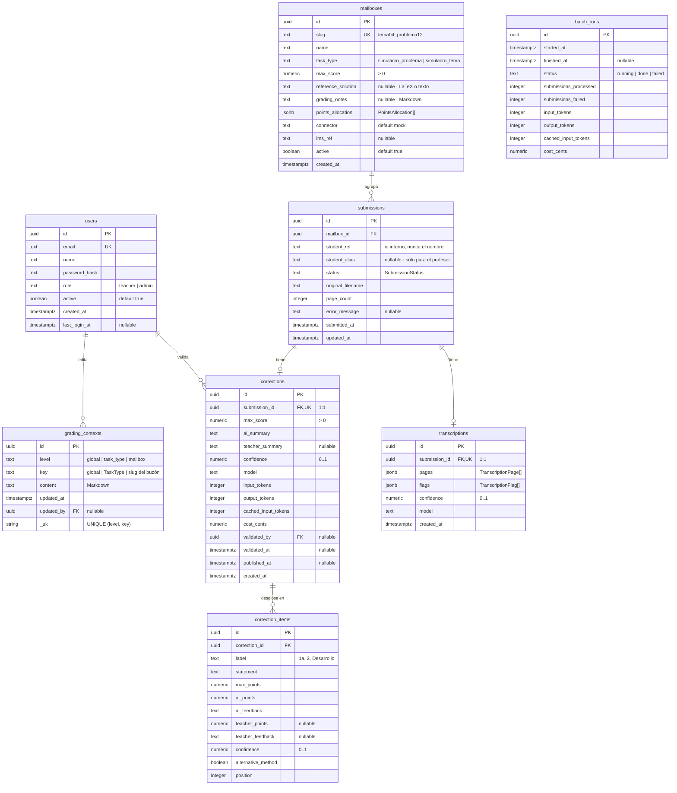
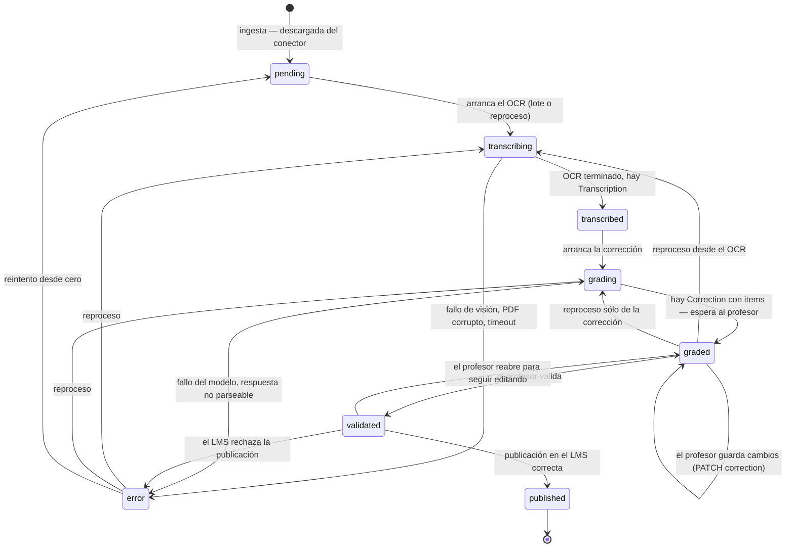

# Modelo de datos

Derivado de `apps/api/migrations/0001_init.sql` y de `packages/shared/src/domain.ts`. El SQL manda:
si algo aquí no cuadra con la migración, el error está en este documento.

## Diagrama entidad-relación



`batch_runs` y `grading_contexts` aparecen sin aristas porque no tienen clave foránea hacia el
resto del grafo. La relación existe, pero es lógica, no referencial:

- `grading_contexts.key` apunta al `TaskType` o al `mailboxes.slug` según el nivel. **No hay FK a
  propósito**: un contexto de buzón puede existir antes de que el buzón se cree (por ejemplo, el
  que viene del repositorio en `contexts/mailboxes/`), y borrar un buzón no debe llevarse por
  delante unas instrucciones que costaron escribir.
- `batch_runs` agrega el consumo de una ejecución; qué entregas procesó se deduce por ventana
  temporal. Si esa trazabilidad hace falta, requiere una columna `batch_run_id` en `submissions`
  y una migración nueva — está en las preguntas abiertas de `HU-09`.

## Cardinalidades y restricciones que importan

| Regla | Dónde vive | Consecuencia |
|---|---|---|
| Una entrega tiene **como mucho una** transcripción | `transcriptions.submission_id UNIQUE` | Reprocesar sustituye, no acumula. No hay historial de transcripciones. |
| Una entrega tiene **como mucho una** corrección | `corrections.submission_id UNIQUE` | Idem: no hay historial de correcciones. |
| No se importa dos veces la misma entrega | `UNIQUE (mailbox_id, student_ref, original_filename)` | La ingesta es idempotente y se puede relanzar sin miedo. Si el alumno re-sube el examen con **otro** nombre de fichero, entra como entrega nueva. |
| Borrar un buzón borra sus entregas | `ON DELETE CASCADE` | Y en cascada, sus transcripciones y correcciones. Operación destructiva. |
| Borrar un usuario no borra lo que validó | `validated_by ... ON DELETE SET NULL` | Se pierde el quién, no el qué. Por eso los usuarios se **desactivan** (`active = false`) en lugar de borrarse. |
| Los puntos nunca son negativos | `CHECK (ai_points >= 0)`, `CHECK (teacher_points >= 0)` | No existe la penalización con puntos negativos a nivel de apartado. |
| Las confianzas están en `[0, 1]` | `CHECK (confidence BETWEEN 0 AND 1)` | En transcripción, corrección y apartado. |
| El coste se guarda en céntimos | `cost_cents numeric(10,4)` | Nada de flotantes para dinero. `UsageMetrics.costCents`. |

### Lo que el esquema *no* impone

- **`SUM(points_allocation.maxPoints)` no tiene por qué ser `max_score`.** Es deliberado
  (`domain.ts` lo dice explícitamente): hay enunciados con apartados opcionales. La UI avisa de la
  discrepancia; no la bloquea.
- **`SUM(correction_items.max_points)` tampoco.** Y por tanto la nota total efectiva puede superar
  `max_score` si el profesor sube puntuaciones sin criterio. Es responsabilidad de la UI avisar.
- **No hay transiciones de estado en la base de datos.** El `CHECK` de `submissions.status` sólo
  valida el conjunto de valores, no el orden. La máquina de estados se hace cumplir en `apps/api`.

## Ciclo de vida de una entrega



### Qué dispara cada transición

| Origen | Destino | Disparador | Efecto en datos |
|---|---|---|---|
| — | `pending` | `LMSConnector.download()` completado durante la ingesta | `INSERT submissions`, se guarda el escaneo y `page_count` |
| `pending` | `transcribing` | El lote toma la entrega, o `POST /api/submissions/{id}/reprocess` | `status`, `updated_at` |
| `transcribing` | `transcribed` | `core.transcribe()` devuelve una `Transcription` válida | `INSERT`/`UPDATE transcriptions` |
| `transcribed` | `grading` | El lote encadena la corrección | `status` |
| `grading` | `graded` | `core.grade()` devuelve una `Correction` con al menos un item | `INSERT corrections` + `correction_items`, `usage` |
| `graded` | `graded` | `PATCH /api/submissions/{id}/correction` | `teacher_points`, `teacher_feedback`, `teacher_summary`. **No** toca `validated_*` |
| `graded` | `validated` | `POST /api/submissions/{id}/validate` | Guarda los cambios pendientes + `validated_by`, `validated_at` |
| `validated` | `published` | `POST /api/submissions/{id}/publish` con éxito en el conector | `published_at` |
| `validated` | `graded` | Reapertura por el profesor | Limpia `validated_by` y `validated_at` |
| cualquiera | `error` | Excepción no recuperable en el paso en curso | `error_message` con texto legible en español |
| `error` | `transcribing` / `grading` / `pending` | `POST /api/submissions/{id}/reprocess` | Limpia `error_message` |

### Invariantes de estado

1. `status = 'graded'` implica que existe fila en `corrections` con al menos un `correction_item`.
2. `status = 'validated'` implica `corrections.validated_at IS NOT NULL` y `validated_by IS NOT NULL`.
3. `status = 'published'` implica `published_at IS NOT NULL` **y** `validated_at IS NOT NULL`.
   Nunca se publica sin validar: no existe arista `graded -> published`.
4. `status = 'error'` implica `error_message IS NOT NULL`.
5. `published` es terminal. Republicar exige reabrir explícitamente, y eso no está resuelto —
   ver preguntas abiertas de `HU-17`.
6. `REVIEWABLE_STATUSES = ['graded', 'validated', 'error']` es lo que la cola muestra por defecto.
   `pending`, `transcribing`, `transcribed` y `grading` son estados de máquina: se ven filtrando
   explícitamente, no en la bandeja de trabajo del profesor.

## Correspondencia SQL ↔ TypeScript

El SQL usa `snake_case`; el contrato HTTP, `camelCase`. La capa de acceso a datos traduce.

| Tabla | Tipo de `@vega/shared` | Observaciones |
|---|---|---|
| `users` | `User` | `password_hash` **nunca** sale por la API |
| `mailboxes` | `Mailbox` | `points_allocation` (jsonb) ↔ `PointsAllocation[]` |
| `submissions` | `Submission` | 1:1 en columnas |
| `transcriptions` | `Transcription` | `pages` y `flags` son jsonb ↔ `TranscriptionPage[]` / `TranscriptionFlag[]` |
| `corrections` | `Correction` | Las cuatro columnas de consumo se agrupan en `usage: UsageMetrics` |
| `correction_items` | `CorrectionItem` | Se sirven ordenados por `position` |
| `grading_contexts` | `GradingContext` | |
| `batch_runs` | `BatchRun` | Mismo agrupamiento de `usage` |

Las fechas se guardan como `timestamptz` y viajan como ISO 8601 con offset (`IsoDate`). Los
`numeric` se serializan como `number`; los importes en céntimos con hasta cuatro decimales.

## Cálculos derivados

No se persisten: se calculan a partir de los items, siempre con las funciones de `domain.ts`.

```ts
effectivePoints(item) = item.teacherPoints ?? item.aiPoints
effectiveSource(item) = item.teacherPoints === null ? 'ai' : 'teacher'
totalScore(items)     = redondeo a 2 decimales de la suma de effectivePoints
```

Y la desviación que alimenta el panel (`OverviewResponse.avgTeacherDeviation`), sobre correcciones
ya validadas: media de `SUM(effectivePoints) - SUM(aiPoints)`. Positiva significa que el profesor
sube la nota respecto a la IA.
