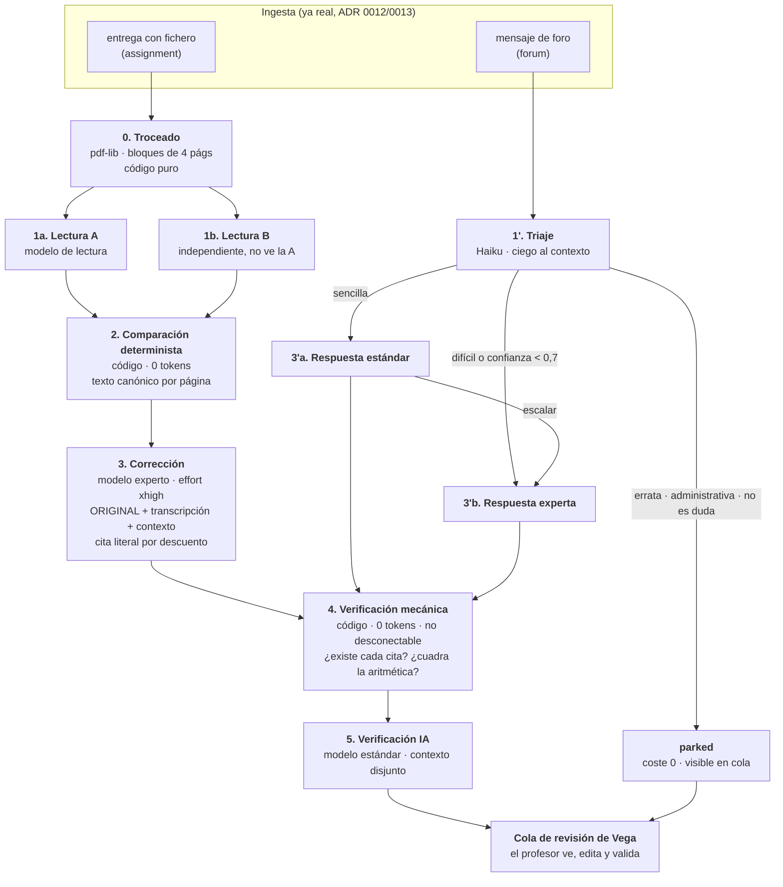

# Motor de IA — arquitectura cerrada y plan de implementación

> **Estado: CERRADO.** Este documento consolida y sustituye, como fuente de verdad del motor,
> a `diseno-motor-ia.md` y a los análisis de `docs/analisis/` (`motor-ia.md`, `motor-ia-codex.md`,
> `motor-ia-gemini.md`, `vision-diferencial-ia.md`), que quedan como material de trabajo. Integra
> el input humano de `docs/analisis/comentarios-sesion.md` (§18 responde punto por punto) y los
> requisitos de `docs/requisitos/requisitos-mvp.md`.
>
> **Alcance**: todo el circuito **leer de Moodle (lote) → IA → resultados en Vega**. La
> **publicación en Moodle queda explícitamente fuera** (nota, PDF de feedback y respuesta en foro);
> el flujo termina en la cola de revisión, con el profesor validando en Vega.
>
> Convenciones del repo: cuando este documento y el código discrepen, manda el código; las
> referencias son `fichero:símbolo` reales verificadas el 2026-07-22 sobre `feat/h3-motor-ia`.

---

## 0. Resumen en cinco líneas

1. **El original manda.** La corrección ve las páginas del alumno; la transcripción es un artefacto
   derivado, producido por **doble lectura independiente** con comparación determinista.
2. **Cuatro operaciones** (`transcribe`, `grade`, `triage`, `verify`, ADR 0011) sobre **Batches API
   de Anthropic** (−50 % en todos los tokens), con llamada síncrona solo para reprocesos puntuales.
3. **Modelos fijos por rol**, configurables por combo en Ajustes; sin enrutado dinámico.
4. **Todo lo comprobable por código se comprueba por código** (citas, aritmética, topes,
   discrepancias de lectura), a coste cero y sin poder desconectarse.
5. **Todo queda registrado** (`ai_calls`: petición, respuesta, tokens, coste, versión de prompt y
   contexto) para depurar desde un panel de administración y afinar prompts desde fuera.

---

## 1. Decisiones cerradas

| # | Decisión | Elección | Origen / por qué |
|---|---|---|---|
| D1 | Fuente de verdad de la lectura | **El original visual.** `grade()` recibe las páginas del alumno **y** la transcripción consolidada. La transcripción no es autoridad: es hipótesis de lectura, ancla de citas y soporte de la revisión en pantalla | Codex (transcripción como único input = punto único de fallo) + la prueba real del cliente en Claude Desktop fue con el original |
| D2 | Validación de la lectura | **Doble transcripción independiente** (misma operación, dos llamadas, ninguna ve a la otra) + **comparación determinista en código**. Discrepancia → marca visible, baja confianza, ambas lecturas al profesor | Sesión §1 y §2: «la lectura es crítica»; detección barata de alucinación de OCR sin tercer modelo |
| D3 | Batches API | **Dentro del MVP y transporte por defecto** del lote. Síncrono solo para reproceso individual y pruebas | Sesión §4: «si ahorra costes debe ir». SLA 8 h/24 h lo permite de sobra; la mayoría de lotes vuelve en <1 h (máx. 24 h) |
| D4 | Modelos | **Fijos por rol, combo en Ajustes**: lectura y corrección `claude-opus-4-8`; triaje `claude-haiku-4-5`; verificación `claude-sonnet-5`. `claude-fable-5` como candidato techo a evaluar en el piloto (exige retención de datos de 30 días) | Sesión §2 (lectura con lo mejor y con esfuerzo), §3 (combo), §12 (triaje barato). Los modelos de los análisis de Gemini (`claude-3-5-sonnet`…) están retirados |
| D5 | Formato de salida | **Structured outputs** (`output_config.format` + esquema Zod) en todas las llamadas. Se acabó el JSON-en-texto con `JSON.parse` | Fiabilidad + menos reintentos; compatible con Batches |
| D6 | Anti-alucinación | Defensa por capas (§9): esquema → cita literal obligatoria en cada descuento → comprobación mecánica → doble lectura → `verify()` con contexto disjunto → profesor. **La capa mecánica no es desconectable** | ADR 0011 + requisito «es IMPRESCINDIBLE que no alucine» |
| D7 | Contextos: niveles y persistencia | **Cinco**: `global` (solo admin) → `activity_kind` → `template` → `course` → `activity`. Los Markdown aportan únicamente la semilla inicial; desde ese momento PostgreSQL conserva la versión activa y todo el historial inmutable. No hay sincronización ni commits Git en ejecución | Requisito literal: admin guarda pautas comunes, cada profesor sus aulas. La BD permite auditar exactamente qué versión se aplicó sin convertir el repositorio en almacenamiento de producción |
| D8 | Prompts del sistema | **Tabla `prompts` versionada**, sembrada desde `prompts/`, editable por admin con «restaurar por defecto». Cada llamada registra clave+versión → reproducibilidad | Bloqueante nº 1 de `docs/revision/h2-preparacion-motor-ia.md`; requisito de afinar prompts con registro completo |
| D9 | Triaje de dudas | Clasificador **ciego** en Haiku: `errata`/`administrativa`/`no_es_duda` → `parked` (coste 0); `sencilla` → modelo estándar; `dificil` → modelo experto. Umbrales asimétricos (aparcar ≥ 0,9; escalar < 0,7) | Sesión §12 + ADR 0011. La deduplicación que lo hacía inviable ya está resuelta (ADR 0012, `remote_id`) |
| D10 | Depuración | **Panel de registros para el admin** (sin chat en la app): cada llamada con petición, respuesta, tokens, coste, prompt y contexto; exportable como JSON para hablar con Claude Code fuera | Sesión §5. Requisito: «registro de todo, qué llegó a la API, qué respondió» |
| D11 | Explicaciones | El profesor ve **cómo se llegó a la nota** (citas, feedback por apartado, veredicto de verificación, notas para el profesor). El interruptor `ai.explanations` (admin) permite apagar lo que cuesta tokens cuando el sistema esté rodado | Sesión §6 y §7 |
| D12 | Coste | Contabilidad **correcta**: `cache_creation` (1,25×/2×), descuento de lote (0,5×), **tarifas fechadas por modelo** (la intro de Sonnet 5 acaba el 2026-08-31), conversión €/$ fechada. Coste por corrección visible al profesor; total mensual navegable para el admin; señal de **modo simulado** en el contrato | Requisitos técnicos + HU-18; hoy el panel infravalora y no distingue mock de real |
| D13 | Omitir simulacros | Dos mecanismos: `activities.enabled` (ya existe) y **aparcado manual por entrega** (`parked` con motivo, acción «Omitir» en la cola; se reactiva con reprocesar) | Sesión §13 |
| D14 | Comunidad autónoma | Ya resuelta en datos (ADR 0013: `students.community` viaja con el trabajo). El **criterio por comunidad se escribe en los contextos** (p. ej. sección «Si el alumno es de Galicia…»); para PD, ficheros de normativa por comunidad adjuntos a la actividad | Sesión §10; el dato ya llega al modelo desde la migración 0006 |
| D15 | Autonomía | **Ningún camino automático hacia `published` en esta iteración**: el lote termina siempre en `graded` (o `parked`). Se elimina el atajo actual que marca `published` solo en BD sin llamar al conector. La decisión ADR 0004 vs HU-21 se toma en el hito de publicación | La publicación está fuera de alcance; el atajo actual «vacía la cola sin que el alumno reciba nada» |
| D16 | PD (programación didáctica) | **Fuera de esta iteración**, pero la arquitectura la deja preparada: niveles `template`/`course`, comunidad del alumno, ficheros adjuntos por actividad, registro de prompts por operación | Sesión §8 |
| D17 | OCR/HMER externo (Mathpix, etc.) | **Fuera del MVP.** La segunda lectura cumple ese papel. Si algún día entra, será un lector paralelo cuya salida solo abre discrepancias, nunca decide | Sesión §11: «como apoyo… la IA debería revisar las discrepancias» |
| D18 | Fiabilidad global | **Métrica compuesta calculada, sin agente extra**: % validadas sin cambios, desviación media, % citas verificadas, % lecturas sin discrepancias, % verificaciones superadas | Requisito «si es posible»; con el ledger sale gratis; un agente evaluador externo queda anotado como evolución |

---

## 2. El pipeline



Las llamadas 1a/1b, 3, 1', 3' y 5 viajan por la **Batches API** (§6). Todo lo demás es código.
La publicación (después de `validated`) no forma parte de esta iteración.

### Máquina de estados

- **Entrega**: `pending → transcribing → transcribed → grading → graded → …` (`error` desde
  cualquier fase; `reprocess` devuelve a `pending`). El pipeline por fases **rehabilita** el estado
  `transcribed`, hoy fantasma: pasa a significar «lecturas consolidadas, esperando corrección».
- **Foro**: `pending → grading → graded | parked`. `parked → pending` con «Forzar reproceso».
- `parked` es **nuevo** y tiene dos orígenes: triaje (etiqueta del clasificador) y manual
  (acción «Omitir» del profesor, con motivo). Entra en `REVIEWABLE_STATUSES` como pestaña propia
  con contador y antigüedad, para que no sea un agujero negro.

---

## 3. Lectura: doble pasada y comparación

**Por qué.** La transcripción era el suelo de todo el edificio y el único artefacto sin verificar
contra nada: una alucinación de OCR (completar el paso que «debería» estar, corregir un signo en
silencio) atravesaba todas las capas. Las dos mitigaciones elegidas:

1. **El corrector ve el original.** Aunque la transcripción esté mal, el modelo que decide la nota
   tiene delante los píxeles y la instrucción de volver a ellos ante cualquier paso dudoso.
2. **Doble lectura + diff.** Dos llamadas `transcribe()` independientes (misma operación del
   proveedor, temperatura por defecto, ninguna recibe la salida de la otra). El motor compara en
   código, página a página, sobre **texto canónico** (espacios colapsados, comandos LaTeX
   equivalentes unificados, separador decimal unificado — la misma normalización que usan las
   citas, §9). Cada diferencia material genera una marca `DISCREPANCIA` con **ambas lecturas**,
   que (a) viaja inline en la transcripción consolidada que ve el corrector, (b) baja la confianza,
   y (c) se enseña al profesor en la vista lado a lado.

**Reglas que cambian respecto al prompt actual:**

- Se **elimina** la instrucción de elegir en un `[DUDA]` «la lectura más coherente con el paso
  siguiente» (`anthropic.ts:TRANSCRIPTION_SYSTEM`): es un sesgo sistemático que repara en silencio
  el error real del alumno. Un `[DUDA]` registra ambas lecturas y no elige.
- La transcripción consolidada toma la Lectura A como base; las discrepancias no se resuelven
  automáticamente **nunca**.

**Troceado.** Un PDF de 10–16 páginas no viaja entero a una llamada de visión: se parte en bloques
de 4 páginas (configurable) con `pdf-lib` —ya en el repo para contar páginas, JS puro, coherente
con la decisión de imagen «Node sin compilador»—, cada bloque es una petición del lote, y el
ensamblado comprueba contra el manifiesto que **ninguna página falta ni sobra** (fallo → `error`,
nunca corrección parcial silenciosa). La corrección, en cambio, recibe el documento **entero**
(el razonamiento entre páginas importa para la nota).

**Coste asumido.** La doble lectura duplica la fase más cara en visión. Con lote (−50 %) el
sobrecoste queda ≈ 0,15 € por entrega de 16 páginas (§14) y es exactamente lo que la sesión pidió
pagar: la lectura es donde no se puede fallar.

---

## 4. Las cuatro operaciones del proveedor

`AiProvider` pasa de 3 operaciones reales (`provider.ts:190-200`: `transcribe`, `grade`,
`verifyConnection`) a **4 + conexión**, según ADR 0011, con dos enmiendas de entrada que exige
este diseño (se formalizan en el ADR 0015, §17):

```ts
transcribe(input: TranscribeInput): Promise<TranscribeResult>
// sin cambios de firma; el motor la llama DOS veces y compara en código

grade(input: GradeInput): Promise<GradeResult>
// CAMBIA: + document: PageSource[] (el original), context pasa de string a segmentos
// (ContextSegment[] con nivel y contenido, para los breakpoints de caché),
// transcription = consolidada con marcas DISCREPANCIA

triage(input: TriageInput): Promise<TriageResult>          // NUEVA (ADR 0011)
// ciega por contrato: mensaje + hilo previo; sin contexto del curso
// → { label: 'errata'|'administrativa'|'no_es_duda'|'sencilla'|'dificil', confidence, reason }

verify(input: VerifyInput): Promise<VerifyResult>          // NUEVA (ADR 0011)
// contexto disjunto por contrato: transcripción + corrección propuesta; SIN contexto ni solución
// → { coherent: boolean, issues: [{kind, itemLabel, detail}], confidence }

verifyConnection(): Promise<VerifyConnectionResult>        // ya existe, se conserva
```

- `GradedItem` gana `aiQuote: string | null` y `aiQuotePage: number | null` (§9).
- Las salidas de respuesta de foro ganan `escalar: boolean` y `noEsDuda: boolean` (§10).
- **El mock implementa las cuatro** con datos incómodos (discrepancias de lectura, un
  `escalar: true`, un triaje bajo umbral, una verificación con veredicto grave), o los tests no
  compilan. Es la condición del ADR 0011 y lo que mantiene el circuito completo sin red.
- `verify()` se mantiene **deliberadamente ciego** a la solución de referencia (contra el criterio
  de Codex): su trabajo es coherencia nota↔feedback y pasos señalados, no re-corregir matemáticas
  «hacia abajo» con un modelo menor. La defensa del método alternativo sigue siendo la regla
  `global.md` §5.4 (confianza < 0,60) y `avgTeacherDeviation` como detector estadístico.

---

## 5. Modelos y parámetros por rol

Configurables en Ajustes (combo por rol, sesión §3); los ids nunca se escriben a mano en el motor.

| Rol (clave en `app_settings`) | Modelo por defecto | Parámetros | Se usa en |
|---|---|---|---|
| `anthropic.readingModel` | `claude-opus-4-8` | thinking adaptive, effort `high`, **max_tokens ≥ 32k por lectura** | Lecturas A y B |
| `anthropic.gradingModel` | `claude-opus-4-8` | thinking adaptive, effort `xhigh`, max_tokens ≥ 64k (**lo exige `xhigh`**) | Corrección y respuesta experta de foro |
| `anthropic.verifyModel` | `claude-sonnet-5` | thinking adaptive, effort `high`, max_tokens 8k | `verify()` y respuesta sencilla de foro |
| `anthropic.triageModel` | `claude-haiku-4-5` | sin thinking, max_tokens 1k | Triaje de dudas |

Hechos de la API que condicionan esto (verificados contra la referencia actual de Anthropic):

- **Opus 4.8**: omitir `thinking` = correr **sin** pensar → `thinking: {type:'adaptive'}` va
  **explícito** en lectura/corrección/verificación. `temperature/top_p/top_k` ya no existen
  (400) — la «temperatura 0 para OCR» de los análisis de Gemini no es aplicable.
- **`claude-fable-5`** ($10/$50 por MTok) es el candidato techo para lectura y corrección si el
  piloto demuestra que reduce errores críticos; **exige retención de datos de 30 días** (no
  disponible con ZDR). Dado que por el ADR 0013 el nombre del alumno ya viaja a Anthropic por
  decisión explícita del cliente, es una decisión de política de datos, no técnica: se decide en el
  piloto (T14), no aquí.
- **Sonnet 5**: precio introductorio ($2/$10) hasta el **2026-08-31**, después $3/$15 — por eso las
  tarifas van fechadas (§11).
- **Structured outputs**: el esquema no admite restricciones numéricas (`minimum`/`maximum`);
  `confidence 0–1` y los topes los sigue garantizando el motor (`engine.ts:normalizePoints`),
  no la API. Incompatible con la función `citations` nativa — nuestro grounding es propio y mejor
  (verificable por código, §9): que nadie «mejore» esto activando citations.
- **Subir el SDK es el primer commit del motor**: `@anthropic-ai/sdk@0.65.0` no tipa `thinking`
  adaptativo ni `output_config` (de ahí los casts de `anthropic.ts:buildParams`) ni la Batches API
  tipada que necesita §6.
- `stop_reason: 'max_tokens'` se reintenta **una vez** con más presupuesto de salida, sin pasar
  del techo del modelo (128k en la familia actual; 64k en Haiku 4.5, donde pedir más es un 400);
  `'refusal'` **no se reintenta jamás** (repetir la misma petición tras un rechazo no cambia el
  resultado y va contra la guía de la API): fallo tipado directo, registrado en el ledger.
- **Una salida estructurada que no parsea es, casi siempre, una respuesta cortada.** El SDK lanza
  al parsear el JSON, **antes** de que se pueda mirar `stop_reason`, así que el reintento por tope
  de tokens no se activaba nunca: la entrega moría con un «Unterminated string in JSON». Se trata
  igual que `max_tokens` y se amplía el presupuesto. Medido en el piloto: con 16k, un examen de
  seis páginas agota el tope a mitad del JSON, porque el razonamiento adaptativo gasta del mismo
  presupuesto que el texto.
- **Todas las llamadas van por streaming** (`messages.stream(...).finalMessage()`), aunque el motor
  no enseñe nada incremental. El SDK **rechaza en local** una petición sin streaming cuyo
  `max_tokens` estime más de 10 minutos de generación (con el suelo de 32k de la lectura, todas), y
  el timeout por petición no suprime esa comprobación —sólo el del cliente—. Medido en el piloto:
  un lote entero de 25 entregas murió con «Streaming is required…» sin que ninguna llamada llegara a
  la red. Con `output_config.format`, el mensaje final del stream llega igualmente parseado en
  `parsed_output`, y una respuesta cortada rechaza con el mismo error de parseo de arriba.
- **La transcripción recibe bloques, no páginas.** `input.pages` son los trozos en que la ingesta
  parte el PDF (`ai.pagesPerChunk`), y el prompt debe anunciar los **números de página del
  original**. Anunciar el número de bloques hacía que el modelo devolviera una entrada por bloque
  numerada desde 1, y el ensamblado tiraba la entrega ya pagada.
- **Visión en alta resolución automática (Opus 4.8)**: las imágenes/PDF se procesan hasta 2.576 px
  → hasta ~4.800 tokens por página densa, no los ~1.600 clásicos. Afecta directamente al
  presupuesto (§14): los números de visión son cotas inferiores hasta medir en el piloto.
- **Guardas por modelo en el proveedor** (`anthropic.ts`): Haiku 4.5 es de una generación anterior
  y responde 400 a `thinking: adaptive` y a `effort` (por eso el triaje no los envía); `xhigh`
  sólo se pide a Opus 4.8/Fable 5 y se degrada a `high` en el resto. Los combos de Ajustes ya
  restringen las combinaciones, y el proveedor además se defiende solo.

Sin enrutado dinámico ni clasificador de complejidad para entregas: la única «elección de modelo»
en caliente es la del triaje de foros, que es una etiqueta, no un router (§10).

---

## 6. Transporte: Batches API por defecto

**Decisión** (sesión §4): el lote nocturno usa `messages/batches` (−50 % en **todos** los tokens,
también visión y salida). El SLA del producto (dudas cada 8 h, correcciones cada 24 h) absorbe la
asincronía: la mayoría de lotes termina en menos de 1 h, garantizado < 24 h, resultados
disponibles 29 días.

### Diseño

El lote deja de ser un bucle síncrono (`batch.ts:processOne`) y pasa a ser un **proceso por fases
con estado durable**:

```
runBatch:  ingesta (ya existe) → FASE A: lote de lecturas (2 pasadas × bloques × entregas
           + triajes de foros) → [poll] → consolidación/diff/parked en código
           → FASE B: lote de correcciones + respuestas de foro → [poll] → persistencia
           → FASE C: lote de verificaciones → [poll] → veredictos → cierre del run
```

- **Tabla `ai_batches`**: `id, batch_run_id, provider_batch_id, phase (reading|grading|verify),
  status, request_count, created_at, ended_at`. Cada petición lleva `custom_id` autodescriptivo
  (`sub:<id>:pass:<1|2>:chunk:<n>`, `sub:<id>:grade`, …); los resultados llegan **sin orden** y se
  casan por `custom_id`, nunca por posición.
- **El poller vive en el scheduler existente** (`batch/scheduler.ts`, tick de 60 s + advisory
  lock): en cada tick, para cada `ai_batches` abierto consulta `processing_status`; al terminar,
  descarga resultados, persiste y dispara la fase siguiente. Sin Redis ni worker nuevo, coherente
  con la arquitectura actual.
- **Durabilidad**: si el proceso muere, `provider_batch_id` está en BD; al arrancar,
  `batch/recovery.ts` deja de «resetear a pending» las entregas en fase activa con lote vivo y
  pasa a **reanudar el poll**. Un `batch_run` solo se cierra cuando su última fase cierra.
- **`POST /api/batch/run` pasa a 202** `{run}` inmediato (HU-09 RN-8): con transporte por lotes ya
  no tiene sentido una petición HTTP colgada.
- **Transporte síncrono** (`Messages` + streaming) se conserva para: reproceso individual desde la
  pantalla de revisión (el profesor no espera al lote), la CLI del motor y los tests. La elección
  es por invocación (`transport: 'batch' | 'sync'`), no global.
- **Caché en lote**: los aciertos son *best-effort* (peticiones concurrentes). El presupuesto (§14)
  asume **0 % de aciertos**: el −50 % es el ahorro garantizado y la caché es propina. Los
  marcadores `cache_control` se mantienen y se **mide** `cache_read/creation` real en el ledger
  antes de optimizar más. En síncrono la caché sí rinde (mismo prefijo, entregas seguidas).
- `submissions.batch_run_id` (nueva columna) ata cada entrega al run que la procesó — cierra la
  pregunta abierta de HU-09 y hace el coste por lote exacto en vez de «por ventana temporal».
- **Límites del proveedor y fragmentación**: un lote admite 100k peticiones **o 256 MB**, y la
  fase A (2 pasadas × páginas en base64) revienta el límite de tamaño mucho antes que el de
  peticiones. Cada fase puede producir **varios `ai_batches`** (varias filas por
  `batch_run_id`+`phase`); el empaquetador corta por tamaño estimado. Alternativa a evaluar en el
  piloto: subir los PDF una vez a la Files API y referenciarlos por `file_id` en ambas pasadas.
- **Resultados por `result.type`**: `succeeded` se persiste; `errored` marca la entrega en
  `error` con causa; `canceled` idem; `expired` (el lote agotó sus 24 h) **se reenvía** en un
  lote nuevo, porque no es un fallo de la entrega. Peor caso teórico de un run completo: 3 fases
  secuenciales × 24 h ≈ **72 h**, no 24 h — el SLA de correcciones lo cubre con normalidad
  (< 1 h/lote típico) pero el peor caso hay que contarlo bien.

---

## 7. Contextos: cinco niveles y permisos

### Jerarquía (orden = estabilidad = prefijo de caché)

| # | Nivel | Clave | Edita | Contenido |
|---|---|---|---|---|
| 1 | `global` | `global` | **solo admin** | Pautas comunes de la academia: rigor, notación, formato, política de corrección. Absorbe el contenido de `contexts/installation.md` (hoy huérfano) |
| 2 | `activity_kind` | `assignment` / `forum` | admin | Qué se valora en una entrega y qué en un foro |
| 3 | `template` | slug de plantilla | profesorado | **Nuevo.** El formato compartido: `simulacro-problema`, `simulacro-tema`, (`pd` en el futuro). `activities.template_key` lo referencia. Recupera el huérfano `assignment-tema.md` |
| 4 | `course` | id del curso | profesorado del curso | **Nuevo.** Las particularidades del aula («cada profesor guarda sus aulas», requisito literal) |
| 5 | `activity` | slug de actividad | profesorado con alcance | Esta actividad concreta |
| — | (aparte) | — | — | Solución de referencia / material + reparto + ficheros de texto adjuntos (ya lo monta `resolveContext()`); la **ficha del alumno viaja con el trabajo, nunca en el prefijo** (ADR 0013) |

- **`installation` no es un nivel**: con `global` restringido a admin, un sexto nivel solo añadía
  fricción (era la alternativa que el propio análisis llamaba «más barata y casi equivalente»).
- **Permisos** (hoy rotos: cualquier autenticado edita `global`, `contexts.ts:85-99`): `global` y
  `activity_kind` exigen admin; `template` cualquier profesor (compartida, con `updatedBy`
  visible); `course` exige pertenencia (`course_teachers`); `activity` mantiene
  `assertActivityAccess`. La lectura de las versiones activas también se acota al alcance.
- **`GradeInput.context` viaja segmentado** (ADR 0011): lista de segmentos por nivel. El proveedor
  coloca **dos `cache_control`** (de los 4 posibles): tras `template` (compartido entre
  actividades de la misma plantilla) y tras el bloque de actividad+solución (compartido entre
  entregas de la misma actividad).
- **Mínimo cacheable en Opus 4.8: 4.096 tokens** (verificado; en Fable 5 son 2.048). Por debajo no
  cachea y no avisa. El contexto real de un problema hoy suma ≈ 5.200–5.800 tokens (global 2.427
  palabras + tipo + actividad), así que el primer breakpoint ya supera el umbral; se **mide** con
  `count_tokens` en el piloto, no se estima.
- **Higiene pendiente que este diseño ordena**: limpiar de `global.md` y `contexts/activities/*`
  las referencias muertas a `task-types/*` (instrucciones que apuntan a documentos que el modelo
  no recibe); corregir `contexts/README.md` (afirma que falta `forum.md`, que existe) y completar el
  paquete de semillas con las plantillas (hoy `bootstrap()` solo incluye `global` y
  `activity_kind`).

### Persistencia: semilla inicial y versiones en PostgreSQL

`contexts/*.md` no es un almacén vivo ni participa en la resolución de una corrección. Es el
paquete de valores predeterminados, auditable junto al código, con el que se inicializa una
instalación:

1. para cada contexto inexistente, la siembra crea su identidad y una versión 1 activa con
   `source = 'seed'` y `created_by = NULL`;
2. si el contexto ya existe, reiniciar o desplegar no crea una versión, no compara contenidos y no
   sobrescribe nada, aunque haya cambiado el Markdown empaquetado;
3. después de la siembra, todas las lecturas y escrituras se hacen exclusivamente en PostgreSQL;
4. no se ejecuta Git, no se escribe en el repositorio y el contenedor no necesita credenciales de
   commit o push.

El modelo de datos separa identidad e historial:

```text
grading_contexts
  id, level, key, active_version
  UNIQUE(level, key)

grading_context_versions
  context_id, version, content, content_hash, source, created_at, created_by
  PRIMARY KEY(context_id, version)
  FOREIGN KEY(context_id) → grading_contexts(id)
```

La pareja `(grading_contexts.id, active_version)` referencia una versión existente. Cada guardado
crea `N + 1` de forma inmutable y mueve el puntero activo en la misma transacción; nunca actualiza
ni borra el contenido histórico. Dos ediciones concurrentes usan bloqueo optimista con la versión
esperada —o bloqueo de fila— y una de ellas recibe `409 CONFLICT` en vez de pisar silenciosamente
a la otra.

La migración convierte cada fila actual de `grading_contexts` en su versión 1 activa, conservando
contenido, autor y fecha. `readContextLevel()` y `resolveContext()` leen sólo la versión activa.
Al comenzar una corrección se fijan las parejas `context_id/version` de todos los segmentos
presentes y la ausencia explícita de cualquier nivel sin contexto; un cambio posterior no modifica
una ejecución en curso ni sus reintentos. El ledger conserva ese conjunto además del hash del
contexto efectivo: el hash aislado no permite reconstruir la entrada.

### Historial visible: política y alcance

Las versiones inactivas son información de auditoría. En esta iteración no se añade endpoint ni
pantalla para consultarlas, tampoco reutilizando las rutas actuales. La futura consulta desde la
aplicación será **exclusiva de administración**; el profesorado continúa viendo y editando sólo la
versión activa dentro de su alcance.

Hasta implementar esa pantalla, desarrollo dispone de esta consulta SQL de sólo lectura para
inspeccionar las versiones no activas:

```sql
SELECT
  c.level,
  c.key,
  v.version,
  v.source,
  v.created_at,
  u.email AS created_by,
  v.content
FROM grading_contexts AS c
JOIN grading_context_versions AS v
  ON v.context_id = c.id
LEFT JOIN users AS u
  ON u.id = v.created_by
WHERE v.version <> c.active_version
ORDER BY c.level, c.key, v.version DESC;
```

Esta consulta requiere acceso operativo directo a PostgreSQL y no se expone como funcionalidad de
usuario. Una futura restauración desde el historial creará una versión nueva copiando el contenido
elegido; no reactivará ni modificará una fila histórica.

### Dónde viven las instrucciones de transcripción (cierra HU-10 p1)

Las instrucciones de OCR **no son criterios del profesor**: viven en el **registro de prompts**
(§8), editables por el admin. Los niveles de contexto son solo de corrección/respuesta.

---

## 8. Registro de prompts versionado

Cierra el bloqueante nº 1 de la revisión de H2 («los 8 ficheros de `prompts/` no los lee nadie»).

- Tabla **`prompts`**: `key` (`transcription.system`, `grading.system`, `triage.system`,
  `verify.system`, `forum.answer.system`, …), `version` (entera, autoincremental por clave),
  `content`, `active`, `updated_by/at`. La fila activa es la que se usa; las anteriores no se
  borran nunca.
- **Siembra al arrancar** desde las semillas **embebidas en el código**
  (`apps/api/src/prompts/seeds.ts`): siembran la versión 1, la BD manda después. «Restaurar por
  defecto» crea una versión nueva con el contenido de la semilla. *(Decisión posterior al cierre:
  la carpeta `prompts/` del repositorio se eliminó — la BD es la única fuente de verdad en
  ejecución y las semillas viajan dentro del binario, no como ficheros a desplegar.)*
- Existe además **`global.system`**: instrucciones que se anteponen a todas las operaciones
  (idioma, tono, coma decimal). Vacío o recortado no molesta; las instrucciones específicas de
  cada operación mandan sobre él.
- Los system prompts se leen del registro (con la constante TS de `anthropic.ts` como *fallback*
  de emergencia).
- **Cada llamada registra `prompt_key`, `prompt_version` y el hash del contexto resuelto** en
  `ai_calls` (§11): una corrección histórica es explicable con exactitud («se puntuó con la v3 del
  prompt y este contexto»), que es la mitad de «depurar la respuesta final» del requisito.
- Edición: pantalla de admin (lista, diff contra versión anterior, activar). El profesor **nunca**
  toca prompts; escribe contextos (criterios), como hasta ahora.

---

## 9. Anti-alucinación: defensa por capas

| # | Capa | Coste | Detecta |
|---|---|---|---|
| a | Structured outputs | 0 | Formato roto, campos inventados |
| b | **Cita literal obligatoria** en cada descuento (`aiQuote` + página) | 0 | — (es el ancla de c) |
| c | **Comprobación de existencia por código** sobre texto canónico | 0 | **Cita fabricada: 100 % de detección** |
| d | Aritmética en código (`alignItems`, `normalizePoints`, topes, cuartos) | 0 | Notas que no cuadran |
| e | **Doble lectura + diff determinista** | ~1 lectura extra | Alucinación de OCR, el punto ciego clásico |
| f | Marcas `[ILEGIBLE]`/`[DUDA]`/`[DISCREPANCIA]` con reglas duras (`global.md` §8) | 0 | Papel que nadie ha leído |
| g | El corrector ve el original | ~tokens de visión | Transcripción como único punto de fallo |
| h | `verify()` — modelo estándar, contexto disjunto | ~0,02 € | Incoherencia nota↔feedback, pasos señalados |
| i | Confianza calibrada + avisos (`detectReviewFlags`) | 0 | Dirige la atención del profesor |
| j | **Validación humana** (ADR 0004) | tiempo | Todo lo demás |

**Reglas duras:**

- **Si no puede citarse, no puede descontarse.** Un item con `aiPoints < maxPoints` sin `aiQuote`
  válida genera aviso `missing_quote` y capa la confianza del apartado a < 0,5.
- **Comparación canónica o nada** (ADR 0011 §4): `\frac` vs `\dfrac`, espaciado, coma decimal se
  normalizan antes del `includes`; el esquema exige la cita como copia carácter a carácter con
  página. La tasa de falsos positivos se mide en el piloto **antes** de dar peso visual a los
  avisos — un verificador que grita en falso enseña al profesor a ignorarlo y es peor que ninguno.
- **El alcance exacto de la garantía, por escrito**: la comprobación mecánica garantiza que toda
  cita **existe**, no que **pruebe** lo que se afirma con ella. Para el soporte están `verify()`
  (dirigido a los descuentos de más peso y apartados señalados) y el profesor. Lo que sí se puede
  afirmar: la alucinación deja de ser un fallo silencioso y pasa a ser un **evento observable**.
- La capa mecánica **no es desconectable**. `ai.verify=false` (ajuste de admin) apaga solo la
  llamada al modelo (h), nunca (c)/(d)/(e).

---

## 10. Foros: triaje y respuesta

1. **`triage()`** (Haiku, ciego): recibe solo el mensaje y el hilo previo. La ceguera es la
   característica: es lo que lo hace costar céntimos y lo que impide que una errata pague el
   prefijo entero del curso.
   - `errata` / `administrativa` / `no_es_duda` con confianza ≥ 0,9 → **`parked`** (coste de
     corrección cero, etiqueta visible en cola). Por debajo de 0,9 **no** se aparca: el silencio
     a un alumno es el único error con coste humano directo.
   - `sencilla` → respuesta con el modelo estándar (`verifyModel`).
   - `dificil` o confianza < 0,7 → respuesta con el modelo experto (`gradingModel`).
2. **Respuesta** (con contexto completo de 5 niveles + material): salida `aiLatex` (nunca nota,
   `graded=false` estructural). Dos banderas de degradación simétrica:
   - `escalar: true` desde la ruta estándar → se descarta el borrador barato (no se le enseña al
     experto, para no anclarlo) y se relanza en la ruta experta.
   - `noEsDuda: true` desde cualquier ruta (que sí ve contexto) → corrige al clasificador ciego y
     aparca.
3. **`verify()`** también para foros durante el piloto (coherencia y afirmaciones señaladas).

Prerequisitos ya cumplidos: deduplicación por `(activity_id, remote_id)` (ADR 0012) y lectura de
«primera pregunta no respondida por debate» en el conector. `contexts/activity-kinds/forum.md`
existe y pasa a cargarse con seguridad (§7).

---

## 11. Observabilidad, coste y depuración

### Ledger `ai_calls` (siempre activo; es almacenamiento, no tokens)

Una fila por **intento** de llamada: `id, batch_run_id, ai_batch_id, submission_id, operation
(reading_a|reading_b|grade|triage|verify|forum_answer|connection_test), transport (batch|sync),
provider, model_requested, model_returned, prompt_key, prompt_version, context_hash,
context_versions (jsonb con level, key, context_id, version y content_hash),
request_params (jsonb, sin binarios: los bloques de páginas se referencian por storage_path+hash),
response_raw (jsonb), parsed_ok, stop_reason, error, latency_ms, input_tokens, output_tokens,
cache_read_tokens, cache_creation_tokens, cost_cents, simulated (provider=mock), created_at`.

- **Panel de admin** (nueva página, admin-only): lista filtrable (por entrega, lote, operación,
  error), detalle con petición/respuesta formateadas y **botón «Copiar JSON»** del caso completo —
  el flujo de depuración es: panel → JSON → conversación con Claude Code fuera de la app
  (sesión §5: sin chat embebido).
- **Purga programada** configurable (`ai.logRetentionDays`, por defecto 180) que deja constancia.
- El **resumen del razonamiento** (`thinking.display: 'summarized'`) se guarda cuando
  `ai.explanations` está activo. La pantalla dice «resumen del razonamiento», no «lo que pensó»:
  la API nunca devuelve la cadena en bruto.

### Coste exacto

```
coste_llamada = ( input_no_cache × tarifa_input
                + cache_creation × tarifa_input × 1,25   ← hoy NO se contabiliza
                + cache_read     × tarifa_input × 0,1
                + output(+thinking) × tarifa_output )
                × 0,5 si transport=batch
```

- `cost/pricing.ts` pasa a **tarifas fechadas por modelo** (`validFrom`): Opus 4.8 $5/$25,
  Sonnet 5 $2/$10 → $3/$15 desde 2026-09-01, Haiku 4.5 $1/$5, Fable 5 $10/$50. Conversión €/$
  fechada. Modelo sin tarifa ⇒ `unpriced` + alerta, **nunca coste 0**.
- El coste se calcula y persiste **en el momento de la llamada**; el histórico no se recalcula.
- **Profesor**: coste de la corrección abierta (ya se persiste `corrections.cost_cents`, ahora
  pasa a sumar todas las fases desde `ai_calls`) + agregado de su ámbito en el panel.
- **Admin**: total mensual navegable (el `CostBreakdown` existente gana el eje «operación» y el
  enlace al ledger). `batch_run_id` en submissions hace exacto el coste por lote.
- **Modo simulado**: `simulated` en `ai_calls` y `corrections.simulated` → el panel separa ceros
  reales de ceros de mock (cierra HU-18 p2).

### Índice de fiabilidad (requisito «% de fiabilidad global»)

Métrica compuesta calculada del ledger + ediciones del profesor, mostrada en el panel con su
desglose (nunca como caja negra): % validadas sin cambios (`untouchedRatio`, ya existe),
desviación media (`avgTeacherDeviation`, ya existe), % citas verificadas, % entregas sin
discrepancias de lectura, % verificaciones IA superadas. Un evaluador externo (otro agente que
audite muestras) queda anotado como evolución post-piloto.

---

## 12. Seguridad y datos (lo que entra y lo que queda como deuda)

**Se cierra en esta iteración** (agujeros que el motor no puede heredar):

- La pestaña «Original» sirve **el fichero real** (`storage_path`) por ruta autenticada con
  alcance (`GET /api/submissions/:id/original`), renderizado con pdf.js en el frontend; se retiran
  los SVG simulados de `routes/scans.ts`, que además hoy van **sin autenticación** (HU-15 p1).
- Permisos de contextos por nivel (§7).
- `POST /api/submissions/:id/reprocess` exige alcance (hoy cualquier autenticado reencola
  entregas ajenas) y gana esquema de petición (`scope: 'full' | 'grade_only'`, cierra HU-11 p2:
  recorregir sin repagar la lectura).
- `GET /api/health` reporta el proveedor/conector **efectivos** (de `app_settings`, no del `.env`).
- `GET /api/contexts/resolved/:id` filtra `upload_complete` al leer ficheros.

**Deuda que se acepta y se deja escrita** (no cambia en esta iteración): secretos y token de
Moodle en claro en BD; sin cifrado en reposo de ficheros de alumnos; sin política de retención ni
supresión RGPD desde la app. Son anteriores al motor y están registradas en ADR 0010/0012/0013.

---

## 13. Cambios en el modelo de datos (migración 0007, aditiva)

| Cambio | Detalle |
|---|---|
| `submissions.status` + `parked` | Reconstruir el CHECK de `0001:44-46`; `parked` entra en cola con pestaña propia |
| `submissions.batch_run_id` | FK a `batch_runs`, nullable |
| `submissions.parked_reason`, `parked_by`, `triage_label`, `triage_confidence` | Origen del aparcado (triaje o manual) |
| `correction_items.ai_quote`, `ai_quote_page` | **Obligatorias para descontar** (regla en motor, no CHECK) |
| `corrections.verification` (jsonb), `teacher_notes`, `simulated` | Veredicto mecánico+IA; notas solo-profesor; señal de mock |
| `transcriptions.discrepancies` (jsonb), `pass_count` | Diff de las dos lecturas, con ambas lecturas por discrepancia |
| Tabla `ai_calls` | Ledger (§11), con índices por submission y batch_run |
| Tabla `ai_batches` | Seguimiento de lotes del proveedor (§6) |
| Tabla `prompts` | Registro versionado (§8) |
| `grading_contexts.level` + `template`, `course`; `active_version` | Identidad estable y puntero a la versión activa; reconstruir CHECK de `0002:144-146` |
| Tabla `grading_context_versions` | Historial inmutable: `(context_id, version)`, contenido, hash, origen, autor y fecha; backfill de cada contexto actual como v1 |
| `activities.template_key` | text NULL |
| `app_settings` claves nuevas | `anthropic.readingModel/verifyModel/triageModel`, `ai.transport`, `ai.verify`, `ai.explanations`, `ai.lowConfidenceThreshold`, `ai.logRetentionDays` |

La máquina de estados con `parked` y el pipeline por fases se documentan en `modelo-de-datos.md`
**en el mismo PR** que la migración. El umbral 0,75 (hoy duplicado en `engine.ts` y `batch.ts`)
pasa a **una constante en `@vega/shared`** alimentada por `ai.lowConfidenceThreshold`.

---

## 14. Presupuesto orientativo (pre-medición, tarifas de lista, lote −50 %, caché al 0 %)

| Operación | Composición | Coste ≈ |
|---|---:|---:|
| Entrega de problemas, 10 págs | 2 lecturas (32k img in / 10k out) + corrección (16k img + 5k transcr + 6k ctx / 6k out+thinking) + verificación | **0,35–0,60 €** |
| Entrega de tema, 16 págs | 2 lecturas (51k img / 16k out) + corrección (26k img + 8k + 6k / 8k) + verificación | **0,55–1,00 €** |
| Duda sencilla | triaje Haiku + respuesta Sonnet + verificación | **0,02 €** |
| Duda difícil | triaje + respuesta Opus con thinking + verificación | **0,08 €** |
| Errata / no-duda aparcada | solo triaje | **< 0,001 €** |

Los rangos reflejan la **visión en alta resolución automática de Opus 4.8** (§5): una página densa
puede costar hasta ~4.800 tokens en vez de ~1.600, y eso multiplica la parte de visión de las dos
lecturas. Mes tipo de la academia (200 problemas + 20 temas + 300 dudas mixtas): **≈ 90–180 €/mes**
según densidad real de los escaneos. El coste vive en la salida y en la visión duplicada; ambas son
decisiones de calidad deliberadas. Los números finos salen del ledger con clave real en el piloto
(T14) usando `count_tokens` y `usage`, nunca estimadores de terceros; si la visión domina, la
palanca es una política de reducción de resolución medida, no adivinada.

---

## 15. Qué queda explícitamente fuera (y por qué)

| Fuera | Motivo | Dónde queda anotado |
|---|---|---|
| Publicación en Moodle (nota, PDF, post de foro) | Alcance de esta iteración por decisión del cliente | HU-17/HU-20/HU-21; el conector ya tiene 6/7 operaciones |
| Modo `autonomous` en ejecución | Sin publicación no significa nada; y el ADR 0004 prevalece hasta decidir HU-21 | §1 D15 |
| Programación didáctica | Sesión §8: esta iteración solo dudas + simulacros; la arquitectura la deja preparada (D16) | `motor-ia-codex.md` §14 como semilla del diseño futuro |
| OCR/HMER externo (Mathpix, PaddleOCR…) | La doble lectura cubre el papel de segundo lector; añadir un tercero es coste/complejidad sin evidencia todavía | D17 |
| RAG | La normativa/material cabe entero y cacheado; un fallo de retrieval es indetectable a posteriori | `motor-ia.md` (análisis) §6.4 |
| Panel económico avanzado | La vista mínima exigida por requisitos sí entra (§11); el resto después | HU-18 |
| Cifrado en reposo, retención RGPD | Deuda transversal anterior al motor | §12 |

---

## 16. Riesgos

| Riesgo | Mitigación |
|---|---|
| El proveedor Anthropic **nunca se ha ejecutado** contra la API real | T2 incluye prueba real mínima; T14 es un piloto monitorizado con ledger activo antes de abrir el grifo |
| Dos lecturas coinciden y ambas están mal (error correlacionado) | El corrector ve el original; el profesor compara escaneo↔transcripción; se mide en el piloto con el corpus |
| Falsos positivos del comparador/citas (LaTeX equivalente) | Normalización canónica + medir tasa en piloto antes de dar peso visual a los avisos |
| El triaje aparca dudas reales | Umbral ≥ 0,9, contador+antigüedad visibles, muestra revisada en piloto |
| Lote de Anthropic que tarda horas (peor caso 24 h) | SLA del producto lo tolera; reproceso síncrono para urgencias; `ai_batches` reanuda tras reinicio |
| Coste del thinking variable | `output_tokens` por llamada en el ledger + alerta de desviación sobre el histórico de la actividad |
| El corpus de ejemplo está contaminado (`simulacro-entregado.pdf` ya lleva la corrección humana anotada encima) | T14 exige entregas **limpias** para el corpus; el PDF anotado sirve solo como referencia de criterio, no como entrada de OCR |
| Moodle3 sin verificar contra un Moodle real | Fuera del camino crítico de esta iteración (la ingesta ya está cableada y probada con mock/filesystem); sigue siendo el riesgo nº 1 del proyecto para el hito de publicación |

---

## 17. Plan de implementación

Orden de menor a mayor riesgo; T1–T5 se prueban íntegramente con el mock (sin red ni coste).
Cada tarea es un PR con su migración/tests y deja el circuito completo en verde.

### T1 — Migración 0007 + contratos compartidos
**Objetivo**: todo el vocabulario nuevo existe en BD y en `@vega/shared` antes de tocar el motor.
**Alcance**: migración 0007 (§13 completa); `enums.ts` (`parked`, `DISCREPANCIA`,
`TriageLabel`, niveles `template`/`course`, `LOW_CONFIDENCE_THRESHOLD` único); `domain.ts`
(campos nuevos de `Correction`, `CorrectionItem.aiQuote/aiQuotePage`, `Transcription.discrepancies`,
`AiCall`, `Prompt`, `GradingContextVersion`, `AppSettings.ai*`); `api.ts` (contratos de ledger,
prompts, contextos activos con id/versión, reprocess con
`scope`, 202 del lote, cola con `parked`); `db/schema.ts` espejo.
**Aceptación**: migra en limpio y sobre una BD 0006 con datos; cada `grading_contexts` existente
pasa a v1 activa sin perder contenido, autor ni fecha; `pnpm test` de shared en verde;
`modelo-de-datos.md` actualizado en el mismo PR.
**Depende de**: —

### T2 — SDK nuevo + structured outputs + fallos tipados
**Objetivo**: la capa Anthropic deja de ser «entrega 1 jamás ejecutada» y habla la API actual.
**Alcance**: subir `@anthropic-ai/sdk` (core y api); eliminar `buildParams` con casts; migrar
`transcribe`/`grade` a `output_config.format` con `zodOutputFormat`; thinking adaptive explícito +
effort por rol; manejo tipado de `refusal`/`max_tokens` (reintento 1× en síncrono, fallo con causa
en lote); `verifyConnection()` intacto; **una ejecución real mínima** contra la API con la clave de
Ajustes documentada en el PR (transcribe+grade de 1 página).
**Aceptación**: cero casts `as Anthropic.*`; tests del mock intactos; llamada real adjunta al PR
con `usage` registrado.
**Depende de**: T1

### T3 — Registro de prompts
**Objetivo**: §8 completo.
**Alcance**: tabla + siembra desde `prompts/` en `bootstrap()`; servicio (`prompts/service.ts`);
los system prompts del proveedor se leen del registro; rutas admin (`GET/PUT /api/prompts`);
pantalla admin (lista, editor con diff, activar, restaurar); `prompt_key/version` en las llamadas.
**Aceptación**: editar un prompt desde la UI cambia la siguiente corrección (verificable con mock);
`ai_calls` (cuando exista, T8) registra versión; los 8 ficheros de `prompts/` cargados.
**Depende de**: T1

### T4 — Registro versionado, niveles y permisos de contextos
**Objetivo**: completar §7 y retirar definitivamente Git como almacén de contextos en ejecución.
**Alcance**:

- `resolveContext()` con 5 niveles y salida **segmentada**; `activities.template_key` en la ficha de
  actividad como selector de plantilla;
- siembra inicial idempotente de identidad + v1 desde el paquete `contexts/`, incluida la plantilla;
  una BD ya inicializada no compara ni reimporta ficheros al reiniciar o desplegar;
- tabla `grading_context_versions` inmutable y servicio transaccional: cada `PUT` crea
  `N + 1`, mueve `active_version` y exige la versión esperada para detectar concurrencia;
- `readContextLevel()` y el contexto resuelto usan exclusivamente versiones activas y devuelven
  `context_id`, `version` y `content_hash` para fijarlas al inicio de cada ejecución;
- `ContextPage` conserva las pestañas de versiones activas por nivel; permisos en
  `routes/contexts.ts` (admin para `global`/`activity_kind`, alcance docente para
  `template`/`course`/`activity`); ninguna ruta expone versiones inactivas;
- fusión de `installation.md` en `global.md`, limpieza de referencias muertas (`task-types/*`) y
  filtro `upload_complete` en el contexto resuelto;
- documentar y probar la consulta SQL de §7 que lista sólo versiones inactivas para desarrollo;
- reconciliar en el mismo PR HU-06, `contexts/README.md`, `arquitectura.md`,
  `modelo-de-datos.md`, `api.md` e `hitos.md`. El ADR 0016 sustituye expresamente al ADR 0003; el
  ADR aceptado no se reescribe.

**Aceptación**:

1. en una BD vacía, cada semilla produce una única v1 activa con `source = 'seed'` y autor nulo;
2. sobre una BD 0006, cada contenido actual pasa intacto a una v1 activa con su autor y fecha;
3. cambiar un Markdown y redesplegar no crea versión ni modifica la BD ya inicializada;
4. guardar crea una v2 inmutable y conserva byte a byte la v1;
5. dos guardados concurrentes no obtienen el mismo número ni se pisan: uno termina o recibe 409;
6. un teacher no puede editar `global` (403) y ninguna ruta devuelve versiones inactivas;
7. dos actividades con la misma plantilla comparten el segmento activo idéntico byte a byte;
8. `GET /api/contexts/resolved/:id` muestra los 5 niveles y los ids/versiones activos;
9. la consulta de §7 no devuelve nunca la versión activa.

**Fuera de alcance**: endpoint, pantalla, diff y restauración del historial. Cuando se implementen,
serán exclusivamente de administración (E1).
**Depende de**: T1

### T5 — Motor: 4 operaciones, doble lectura, verificación mecánica
**Objetivo**: §3, §4 y §9 en `packages/core`, todo con mock.
**Alcance**: `triage()` y `verify()` en la interfaz + mock (con datos incómodos) + Anthropic;
`GradeInput` con `document` + contexto segmentado; orquestación de doble `transcribe` +
comparación canónica (`normalizeCanonical()` compartida entre diff y citas) + consolidación con
`DISCREPANCIA`; verificación mecánica (existencia de citas, aritmética ya existente, item a
máxima puntuación con descuentos en el feedback); `GradedItem.aiQuote`; **escribir ADR 0015**
(enmienda 0011: el original entra en `grade()`, doble lectura, Batches como transporte) y
**ADR 0016** (registro de prompts y 5 niveles).
**Aceptación**: tests unitarios de diff/citas/consolidación; mock produce discrepancias y el motor
las convierte en flags; `gradeSubmission()` sigue siendo función pura.
**Depende de**: T1, T2 (SDK), T4 (contexto segmentado)

### T6 — Troceado del PDF
**Objetivo**: una entrega de N páginas viaja como bloques reales, nunca como ruta fabricada.
**Alcance**: `pagesOf` (`batch.ts:495-516`) pasa a partir el PDF con `pdf-lib` en bloques de
`ai.pagesPerChunk` (defecto 4) y a producir `PageSource[]` reales; manifiesto de páginas +
verificación de ensamblado (falta/duplicado ⇒ `error`); las rutas `'fichero.pdf#N'` quedan solo
para el mock de demo y se rechazan con proveedor real.
**Aceptación**: entrega de 16 páginas → 4 bloques → transcripción consolidada con 16 páginas
exactas; test con PDF sintético multipágina.
**Depende de**: T5

### T7 — Transporte Batches API
**Objetivo**: §6 completo.
**Alcance**: `ai_batches` + envío por fases desde `runBatch`; poller en `scheduler.ts`;
ensamblado por `custom_id`; `recovery.ts` reanuda en vez de resetear; `POST /api/batch/run` → 202;
transporte síncrono para `reprocess` (con `scope`) y CLI; **eliminar la marca `published` en BD
del camino de autonomía** (D15: el lote termina en `graded`); `submissions.batch_run_id`.
**Aceptación**: con mock, un lote recorre A→B→C y sobrevive a un reinicio del proceso a mitad;
run manual devuelve 202 al instante; ninguna entrega acaba `published`.
**Depende de**: T5, T6

### T8 — Ledger `ai_calls`
**Objetivo**: §11 (registro), antes de encender foros y verificación para capturarlo todo.
**Alcance**: escritura desde el proveedor/orquestador (todas las operaciones, mock incluido con
`simulated`); rutas admin + panel de registros (lista, filtros, detalle, «Copiar JSON»); purga
programada; resumen de razonamiento cuando `ai.explanations`.
**Aceptación**: una corrección con mock deja ≥ 4 filas trazables (2 lecturas, 1 corrección,
1 verificación) con `prompt_version`, `context_hash`, las versiones de todos los segmentos usados y
la ausencia explícita de los que falten; el JSON exportado reproduce la llamada.
**Depende de**: T2, T3, T7

### T9 — Foros: triaje + rutas de respuesta
**Objetivo**: §10 completo.
**Alcance**: triaje en fase A del lote; `parked` (triaje y manual con motivo); rutas
sencilla/experta con `escalar`/`noEsDuda`; pestaña y contador de aparcadas en la cola; acción
«Omitir» (D13) y «Forzar reproceso» desde la cola/detalle.
**Aceptación**: con mock, un lote de foros produce las tres rutas; una errata cuesta 1 llamada de
triaje; aparcadas visibles con antigüedad.
**Depende de**: T7, T8

### T10 — Verificación IA cableada
**Objetivo**: fase C productiva.
**Alcance**: `verify()` tras cada corrección/respuesta (batch fase C, sync en reproceso);
`corrections.verification` persistido; avisos en cola y detalle («verificación: 2 avisos»);
`ai.verify` en Ajustes (defecto activo).
**Aceptación**: mock de verify con veredicto grave se ve en cola; apagar `ai.verify` no apaga la
capa mecánica (test explícito).
**Depende de**: T8

### T11 — Coste exacto y panel
**Objetivo**: §11 (coste) + fiabilidad.
**Alcance**: `pricing.ts` con tarifas fechadas + `cache_creation` + multiplicador batch;
`unpriced` con alerta; coste por corrección sumando fases; `CostBreakdown` con eje operación +
enlace al ledger; señal de simulado; índice de fiabilidad con desglose en el panel.
**Aceptación**: una corrección batch con caché fría cuadra a mano contra `usage`; el panel
distingue mock de real; histórico no se recalcula al cambiar tarifas.
**Depende de**: T8

### T12 — Ajustes del motor + salud
**Objetivo**: toda la configuración del motor es del admin y por la web.
**Alcance**: combos de modelo por rol (con nota de retención en Fable 5), `ai.transport`,
`ai.verify`, `ai.explanations`, `ai.lowConfidenceThreshold` (sustituye a las dos constantes
duplicadas), `ai.pagesPerChunk`, `ai.logRetentionDays`; `health.ts` reporta configuración
efectiva de `app_settings`.
**Aceptación**: cambiar el modelo de lectura en Ajustes cambia la siguiente llamada (visible en
ledger); umbral editable mueve los avisos de la cola.
**Depende de**: T8

### T13 — Resultados en Vega (UI de revisión)
**Objetivo**: el profesor ve la verdad: original real, discrepancias, citas, verificación.
**Alcance**: `GET /api/submissions/:id/original` autenticada con alcance + pdf.js en
`OriginalView` (retirar `routes/scans.ts` y sus SVG); `TranscriptionView` con `DISCREPANCIA`
(ambas lecturas) además de `[ILEGIBLE]`/`[DUDA]`; vista de corrección con cita por descuento
(clic → página del original) y veredicto de verificación; `teacherNotes` visible si
`ai.explanations`; alcance en `reprocess`.
**Aceptación**: en móvil (375 px) se puede comparar original↔transcripción y saltar de una cita a
su página; ruta de original devuelve 403 fuera de alcance; cero referencias a scans SVG.
**Depende de**: T5 (datos), T9/T10 (badges); puede empezar en paralelo con T9

### T14 — Piloto con clave real y corpus de evaluación
**Objetivo**: encender el motor de verdad, medir y calibrar antes de darlo por bueno.
**Alcance**: corpus (docs/ejemplos como referencia de criterio + entregas reales **sin anotar**,
temas y problemas, varios escáneres y caligrafías); primer lote pequeño monitorizado
(`ai.explanations` activo); medir: coste real por operación vs §14, aciertos de caché reales,
tasa de falsos positivos de citas/diff, tasa de aparcado erróneo del triaje, desviación del
profesor; comparar `claude-opus-4-8` (effort high/xhigh) vs `claude-fable-5` en errores críticos
de lectura; fijar umbrales (`0,75`, aparcar `0,9`, escalar `0,7`) con datos; decisión formal de
modelo por rol y actualización de §5/§14 con números medidos.
**Aceptación**: informe de piloto en `docs/revision/`; tarifas y presupuesto del doc actualizados;
decisión Fable/Opus registrada (ADR si cambia el default).
**Depende de**: todo lo anterior

### E1 — Historial de contextos para administración (fase posterior)
**Estado**: fuera del alcance de esta iteración; no forma parte de la ruta crítica T1–T14.
**Objetivo**: permitir que sólo administración consulte y compare el historial que T4 ya conserva.
**Alcance futuro**: endpoints admin-only para listar y leer versiones inactivas; pantalla con
versión, autor, fecha, origen y diff; restaurar crea una versión nueva y auditada, nunca modifica
una histórica; registro del acceso. El profesorado no recibe este permiso, aunque haya creado la
versión desde un contexto de su curso o actividad.
**Puente actual**: la consulta SQL de sólo lectura de §7 permite a desarrollo diagnosticar el
historial sin abrir una API ni ampliar permisos de usuario.
**Aceptación futura**: teacher obtiene 403; admin puede comparar activa↔histórica; restaurar genera
`N + 1`; el ledger y las correcciones antiguas siguen apuntando a sus versiones originales.
**Depende de**: T4, T8

**Ruta crítica**: T1 → T2/T3/T4 (paralelas) → T5 → T6 → T7 → T8 → {T9, T10, T11, T12, T13 en
paralelo} → T14. E1 queda expresamente fuera.

---

## 18. Trazabilidad con la sesión de trabajo (`comentarios-sesion.md`)

| Comentario | Respuesta de esta arquitectura |
|---|---|
| C1 — Dos pasadas de lectura, validador sin contexto de la primera | Sí: doble `transcribe()` independiente + diff determinista (§3). El «agente validador» es código, no un tercer modelo: detección exacta y gratis |
| C2 — Para lectura, el modelo más caro y con esfuerzo | Lectura en `claude-opus-4-8` con thinking adaptativo y effort high; `claude-fable-5` (el techo actual) se evalúa en el piloto — tiene un condicionante de retención de datos de 30 días que es decisión vuestra (§5, T14) |
| C3 — Combo de modelo de lectura a nivel de aplicación | Sí: combo por rol en Ajustes, no solo lectura (§5, T12) |
| C4 — ¿Por qué Batch fuera del MVP? Debe ir | Dentro y como transporte por defecto (−50 % garantizado en todos los tokens). El diseño por fases con reanudación es el precio, y está pagado en T7 (§6) |
| C5 — Depurar = panel de registros, sin chat en la app | Panel `ai_calls` con export JSON para conversar con Claude Code fuera (§11, T8) |
| C6 — El profesor ve cómo se llegó a la nota; el admin, todo | Citas por descuento + feedback + verificación + notas de profesor; el admin además ve el ledger completo (§9, §11) |
| C7 — Poder desactivar lo que gasta tokens | `ai.explanations` y `ai.verify` son interruptores de admin; la capa mecánica no se apaga (§9, T12) |
| C8 — PD en mente, pero esta iteración solo dudas y simulacros | D16: fuera, con la arquitectura preparada (plantillas, comunidad, prompts por operación) |
| C9 — Ejemplos en docs/ejemplos | Usados: `resolucion.tex` como solución de referencia de problemas; **aviso**: el PDF de ejemplo ya lleva la corrección humana encima — vale como referencia de criterio, no como entrada de OCR del piloto (§16, T14) |
| C10 — Comunidad autónoma del alumno para elegir rúbrica | El dato ya viaja (ADR 0013); el criterio por comunidad se escribe en contextos; para PD, normativa por comunidad como ficheros adjuntos (D14) |
| C11 — OCR externo como apoyo, la IA revisa discrepancias | La segunda lectura ES ese apoyo, y las discrepancias las revisa el profesor con ambas lecturas delante. Un HMER externo queda como lector paralelo opcional post-piloto (D17) |
| C12 — Triaje de dudas con modelo barato | Sí: Haiku ciego al contexto, umbrales asimétricos (§10) |
| C13 — Omitir ciertos simulacros | `activities.enabled` (existe) + «Omitir» manual por entrega → `parked` con motivo (D13, T9). Si lo hablado era otra cosa (p. ej. ignorar entregas anteriores a una fecha en la ingesta), es un ajuste pequeño de `ingest/run.ts` — confirmadlo y se añade a T9 |
| Gemini-1 — Sonnet para lectura | Rechazado (sesión §2 manda: la lectura es crítica). Además los ids que proponía (`claude-3-5-sonnet`) están retirados |
| Gemini-2 — Sin validación de lectura ni respuesta | Corregido: doble lectura + verificación mecánica + `verify()` (§3, §9) |

---

## 19. Documentación que este cierre obliga a tocar

- `docs/README.md`: índice — este fichero como diseño vigente del motor; `diseno-motor-ia.md` y
  `docs/analisis/*` como material de análisis.
- `docs/diseno-motor-ia.md`: banner de sustitución (su §5 —API key y prueba de conexión— ya está
  implementado; su §4 queda superado por este documento).
- ADR 0015 y ADR 0016 (se escriben en T5).
- `modelo-de-datos.md` (T1), `api.md` (T1/T7), `glosario.md` (términos: lectura doble,
  discrepancia, aparcada, plantilla, ledger; y corregir los pasajes obsoletos que niegan la tabla
  `courses` y el envío de la solución al modelo).
- `contexts/README.md` (forum.md existe; niveles nuevos) y limpieza de `task-types/*` (T4).
- HU-06 (cinco niveles, semilla sólo inicial, historial en BD, concurrencia y sin Git en
  ejecución), `arquitectura.md`, `modelo-de-datos.md`, `api.md` e `hitos.md` (T4).
- `docs/tareas-claude-code.md` T03 queda sustituida por T4: no se implementan commits Git de
  contextos ni se usa el repositorio como almacenamiento vivo.
- HU afectadas: HU-09 (202, batch_run_id), HU-10 (instrucciones OCR → registro de prompts),
  HU-11 (reprocess con alcance), HU-18 (simulado, tarifas fechadas), HU-20 (triaje/parked),
  HU-21 (autonomía diferida con la publicación).
