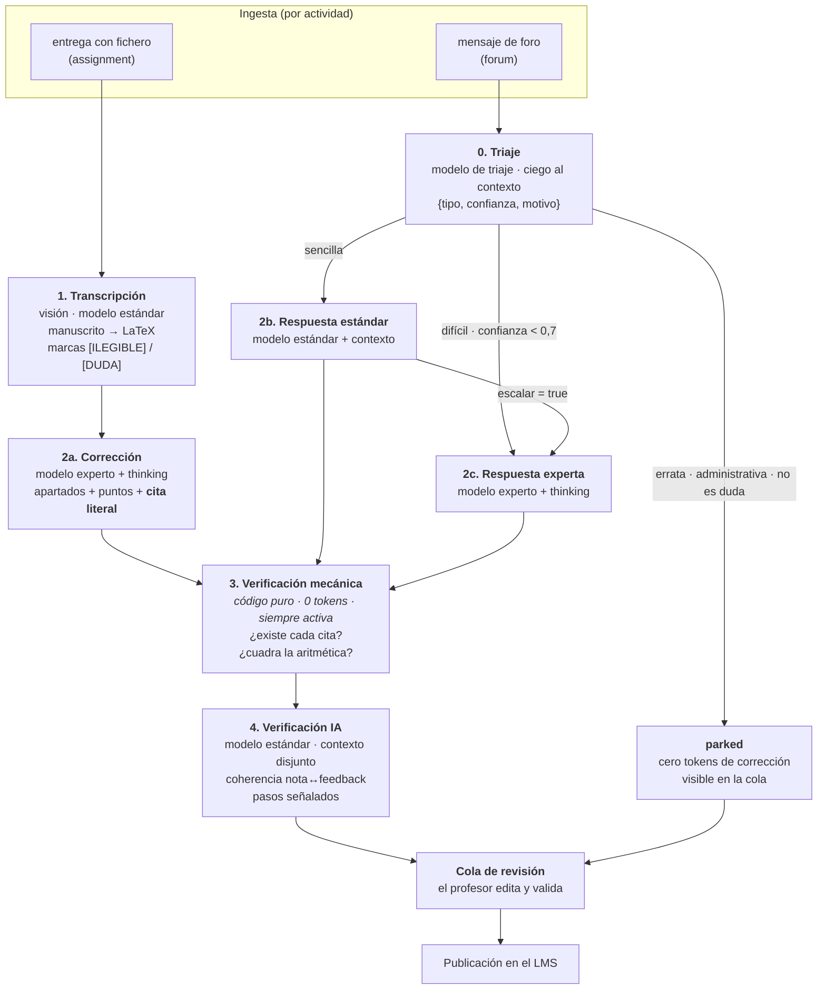

# Motor de IA

Cómo Vega convierte una entrega o una duda en un borrador que el profesor valida, con qué
modelos, a qué coste y con qué defensas contra la alucinación.

Este documento es el diseño técnico del hito **H4** (llamadas reales a la API). Describe el
estado objetivo; lo que hoy existe está en «[Estado real](arquitectura.md#estado-real)» de
`arquitectura.md`, y lo que falta está marcado como **pendiente** en cada sección.

> ### Relación con `diseno-motor-ia.md`
>
> Hay **dos** documentos de motor en `docs/` y no son rivales; se leen en este orden:
>
> - **`diseno-motor-ia.md`** — el análisis del hito: alcance, dónde vive cada dato, la API key y
>   la prueba de conexión, la revisión del modelo de datos. Su §4 quedó abierta explícitamente a
>   que se propusiera una alternativa mejor en ahorro de tokens **antes** de implementarla.
> - **Este documento** — la respuesta a esa invitación, desarrollada: el pipeline completo, la
>   estrategia anti-alucinación y el coste medido por operación.
>
> **Dónde se contradicen, y cómo se resuelve.** `diseno-motor-ia.md` §6 fija **un solo modelo**
> para esta iteración y aplaza el enrutado por complejidad. Este documento propone tres modelos
> escalonados con triaje. **Manda el alcance del hito**: el escalonado es **fase 2**, y lo que
> entra ahora es lo que no depende de él —salida estructurada, niveles de contexto con caché,
> verificación mecánica en código y la cita literal por descuento—, que además es lo que sostiene
> la parte anti-alucinación. La política de modelos de [§5](#5-política-de-modelos) se lee como
> destino, no como trabajo de esta iteración.

---

## 1. Explicado para niños de cinco años

Imagina que eres profesor y cada noche te dejan encima de la mesa un montón de exámenes escritos
a mano y un montón de preguntas de tus alumnos.

Vega es un ayudante que trabaja de noche, mientras duermes.

Primero **mira** cada examen y lo **copia a limpio**, igual que copiarías la letra de un
compañero. Si hay una palabra que no se entiende, no se la inventa: escribe «aquí no se lee».
Eso es muy importante, porque inventarse lo que pone sería hacer trampa.

Después **corrige** la copia a limpio. Pero tiene una regla estricta: **cada vez que quita
puntos, tiene que señalar con el dedo el trozo exacto del examen donde está el fallo**. Como
cuando dices «esto de aquí está mal» en vez de «no sé, algo está mal».

Luego viene un **segundo ayudante** que no ha visto la corrección del primero. Su único trabajo
es comprobar dos cosas: que los trozos señalados **existen de verdad** en el examen, y que las
cuentas de la nota están bien sumadas. Si el primero señaló algo que no está, el segundo lo pilla.

Con las preguntas de los alumnos hace algo parecido, pero antes las **separa en montones**: las
que son solo una errata («aquí pone “derivda”») las aparta sin gastar nada, porque para eso no
hace falta ayuda. Las fáciles las contesta rápido. Las difíciles se las piensa mucho más.

Y al final —esto es lo más importante— **el ayudante nunca entrega nada al alumno**. Deja todo
preparado encima de tu mesa. **Tú lo lees, lo cambias si quieres, y tú decides.** El ayudante
propone; el profesor manda.

---

## 2. Qué problema resuelve y qué no

**Resuelve**: la primera pasada. Copiar a limpio un manuscrito, proponer puntuación apartado por
apartado con su justificación, redactar un borrador de respuesta a una duda, y cruzar un
documento contra una normativa. Todo eso es trabajo mecánico y lento que consume las horas del
profesorado.

**No resuelve**: decidir. La nota que llega al alumno la firma una persona
([ADR 0004](decisiones/0004-validacion-humana-obligatoria.md)). El motor no es un corrector
automático con supervisión opcional; es un redactor de borradores cuyo destinatario es el
profesor.

**No pretende**: ser un sistema que «no se equivoca». Un modelo de lenguaje se equivoca. Lo que
sí pretende es que **cuando se equivente, se note** — que el error deje una huella detectable por
código en vez de pasar como una afirmación segura más. Esa es la tesis del documento y la sección
[§7](#7-anti-alucinación-defensa-en-profundidad) la desarrolla.

---

## 3. Vista general



Las etapas 0 y 4 son nuevas; 1 y 2 existen (`gradeSubmission()` en `packages/core`); la 3 es
código nuevo dentro del motor, sin coste de tokens.

**Una regla atraviesa todo el diagrama**: nada llega a `published` sin `validated_at`, salvo por
la vía de autonomía explícita por actividad, y la autonomía queda **vetada** si la verificación
falló o no se ejecutó ([§8](#8-verificación-mecánica-y-verificación-ia)).

---

## 4. Los niveles de contexto

Hoy son tres (`global` → `activity_kind` → `activity`). El diseño añade dos y fija el orden por
**estabilidad**, que es lo que hace cacheable el prefijo.

| # | Nivel | Quién lo edita | Cambia | Qué contiene |
|---|---|---|---|---|
| 0 | `installation` | **solo admin** | una vez | El estándar de rigor y formato de toda la instalación: demostraciones estrictas, contraejemplos, hipótesis explícitas, LaTeX |
| 1 | `global` | profesorado | 1-2 veces al año | La política de corrección del departamento: tono, arrastre, redondeo, confianza |
| 2 | `activity_kind` | profesorado | rara vez | Qué se valora en una entrega y qué en un foro |
| 3 | `template` | profesorado | rara vez | **Nuevo.** La plantilla del formato: `simulacro-problema`, `simulacro-tema`, `pd`, `dudas-matematicas` |
| 4 | `activity` | profesorado | por actividad | Esta actividad concreta |
| 5 | — | — | por actividad | Solución de referencia / material asociado + matriz + ficheros de texto adjuntos |

**Por qué `template`.** Quince actividades «tema» comparten las reglas del formato y hoy sólo
pueden compartirlas copiándolas en cada una — copiar es como empiezan las contradicciones. El
huérfano `contexts/activity-kinds/assignment-tema.md`, que no corresponde a ningún `ActivityKind`
y no lo carga nadie, es la prueba de que el nivel faltaba. `activities.template_key` lo
referencia.

**Por qué `installation` es discutible.** En una academia con un admin que casi coincide con el
profesorado, un nivel entero nuevo puede ser una fila más con otro permiso. La alternativa mínima
es dejar `global` y restringir su edición por rol. Se implementa como nivel porque el cliente
pidió explícitamente que **el formato común lo decida el administrador** y el profesorado no
pueda relajarlo, y porque separar «cómo se escribe» de «cómo se puntúa» hace ambos textos más
cortos. Es la pieza más fácil de revertir si estorba.

### Caching

Dos `cache_control` (de los 4 que permite la API), colocados donde el prefijo se comparte:

- **Tras el nivel 3** — compartido por todas las actividades de la misma plantilla.
- **Tras el nivel 5** — compartido por todas las entregas de la misma actividad.

Números verificados que condicionan el diseño:

- **Mínimo cacheable: 4.096 tokens** en el modelo experto. Por debajo **no cachea y no avisa**
  (`cache_creation_input_tokens: 0`). El primer breakpoint debe acumular al menos eso: hay que
  **medirlo con `count_tokens`**, no estimarlo.
- **Ventana de 20 bloques**: cada breakpoint retrocede como mucho 20 bloques de contenido. Una
  entrega de ocho o más páginas la supera — hace falta un breakpoint intermedio.
- **TTL 5 minutos** (escritura 1,25×), no 1 hora. El TTL largo (2×) sólo se amortiza con tres
  lecturas y sólo tiene sentido con la Batches API, que se difiere ([§9](#9-coste)).
- Cambiar el id de un modelo o editar un contexto **invalida el prefijo desde ese punto**. La
  primera entrega tras una edición nocturna paga escritura completa: es correcto, pero explica
  «noches caras» en el panel.

> **Cambio obligado de interfaz.** `GradeInput.context` es hoy **un único string**
> (`packages/core/src/ai/provider.ts:97`). Dos breakpoints exigen que el contexto viaje
> **segmentado** hasta el proveedor. Es un cambio de interfaz, no de prompt: sin él, el diseño de
> caché de esta sección no se puede implementar.

---

## 5. Política de modelos

Escalonada por dificultad, configurable en `app_settings` con semilla de `.env`:

| Rol | Modelo por defecto | Se usa en | Por qué |
|---|---|---|---|
| `triage` | `claude-haiku-4-5` | Clasificar dudas | Céntimos por llamada; la tarea es etiquetar, no razonar |
| `standard` | `claude-sonnet-5` | Transcripción, dudas sencillas, verificador | Visión de alta resolución y calidad suficiente |
| `expert` | `claude-opus-4-8` | Corrección de entregas, dudas difíciles, PD | Thinking adaptativo con `effort: high`; es donde se juega la nota |

Parámetros comunes: `thinking: {type: 'adaptive'}` **explícito** (omitirlo ejecuta *sin* pensar) y
`output_config: {format}` con esquema JSON en **todas** las llamadas.

> **Deuda previa que hay que cerrar antes.** `runBatch` construye el proveedor leyendo sólo
> `ctx.config` (`apps/api/src/routes/batch.ts:137-143`), ignorando `anthropic.gradingModel` de
> `app_settings` pese a que `settings/service.ts:9-11` promete lo contrario. La «convención
> existente» sobre la que se apoya esta tabla **no existe en ejecución**: cablearla es el paso 1.

> **El SDK fijado es `^0.65.0`** (`packages/core/package.json:23`, `apps/api/package.json:21`) y
> no tipa `thinking` adaptativo, `output_config` ni los helpers de Zod — de ahí el `buildParams`
> con casts a ciegas. **Subirlo es el primer commit del motor.**

### Structured outputs: qué garantizan y qué no

Sustituyen el `JSON.parse` + Zod de `anthropic.ts:173,235`, que es parseo frágil de JSON dentro
de texto. Con Zod ya presente en el repo:

```ts
import { zodOutputFormat } from '@anthropic-ai/sdk/helpers/zod'

const res = await client.messages.parse({
  model, max_tokens: 16000,
  thinking: { type: 'adaptive' },
  output_config: { effort: 'high', format: zodOutputFormat(CorreccionSchema) },
  messages: [...],
})
if (!res.parsed_output) throw new Error('salida no conforme al esquema')
```

**Dos límites que hay que decir en voz alta**, porque cambian lo que se puede prometer:

1. **El esquema no admite restricciones numéricas.** `minimum`, `maximum` y `multipleOf` no están
   soportados: `confidence: 0..1` y los topes por apartado **los sigue garantizando el motor**
   (`normalizePoints`, `clamp` en `engine.ts`), no la API. Los SDK los quitan del esquema y los
   validan en cliente.
2. **Es incompatible con la función `citations` de la API** (devuelve 400). Nuestro grounding por
   cita literal es **nuestro** —un campo del esquema comprobado por código—, y eso es una ventaja,
   no un apaño: la comprobación la hace un verificador independiente, cosa que la función nativa
   no daría. Conviene dejarlo escrito para que nadie «mejore» el diseño rompiéndolo.

---

## 6. Los cuatro flujos

### 6.1 Entrega de problemas (`simulacro-problema`)

Transcripción → corrección → verificación. Es el flujo que ya existe, más la cita y la
verificación.

La salida de corrección gana un campo por apartado:

```ts
{
  label: '1a', aiPoints: 1.25, aiFeedback: '…',
  confidence: 0.82, alternativeMethod: false,
  citas: [{ page: 2, quote: 'derivamos \\sin(2x) y obtenemos \\cos(2x)' }]  // NUEVO
}
```

**Regla dura: si no puede citarse, no puede descontarse.** Un descuento sin cita es un descuento
que nadie puede comprobar.

### 6.2 Entrega de tema (`simulacro-tema`)

Igual, más una **matriz de contenidos esperados** que llega como fichero adjunto `.md`/`.tex` de
la actividad. El prompt exige cobertura contenido a contenido: `presente` / `parcial` / `ausente`,
con cita literal cuando se marque presente o parcial.

**El problema asimétrico de las ausencias.** Un «presente» falso se detecta mecánicamente (la
cita no existe). Un «ausente» falso —el contenido está, dicho con otras palabras— **no tiene cita
posible** y no dispara ninguna alarma, y además quita puntos injustamente. Mitigación: todo
`ausente` y `parcial` lleva confianza propia, y el verificador hace **búsqueda inversa dirigida**
sólo sobre los marcados ausentes.

A diferencia del simulacro de problema, aquí **la presentación puntúa** (así lo dice hoy
`contexts/global.md` §7.8).

### 6.3 Dudas de foro

Ver [§7](#7-triaje-de-dudas) para el triaje. Las tres rutas comparten el contexto resuelto salvo
el clasificador, que es **ciego** a propósito.

### 6.4 Programación didáctica (`pd`) — hito posterior

Entrada `.docx` → texto extraído con `mammoth` (JS puro; **no** `pandoc` ni `pdftotext`, que son
binarios de sistema y chocan con la decisión de imagen «Node sin compilador» que motivó `pdf-lib`).
La normativa la aporta el admin como ficheros de texto adjuntos a la actividad, **segmentados por
artículo** al subirlos.

Salida: tabla de cumplimiento requisito a requisito con cita de documento + artículo + literal.

**Sin RAG, y es una decisión defendible, no una simplificación.** A 40–60k tokens de normativa, el
contexto completo cacheado cuesta lo mismo que un retrieval de 5k sin caché, y elimina una clase
entera de alucinación: el fallo típico de RAG —el artículo relevante no se recupera y el modelo
rellena de memoria— es **indetectable a posteriori**. Con la normativa entera delante, «prohibido
citar de memoria» es verificable, porque todo lo citable está en el prompt y en el verificador. Se
revisaría si la normativa creciera diez veces.

> **Hueco del modelo de datos que hay que decidir antes de implementar**: el texto extraído del
> `.docx` es de la **entrega**, no de la actividad — `activity_files.content` es el mecanismo
> equivocado. El candidato natural es `submissions.text_content` (hoy sólo foros; nada en el
> esquema lo impide).

---

## 7. Triaje de dudas

Etapa 0 del flujo de foro. El clasificador recibe **sólo** el mensaje y el hilo previo, sin el
contexto del curso: esa ceguera es justamente lo que lo hace barato, y el ahorro entero depende de
ella. Fundirlo en la llamada estándar con contexto completo destruiría el ahorro que justifica su
existencia: una errata pasaría de coste cero a pagar el prefijo entero.

| Etiqueta | Qué pasa | Coste de corrección |
|---|---|---|
| `errata`, `administrativa`, `no_es_duda` | Estado **`parked`**: visible en la cola con etiqueta; el profesor la resuelve a mano o fuerza reproceso | **Cero** |
| `sencilla` | Ruta estándar con contexto completo | ~0,01 € |
| `dificil` | Ruta experta con thinking adaptativo | ~0,07 € |

### Umbrales asimétricos

No son simétricos porque los dos errores no cuestan lo mismo:

- **Aparcar exige confianza ≥ 0,9.** Es la única ruta con coste humano directo — el silencio. Un
  alumno sin respuesta durante semanas es un fallo del sistema aunque ninguna IA haya alucinado.
- **Escalar a experto basta con < 0,7.** El fallo hacia arriba sólo cuesta tokens.

### Degradación simétrica

La salida de las rutas sencilla y difícil incluye **dos** banderas, no una:

- `escalar: boolean` — la ruta estándar detecta que hace falta razonamiento profundo; el borrador
  barato se **descarta** (no se le enseña a Opus, para no anclarlo) y se relanza.
- `no_es_duda: boolean` — la ruta, que **sí** ve el contexto completo, reclasifica lo que el
  clasificador ciego erró y manda la entrega a `parked`.

La cola muestra **contador y antigüedad** de las aparcadas, para que `parked` no sea un agujero
negro.

> **Prerequisito.** La clave natural `UNIQUE (activity_id, student_ref, original_filename)` **no
> deduplica foros** (`original_filename` es `NULL` y en PostgreSQL dos `NULL` no colisionan).
> Reingerir un foro crea entregas duplicadas y **cada duplicado pagaría triaje y corrección**.
> Deduplicar antes de activar el triaje.

---

## 8. Anti-alucinación: defensa en profundidad

Ordenada de la capa más mecánica a la más humana. Las primeras son baratas y no fallan; las
últimas son caras y las paga el profesor.

| # | Capa | Coste | Qué detecta |
|---|---|---|---|
| a | **Structured outputs** | 0 | Campos inventados, formatos rotos |
| b | **Grounding por cita** — todo descuento lleva cita literal | 0 | — (es el ancla de (c)) |
| c | **Comprobación de existencia por código** | 0 | **Cita fabricada: 100 % de detección** |
| d | **Aritmética en código** (`alignItems`, `normalizePoints`, topes, cuartos) | 0 | Notas que no cuadran |
| e | **Marcas `[ILEGIBLE]` / `[DUDA]`** con reglas duras (global §8) | 0 | Papel que nadie ha leído |
| f | **Confianza calibrada** (global §9) | 0 | Dirige la atención del profesor |
| g | **Verificador IA independiente**, contexto disjunto | ~0,02 € | Incoherencia nota↔feedback, pasos señalados |
| h | **Validación humana** ([ADR 0004](decisiones/0004-validacion-humana-obligatoria.md)) | tiempo | Todo lo demás |

### El punto ciego, dicho abiertamente

**La transcripción es el suelo de todo el edificio y es el único artefacto que no está groundeado
contra nada.** El verificador cruza las citas contra la transcripción, no contra la imagen. Una
alucinación de OCR —completar el paso que «debería» estar, corregir en silencio un signo—
atraviesa limpiamente las capas (a)–(g): la cita existirá literalmente, la aritmética cuadrará, la
confianza será alta.

Esconderlo sería indefendible, así que el diseño lo trata como capa formal:

1. La **revisión visual escaneo ↔ transcripción** es una capa del sistema anti-alucinación, no una
   cortesía de la interfaz. Se muestran lado a lado.
2. Cada `[DUDA]` registra **ambas lecturas**, no sólo la elegida. Hoy el prompt dice «elige la más
   coherente con el paso siguiente», que es un sesgo sistemático a favor de la lectura que hace
   cuadrar el desarrollo — y puede ocultar errores reales del alumno.
3. Las páginas de baja confianza donde caen los descuentos decisivos **vetan la autonomía**.
4. Pendiente de valorar: doble lectura de visión con *diff* en las páginas decisivas.

### El alcance exacto de la garantía

Conviene ser preciso, porque un evaluador experto atacará justo aquí:

> La comprobación mecánica garantiza que **toda cita existe**. No garantiza que toda cita
> **pruebe** lo que se afirma con ella.

La existencia elimina la **fabricación** —el 100 % de las citas inventadas—, no el soporte
semántico. Para el soporte hay dos capas más: *spot-check* del verificador IA sobre los descuentos
de mayor peso, y el profesor. Lo que sí puede afirmarse, y ningún sistema basado sólo en prompt
puede: **la alucinación deja de ser un fallo silencioso y pasa a ser un evento observable.** No
«reduce la probabilidad» (afirmación incontrastable): **cambia la clase del fallo**.

---

## 9. Verificación mecánica y verificación IA

Son dos capas distintas y el borrador inicial las mezclaba. **Todo lo verificable por código se
verifica por código** (coste cero, fiabilidad 1); la IA se reserva para lo semántico y **de forma
dirigida**, no exhaustiva.

### Capa mecánica — `packages/core`, siempre activa, no desconectable

- Existencia de cada cita en la transcripción o en los adjuntos.
- Existencia de las citas normativas (documento + artículo) en los adjuntos de la PD.
- Existencia de las secciones del material citadas en respuestas de foro.
- Coherencia gruesa mecanizable: apartado con puntuación máxima cuyo feedback contiene descuentos.
- La aritmética **ya está** en `engine.ts`: no repetirla en la llamada IA.

> **Comparación sobre texto canónico, o el verificador es inútil.** `\frac` vs `\dfrac`,
> espaciado, coma vs punto decimal: un `String.includes` ingenuo produce falsos positivos
> sistemáticos → fatiga de alarmas → el profesor deja de mirar los avisos, que es **peor que no
> tener verificador**. Hay que normalizar (colapsar espacios, unificar comandos LaTeX
> equivalentes, unificar separador decimal) antes de comparar, y el esquema debe pedir la cita
> como copia carácter a carácter **con página**. La tasa de falsos positivos se mide en el
> pilotaje antes de dar peso a los avisos en la interfaz.

### Capa IA — modelo estándar, una llamada, dirigida

Recibe transcripción + corrección **sin** el contexto de corrección. Comprueba coherencia
semántica nota↔feedback, soporte de las citas en los descuentos grandes, y matemática **sólo en
pasos señalados** (apartados con `alternativeMethod` o confianza < 0,75).

**No se le pide re-corregir toda la matemática.** Pedir al modelo estándar que audite la
matemática del experto es verificar *hacia abajo*: no detectaría el error real y podría inventar
uno. La defensa del método alternativo no es el verificador, sino la regla de `global.md` §5.4
(método no verificable ⇒ confianza < 0,60 + aviso) y `avgTeacherDeviation` por actividad como
detector estadístico de deriva.

### El invariante, en código y no en documentación

```
verificación ausente o fallida  ⇒  no auto-publicación
cita inexistente detectada      ⇒  confianza global < 0,5 + veto de autonomía
AI_VERIFY=false + autonomy≠review_all  ⇒  el arranque lo rechaza
actividad forum con triaje      ⇒  no admite modo autonomous
```

Informativo hacia el profesor (no bloquea la cola: el verificador IA también puede equivocarse),
**bloqueante hacia la autonomía**. Sin esto se reintroduce exactamente el fallo que hay que evitar.

---

## 10. Coste

Con lote (−50 %) y caché caliente. Precios de lista; 1 US$ ≈ 0,93 €.

| Operación | Coste | Dónde se va |
|---|---:|---|
| Entrega manuscrita, 4 páginas | **~0,17 €** | 60 % en la salida del modelo experto (thinking incluido) |
| Duda sencilla | **~0,01 €** | — |
| Duda difícil | **~0,07 €** | 6,5× una sencilla |
| Tema teórico, 8 páginas + matriz | **~0,26 €** | — |
| PD, 40 páginas vs 80 de normativa | **~0,30 €** | La normativa se cachea: se paga entera una vez |
| Errata aparcada | **0 €** | El clasificador se amortiza con la primera |

Escenario mensual de una academia (200 entregas, 20 temas, 300 dudas, 30 PDs): **~54 €/mes**.
Para comparar: un minuto de profesor cuesta más o menos lo que corregir dos entregas.

**El coste vive en los tokens de salida, no en el contexto.** Eso tiene tres consecuencias:

1. El **−50 % de la Batches API es el ahorro garantizado**; la caché es *upside*. En Batches las
   peticiones se procesan concurrentemente y sin orden, y una entrada de caché sólo es legible
   cuando la primera respuesta empieza a emitirse: los hits son *best-effort*. Presupuestar con
   0 % de aciertos da ~0,21 €/entrega en vez de 0,17 €: **el diseño es viable sin caché**.
2. **La Batches API se difiere.** Convierte un lote síncrono en un proceso asíncrono con sondeo de
   hasta 24 h, estados nuevos y rediseño del planificador, para ahorrar el 50 % de pocos euros por
   noche. Es el peor ratio complejidad/ahorro del diseño. Se decide con un mes de coste real
   medido — la base de datos ya lo registra por lote.
3. Si algún día se adopta, **pre-calentar** por actividad antes del lote: una llamada con
   `max_tokens: 0` escribe la caché sin facturar salida. Letra pequeña verificada: esa llamada
   devuelve 400 si lleva `output_config.format`, `stream: true` o va dentro del lote — tiene que
   ir suelta y sin esquema, con el contenido cacheable en el bloque `system`.

### Despilfarros a eliminar

| Qué | Arreglo |
|---|---|
| Verificador de PD con la normativa entera en el prompt | La existencia de la cita es un `includes` normalizado: código, 0 tokens. Al verificador, sólo los fragmentos citados |
| `aiLatex` devuelve el documento completo (`\documentclass…`, `anthropic.ts:125`) | El preámbulo es idéntico siempre y se paga a precio de salida en cada corrección. El modelo devuelve el cuerpo; la plantilla es de `renderCorrectionPages` |
| `cache_creation_input_tokens` no se contabiliza (`toUsage`, `anthropic.ts:325`, con `TODO` en 318-319) | Sumarla con su multiplicador y aplicar la tarifa de lote. **El panel de costes es argumento de venta y hoy miente en ambas direcciones** |

Y dos avisos de presupuesto: el precio introductorio del modelo estándar termina el
**2026-08-31** (después sube ~50 %), y su tokenizador cuenta ~30 % más tokens para el mismo texto.
**Medir con `count_tokens` por modelo**, nunca con estimaciones ni con tokenizadores de terceros.

---

## 11. Observabilidad configurable

Pensada para apagarse cuando el sistema esté estable, porque cuesta tokens y espacio.

| Variable | Por defecto | Qué hace |
|---|---|---|
| `AI_VERIFY` | `true` | Activa la pasada de verificación IA. La mecánica **no es desconectable** |
| `AI_LOG_REASONING` | `false` | Guarda en `ai_call_logs` el prompt resuelto, el resumen del razonamiento, la respuesta cruda, modelo, tokens y coste. Sólo admin |
| `AI_TEACHER_NOTES` | `false` | Añade `teacherNotes` a la corrección: aclaración extensa sólo para el profesor |

> **Lo que el log de razonamiento puede y no puede dar.** El razonamiento **en bruto no se
> devuelve nunca**. Lo que se obtiene es un **resumen**, y hay que pedirlo explícitamente con
> `thinking: {type:'adaptive', display:'summarized'}` — por defecto los bloques llegan con texto
> vacío. La pantalla de administrador debe decir «resumen del razonamiento», no «lo que pensó»,
> para no prometer lo que la API no da.

Recomendaciones sobre `ai_call_logs`: apagado por defecto, con purga programada, guardando
**hash o referencia** del prefijo cacheado en vez de duplicar 40–60k tokens por fila, y con acceso
restringido a admin reutilizando `seesEverything()` de `auth/scope.ts`. Para ajustar prompts ya
existen la CLI del motor y `GET /api/contexts/resolved/{id}`: empezar por ahí y por logs con
retención corta.

**`corrections.verification` no se borra al reprocesar.** La evidencia de las alucinaciones
detectadas es la base para calibrar el sistema y para defenderlo.

---

## 12. Cambios en el modelo de datos

Migración `0005_*.sql`, aditiva e idempotente, siguiendo el patrón `ALTER` del
[ADR 0002](decisiones/0002-migraciones-sql-planas.md).

| Cambio | Nota |
|---|---|
| `grading_contexts.level` + `installation`, `template` | Sustituir el CHECK de `0002_activities.sql:145` |
| `activities.template_key text NULL` | Referencia la plantilla |
| `submissions.triage_label`, `triage_confidence` | Etiqueta y confianza del clasificador |
| `submissions.status` + `parked` | Estado nuevo; entra en `REVIEWABLE_STATUSES` |
| **`correction_items.ai_quote`** (+ página) | **Obligatorio.** Sin columna propia, la comprobación de existencia sería parsing frágil de `ai_feedback` |
| `corrections.teacher_notes`, `corrections.verification jsonb` | Notas de profesor y veredicto del verificador |
| Tabla `ai_call_logs` | Apagada por defecto, con purga |
| Deduplicación de foros | `NULLS NOT DISTINCT`, índice parcial o clave por `remoteId` |

La máquina de estados con `parked` (incluida la transición `parked → pending`) se documenta en
`modelo-de-datos.md` **en el mismo PR** que la migración.

---

## 13. Cambios en el código

### `packages/shared`
`ContextLevel` (+2), `SubmissionStatus` (+`parked`), enum `TriageLabel`, campos nuevos en
`Activity`/`Submission`/`Correction`/`AppSettings`. Un **único mapa de niveles** (orden, etiqueta,
permiso, clave) consumido por `resolveContext`, `routes/contexts.ts`, la CLI y el frontend — para
que no vuelva a pasar lo de `referenceSolution`, que se cableó en un sitio y no en los demás.

### `packages/core`
`AiProvider` pasa de 2 a 4 operaciones (`triage`, `verify`). `GradeInput.context` se segmenta.
`GradedItem` gana `citas`. `resolveContext()` monta los dos niveles nuevos. `engine.ts` incorpora
la verificación mecánica junto a `alignItems`/`detectReviewFlags`. El mock implementa las dos
operaciones nuevas o los tests no compilan.

> Ampliar `AiProvider` **contradice literalmente** el [ADR 0005](decisiones/0005-proveedor-ia-intercambiable.md)
> («exactamente dos operaciones», `provider.ts:145-146`). En este repositorio los ADR son
> vinculantes: hace falta un **ADR nuevo que lo sustituya**, como el 0009 hizo con el 0006.
> Ampliarlo en silencio sería un defecto de gobernanza.

### `apps/api`
Cablear `app_settings` → lote; triaje previo en foros; `parked`; persistir triaje, verificación y
`teacher_notes`; permisos por nivel de contexto (hoy `global` lo edita cualquier autenticado);
`reprocess` desde `parked`.

### `apps/frontend`
Pantalla de contextos (niveles y permisos), ajustes (modelos por rol, flags), cola (`parked`,
avisos del verificador), revisión (`teacherNotes`, verificación, escaneo y transcripción lado a
lado), detalle de actividad (`template_key`), página de logs para admin.

---

## 14. Orden de implementación

De menor a mayor riesgo. Los cinco primeros pasos no tocan el conector y se prueban con el mock.

1. **Cablear `app_settings` → `runBatch`** (deuda existente) y añadir las claves de modelo por rol.
2. **Migración 0005**, aditiva: no rompe nada aunque el código aún no la use.
3. **Niveles `installation` y `template`**: `resolve.ts` + shared + rutas + CLI + siembra + front.
4. **Subir el SDK y pasar a structured outputs** en `anthropic.ts`. Es además la primera ocasión
   de **verificar el proveedor contra la API real** — hoy todo el fichero está marcado «sin
   verificar».
5. **Verificación mecánica en `engine.ts`**: código puro, coste cero, tests unitarios.
6. **Triaje + `parked`**, tras deduplicar foros.
7. **Ingesta real de binarios.** *Ver el aviso de abajo.*
8. **Verificador IA** (`AI_VERIFY`), cuando haya datos que lo justifiquen.
9. **Batches API**, tras medir un mes de coste real.
10. **PD**, al final: depende de `.docx`, de dónde vive el texto de la entrega y de la ingesta.

> ### El camino crítico no es lo que parece
>
> El pipeline de entregas **no funciona hoy con el proveedor real, y no por los prompts**:
> `batch.ts:265` fabrica rutas de fichero falsas (`'fichero.pdf#1'`) que sólo el mock tolera; el
> proveedor real haría `readFile` sobre ellas y reventaría. No hay almacén de binarios
> (`storage_path` es siempre `NULL`) ni ninguna ruta que llame a `listSubmissions()` / `download()`.
>
> Transcripción, verificación y PD dependen de ese hueco. **La descarga y el paso de bytes del
> conector al motor es un hito propio y previo**, no un detalle de implementación. Presentar el
> flujo de entregas como cercano sin cerrarlo sería vender vaporware.

---

## 15. Riesgos

| Riesgo | Mitigación |
|---|---|
| **Alucinación de OCR** — atraviesa todas las capas | Revisión visual como capa formal; ambas lecturas en cada `[DUDA]`; veto de autonomía en páginas decisivas de baja confianza. Se acepta y se documenta: depende del profesor |
| **Fatiga de alarmas** del verificador por falsos positivos de LaTeX | Comparación canónica obligatoria; medir la tasa de falsos positivos en pilotaje antes de dar peso a los avisos |
| **El proveedor no se ha ejecutado nunca contra la API real** | Primer lote pequeño y monitorizado con `AI_LOG_REASONING=true`; validar `usage` contra las estimaciones; límite de 32 MB y 600 páginas por petición en escaneos grandes |
| **El triaje aparca dudas reales** | Umbral ≥ 0,9 para aparcar; contador y antigüedad visibles; muestra revisada en pilotaje |
| **Configuración insegura** (`AI_VERIFY=false` + autonomía) | Invariante en código, rechazado al arrancar |
| **Coste variable del thinking** | `output_tokens` por llamada en `ai_call_logs`; alerta cuando el coste por corrección se desvíe del histórico de la actividad |

---

## 16. Preguntas abiertas

1. **¿`installation` como nivel o como permiso sobre `global`?** El diseño elige nivel; la
   alternativa es más barata y casi equivalente.
2. **¿El modo `autonomous` sobrevive?** Contradice el espíritu del ADR 0004 y hoy además marca
   `published` sin llamar al conector. Decisión pendiente en `HU-21`.
3. **Reconciliación fichero ↔ base de datos de los contextos** (`HU-06`), ahora con cinco niveles.
4. **¿Dónde vive el texto extraído de una entrega `.docx`?** `submissions.text_content` o columna
   nueva.
5. **Umbral 0,75**, hoy duplicado en `engine.ts` y `batch.ts`: unificar en `@vega/shared`.

---

## Documentación que este diseño corrige

`contexts/README.md` (líneas 85-90) y `arquitectura.md` (fila «`referenceSolution` y ficheros en
el prompt») afirman que el lote **no** envía la solución de referencia ni el contenido de los
ficheros. **Es falso desde un fix reciente**: `apps/api/src/routes/batch.ts:240-244` los pasa a
`resolveContext()`. Hay que corregirlo, porque un evaluador que lea sólo la documentación
concluiría que Vega corrige a ciegas.
